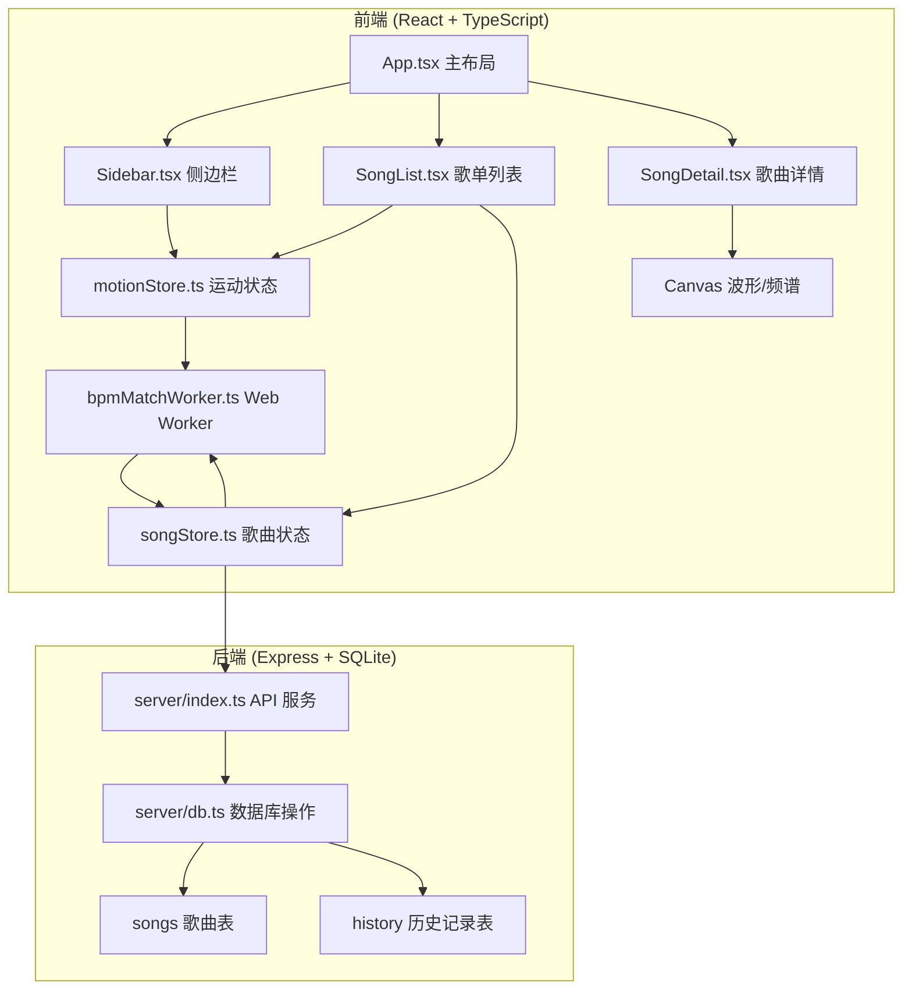
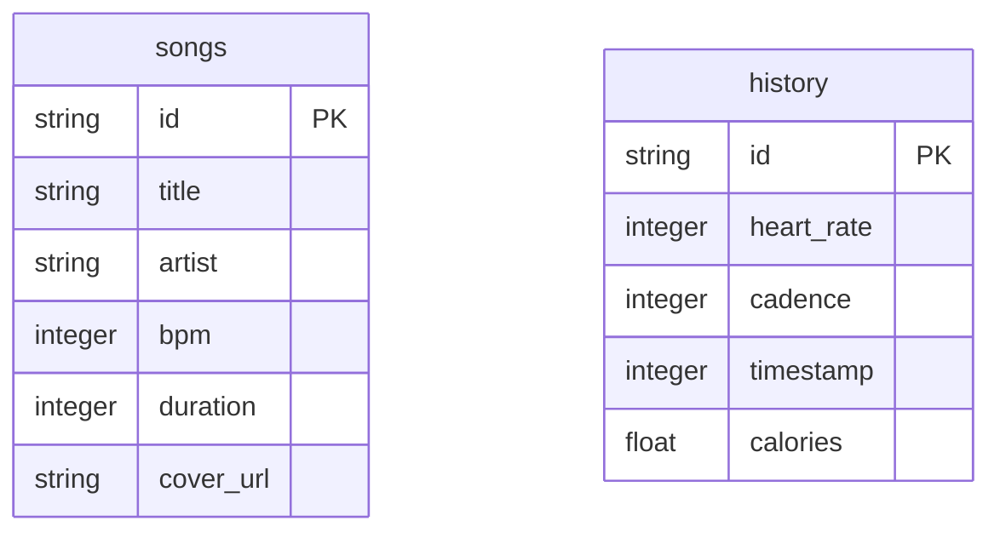

## 1. 架构设计



## 2. 技术描述

- **前端框架**：React 18 + TypeScript 5
- **构建工具**：Vite 5
- **状态管理**：Zustand 4
- **动画库**：Framer Motion（AnimatePresence）
- **样式方案**：CSS Modules / Styled Components
- **Canvas 绑定**：原生 Canvas API
- **Web Worker**：原生 Worker API
- **后端框架**：Express 4
- **数据库**：SQLite 3
- **ID 生成**：uuid

## 3. 文件结构

```
auto60/
├── package.json
├── vite.config.js
├── tsconfig.json
├── index.html
├── src/
│   ├── main.tsx          # 应用入口
│   ├── App.tsx           # 主布局组件
│   ├── components/
│   │   ├── Sidebar.tsx   # 运动统计侧边栏
│   │   ├── SongList.tsx  # 动态歌单列表
│   │   └── SongDetail.tsx # 歌曲详情页
│   ├── stores/
│   │   ├── motionStore.ts # 运动状态管理
│   │   └── songStore.ts   # 歌曲状态管理
│   └── utils/
│       └── bpmMatchWorker.ts # BPM匹配计算Worker
└── server/
    ├── index.ts          # Express API服务
    └── db.ts             # SQLite数据库初始化
```

## 4. API 定义

### 4.1 获取歌曲列表
- **GET** `/api/songs`
- 响应：`{ songs: Song[] }`

### 4.2 获取单首歌曲
- **GET** `/api/songs/:id`
- 响应：`{ song: Song }`

### 4.3 保存运动历史
- **POST** `/api/history`
- 请求体：`{ heartRate: number, cadence: number, timestamp: number, calories: number }`
- 响应：`{ success: boolean, id: string }`

### 4.4 获取运动历史
- **GET** `/api/history`
- 响应：`{ history: HistoryRecord[] }`

### 4.5 类型定义

```typescript
interface Song {
  id: string;
  title: string;
  artist: string;
  bpm: number;
  duration: number;
  coverUrl?: string;
}

interface HistoryRecord {
  id: string;
  heartRate: number;
  cadence: number;
  timestamp: number;
  calories: number;
}

interface MotionState {
  heartRate: number;
  cadence: number;
  isRunning: boolean;
  totalTime: number;
  avgHeartRate: number;
  calories: number;
  heartRateHistory: number[];
}

interface SongState {
  songs: Song[];
  sortedSongs: Song[];
  currentSong: Song | null;
  isDetailOpen: boolean;
}
```

## 5. 数据模型

### 5.1 ER 图



### 5.2 DDL

```sql
CREATE TABLE IF NOT EXISTS songs (
  id TEXT PRIMARY KEY,
  title TEXT NOT NULL,
  artist TEXT NOT NULL,
  bpm INTEGER NOT NULL,
  duration INTEGER NOT NULL,
  cover_url TEXT
);

CREATE TABLE IF NOT EXISTS history (
  id TEXT PRIMARY KEY,
  heart_rate INTEGER NOT NULL,
  cadence INTEGER NOT NULL,
  timestamp INTEGER NOT NULL,
  calories REAL NOT NULL
);

CREATE INDEX IF NOT EXISTS idx_history_timestamp ON history(timestamp);
```

### 5.3 初始数据

插入 20 首不同 BPM 的歌曲数据，覆盖 80-180 BPM 范围，用于匹配不同运动强度。

## 6. 性能优化

- **Web Worker**：BPM 匹配计算和数据平滑在 Worker 线程执行，不阻塞主线程
- **Canvas 优化**：使用 requestAnimationFrame 绘制，避免不必要的重绘
- **动画优化**：使用 CSS transform 和 opacity 属性，触发 GPU 加速
- **状态管理**：Zustand 轻量级状态，避免不必要的重渲染
- **列表动画**：AnimatePresence 管理列表项的进入/退出动画
