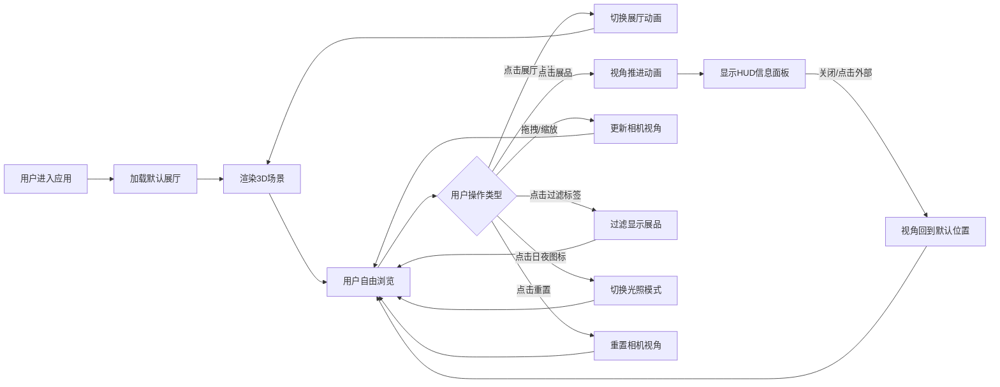

## 1. 产品概述

交互式3D虚拟展厅浏览系统，为虚拟展览策划团队提供构建和展示沉浸式3D展厅的工具，用户可在线浏览不同主题展馆并自由操作视角查看展品细节。

- 主要目的：提供高品质3D虚拟展览体验，支持多展厅切换、展品交互、视角自由控制
- 目标用户：虚拟展览策划团队、线上艺术参观者、博物馆数字化展示场景
- 产品价值：打破物理空间限制，提供沉浸式、可交互的线上展览体验

## 2. 核心功能

### 2.1 用户角色

| 角色 | 注册方式 | 核心权限 |
|------|----------|----------|
| 访客用户 | 无需注册 | 浏览展厅、查看展品详情、切换视角、过滤展品、切换日夜模式 |

### 2.2 功能模块

1. **3D场景渲染模块**：展厅空间结构渲染、展品3D对象展示、光照与材质系统
2. **展品交互模块**：展品点击聚焦、视角动画过渡、信息面板展示
3. **展厅管理模块**：展厅列表侧边栏、展厅切换动画、数据加载
4. **视角控制模块**：鼠标拖拽旋转、滚轮缩放、一键重置视角
5. **过滤与主题模块**：展品类型分类过滤、日夜模式切换

### 2.3 页面详情

| 页面名称 | 模块名称 | 功能描述 |
|----------|----------|----------|
| 主应用页面 | 展厅列表侧边栏 | 深色侧边栏(220px)，展示所有展厅卡片，圆角10px，点击切换展厅 |
| 主应用页面 | 3D场景画布 | Three.js渲染场景，包含展厅结构、展品、光照系统 |
| 主应用页面 | 展品过滤栏 | 场景上方三个标签按钮(雕塑/绘画/装置)，圆角20px，渐变色选中态 |
| 主应用页面 | HUD信息面板 | 右上角毛玻璃面板(320px)，打字机动画显示展品名称和简介 |
| 主应用页面 | 日夜模式切换 | 右上角太阳/月亮图标，1秒过渡动画切换冷暖光照 |
| 主应用页面 | 视角重置按钮 | 左下角圆形按钮(36px)，悬停外发光，点击重置视角 |

## 3. 核心流程

## 4. 用户界面设计

### 4.1 设计风格

- **主色调**：深色调现代主义风格
  - 主背景：#0a0a1a
  - 侧边栏：#1a1a2e
  - 展台材质：#c0c0c0（浅灰色漫反射）
  - 选中渐变：#667eea → #764ba2
  - 未选中灰色：#777
- **按钮风格**：圆角设计，0.2s ease过渡动画，点击时微缩放(scale 0.95再恢复)
- **字体**：
  - 标题：无衬线粗体(font-weight: 600)
  - 展品说明：纤细字体(font-weight: 300)
- **布局**：左侧固定侧边栏 + 主3D场景区域 + 浮动UI层
- **图标风格**：Lucide图标库，太阳/月亮用于日夜模式切换

### 4.2 页面设计概述

| 页面名称 | 模块名称 | UI元素 |
|----------|----------|--------|
| 主应用 | 侧边栏 | 深色背景#1a1a2e，宽220px，展厅卡片圆角10px，hover高亮，选中渐变色 |
| 主应用 | 3D场景 | 全屏Canvas，半透明墙壁带反射，圆柱形展台带柔和光照，展品浮动旋转 |
| 主应用 | 过滤栏 | 顶部居中，三个圆角20px标签按钮，选中态#667eea→#764ba2渐变 |
| 主应用 | HUD面板 | 右上角320px宽，毛玻璃blur(8px)，圆角16px，打字机动画文字 |
| 主应用 | 日夜切换 | 右上角圆形图标按钮，悬停发光，1秒平滑过渡 |
| 主应用 | 重置按钮 | 左下角圆形36px，悬停外发光，点击微缩放反馈 |

### 4.3 响应式设计

- **桌面端(1920×1080)**：完整布局，侧边栏220px全宽显示
- **平板端(768px)**：侧边栏收起为图标栏，HUD面板覆盖半屏
- **触摸优化**：支持触摸拖拽旋转、捏合缩放

### 4.4 3D场景指导

- **环境与氛围**：深色调太空感，日夜两种光照氛围
  - 日间模式：暖色平行光(5000K色温)，柔和阴影
  - 夜间模式：冷色点光源(8000K色温)，对比强烈
- **光照设置**：环境光 + 主方向光 + 展台补光，支持实时阴影
- **相机设置**：PerspectiveCamera，OrbitControls控制(阻尼0.1，惯性滑动，缩放0.5-3倍)
- **构图与焦点**：展品为视觉中心，展台作为基座，墙壁提供空间感
- **交互与动画**：
  - 展品自动旋转(0.02 rad/s)，浮动动画
  - 鼠标悬停高亮发光边缘
  - 点击聚焦：1.2s贝塞尔曲线缓动视角推进
  - 展厅切换：旧展厅缩放淡出(0.5s ease-out)，新展厅旋转淡入(0.6s ease-in + Y轴360°旋转)
- **后处理效果**：毛玻璃HUD面板，轻微环境光散射
- **性能预算**：3D对象≤30个，单展品多边形<500，帧率≥45fps，展厅切换<1s

## 5. 数据定义

### 5.1 展厅数据(Gallery)

| 字段 | 类型 | 说明 |
|------|------|------|
| id | number | 唯一标识 |
| name | string | 展厅名称 |
| description | string | 展厅主题描述 |
| theme | string | 主题分类 |

### 5.2 展品数据(Exhibit)

| 字段 | 类型 | 说明 |
|------|------|------|
| id | number | 唯一标识 |
| galleryId | number | 所属展厅ID |
| name | string | 展品名称 |
| description | string | 展品简介 |
| modelType | 'sphere' \| 'torus' | 3D模型类型 |
| color | string | 展品颜色(HEX) |
| category | 'sculpture' \| 'painting' \| 'installation' | 展品分类 |
| position | {x, y, z} | 3D空间位置 |
