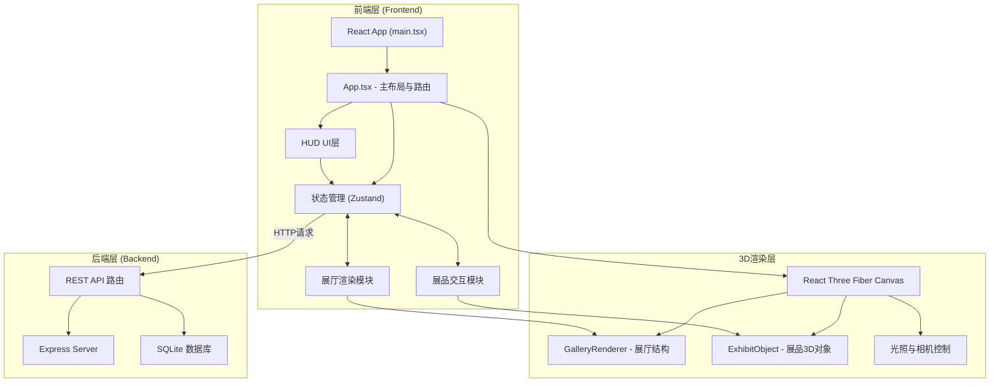
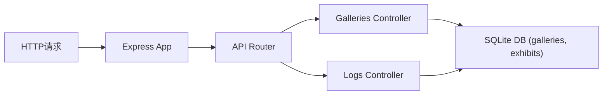
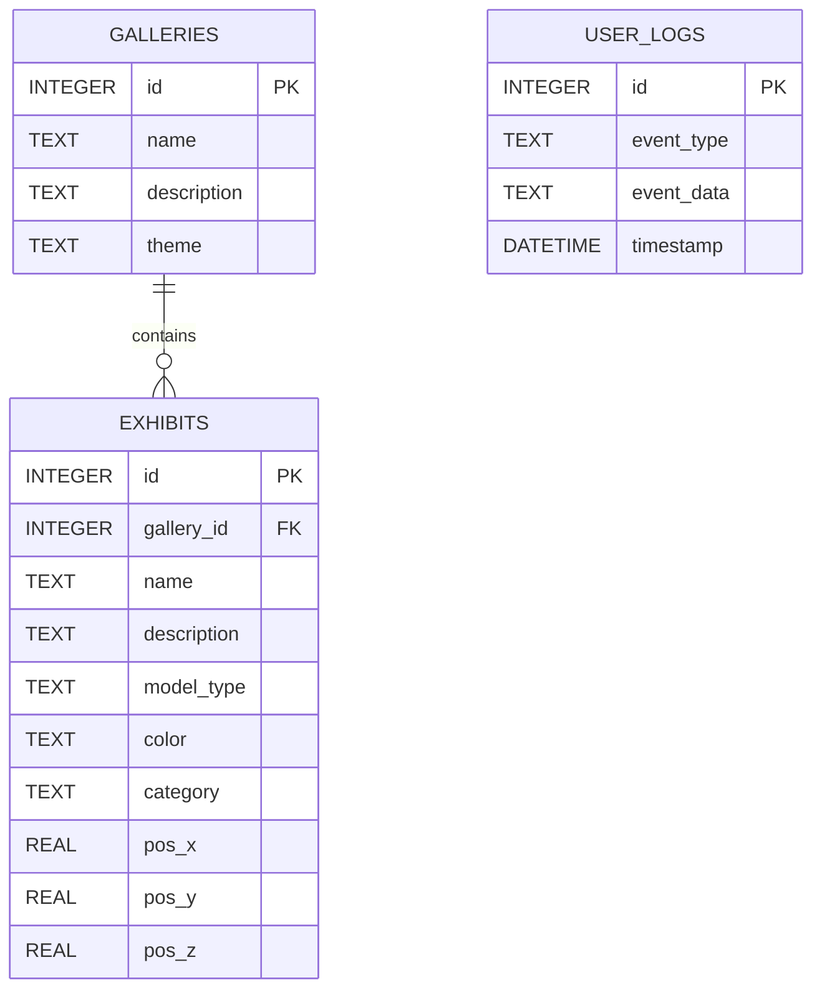

## 1. 架构设计



## 2. 技术描述

- **前端框架**：React@18 + TypeScript@5
- **构建工具**：Vite@5 + @vitejs/plugin-react
- **3D渲染**：three@0.160 + @react-three/fiber@8 + @react-three/drei@9
- **状态管理**：zustand@4
- **后端框架**：Express@4
- **数据库**：sqlite3@5
- **开发模式**：前后端同时启动，Vite配置代理转发至后端3000端口

## 3. 项目文件结构

```
auto61/
├── .trae/documents/
│   ├── PRD.md
│   └── technical-architecture.md
├── server/
│   └── index.ts              # Express后端 + SQLite数据
├── src/
│   ├── components/
│   │   ├── Scene.tsx         # 3D场景容器 (Canvas + 控制)
│   │   ├── GalleryRenderer.tsx # 展厅渲染器 (墙壁/地板/展台)
│   │   ├── ExhibitObject.tsx # 单个展品3D对象
│   │   └── HUD.tsx           # 抬头显示信息面板
│   ├── store/
│   │   └── useStore.ts       # Zustand状态管理
│   ├── App.tsx               # 主布局组件
│   └── main.tsx              # React入口
├── index.html
├── vite.config.js
├── tsconfig.json
└── package.json
```

## 4. 文件间调用关系与数据流向

### 4.1 核心数据流

```
Express API (server/index.ts)
        ↓ (GET /api/galleries, GET /api/galleries/:id)
Zustand Store (src/store/useStore.ts)
        ↓ loadGallery() / selectExhibit()
App.tsx
        ├──→ Scene.tsx (Canvas容器)
        │       ├──→ GalleryRenderer.tsx (展厅结构)
        │       └──→ ExhibitObject.tsx (展品3D对象)
        │               ↓ 鼠标点击/悬停
        │               └──→ store.setSelectedExhibit()
        └──→ HUD.tsx (信息面板)
                ↓ 监听 store.selectedExhibit
                └──→ store.clearSelectedExhibit()
```

### 4.2 模块职责

| 文件 | 职责 | 输入 | 输出 |
|------|------|------|------|
| main.tsx | React入口，挂载App | - | 渲染DOM |
| App.tsx | 主布局，状态分发 | store状态 | Scene, HUD, Sidebar |
| Scene.tsx | 3D场景容器 | exhibits, selectedExhibit, themeMode | Canvas + 3D内容 |
| GalleryRenderer.tsx | 生成展厅空间结构 | gallery配置 | Three.js Group |
| ExhibitObject.tsx | 单个展品渲染与交互 | exhibit数据 | 3D对象 + 事件回调 |
| HUD.tsx | 展品信息面板 | selectedExhibit | UI组件 |
| useStore.ts | 全局状态管理 | actions调用 | state数据 |
| server/index.ts | REST API + 数据库 | HTTP请求 | JSON响应 |

## 5. API定义

### 5.1 类型定义

```typescript
interface Gallery {
  id: number;
  name: string;
  description: string;
  theme: string;
}

interface Exhibit {
  id: number;
  galleryId: number;
  name: string;
  description: string;
  modelType: 'sphere' | 'torus';
  color: string;
  category: 'sculpture' | 'painting' | 'installation';
  position: { x: number; y: number; z: number };
}
```

### 5.2 REST API接口

| 方法 | 路径 | 说明 | 请求参数 | 响应 |
|------|------|------|----------|------|
| GET | /api/galleries | 获取展厅列表 | - | Gallery[] |
| GET | /api/galleries/:id | 获取单展厅展品数据 | id: number | { gallery: Gallery, exhibits: Exhibit[] } |
| POST | /api/logs | 记录用户行为日志 | { type, data, timestamp } | { success: boolean } |

## 6. 服务器架构



## 7. 数据模型

### 7.1 ER图



### 7.2 DDL与初始化数据

```sql
-- 展厅表
CREATE TABLE IF NOT EXISTS galleries (
  id INTEGER PRIMARY KEY AUTOINCREMENT,
  name TEXT NOT NULL,
  description TEXT NOT NULL,
  theme TEXT NOT NULL
);

-- 展品表
CREATE TABLE IF NOT EXISTS exhibits (
  id INTEGER PRIMARY KEY AUTOINCREMENT,
  gallery_id INTEGER NOT NULL,
  name TEXT NOT NULL,
  description TEXT NOT NULL,
  model_type TEXT NOT NULL CHECK(model_type IN ('sphere', 'torus')),
  color TEXT NOT NULL,
  category TEXT NOT NULL CHECK(category IN ('sculpture', 'painting', 'installation')),
  pos_x REAL NOT NULL DEFAULT 0,
  pos_y REAL NOT NULL DEFAULT 0,
  pos_z REAL NOT NULL DEFAULT 0,
  FOREIGN KEY (gallery_id) REFERENCES galleries(id)
);

-- 用户行为日志表
CREATE TABLE IF NOT EXISTS user_logs (
  id INTEGER PRIMARY KEY AUTOINCREMENT,
  event_type TEXT NOT NULL,
  event_data TEXT,
  timestamp DATETIME DEFAULT CURRENT_TIMESTAMP
);

-- 初始化3个展厅，每展厅10个展品
```

## 8. 状态管理(Zustand Store)

```typescript
interface AppState {
  // 展厅状态
  galleries: Gallery[];
  currentGalleryId: number | null;
  currentGallery: Gallery | null;
  exhibits: Exhibit[];
  isLoading: boolean;
  
  // 展品交互
  selectedExhibit: Exhibit | null;
  
  // UI状态
  filterCategory: 'all' | 'sculpture' | 'painting' | 'installation';
  themeMode: 'day' | 'night';
  sidebarCollapsed: boolean;
  
  // Actions
  loadGalleries: () => Promise<void>;
  loadGallery: (id: number) => Promise<void>;
  selectExhibit: (exhibit: Exhibit | null) => void;
  setFilterCategory: (cat: AppState['filterCategory']) => void;
  toggleThemeMode: () => void;
  toggleSidebar: () => void;
  logUserAction: (type: string, data?: any) => void;
}
```

## 9. 性能优化策略

1. **3D对象限制**：每展厅展品+结构≤30个，单展品多边形<500（使用SphereGeometry/TorusGeometry低分段）
2. **材质复用**：墙壁材质、展台材质全局复用，避免重复创建
3. **懒加载**：展厅数据按需加载，切换时清理旧场景
4. **动画优化**：使用requestAnimationFrame帧同步，避免布局抖动
5. **状态最小化**：Zustand按需选择器(selector)避免不必要重渲染
6. **帧率监控**：Three.js Stats插件监控，维持≥45fps
