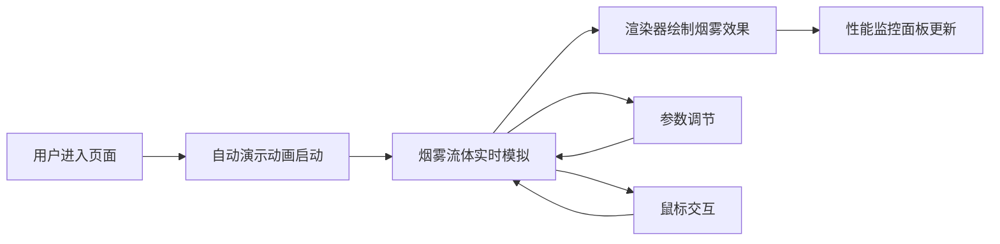

## 1. 产品概述
基于流体力学模拟的实时烟雾特效展示应用，通过Naive Navier-Stokes方程实现2D流体动力学模拟，支持用户交互调节参数生成多样化烟雾动画效果。
- 主要用途：提供可视化流体力学模拟演示，支持实时参数调节和鼠标交互
- 目标用户：对物理模拟、特效展示感兴趣的开发者和设计师
- 市场价值：作为流体动力学算法的可视化演示工具，可用于教学、特效预览等场景

## 2. 核心功能

### 2.1 Feature Module
1. **流体模拟核心**：基于Navier-Stokes方程的2D流体求解器，包含速度场、密度场、压力场计算
2. **实时渲染引擎**：Canvas 2D逐像素渲染，支持颜色渐变和高光效果
3. **UI参数控制面板**：三个滑块控制烟雾密度注入率、扩散速度、风力方向
4. **鼠标交互系统**：点击产生冲击波、拖拽生成烟雾颗粒、高速拖拽产生拖尾特效
5. **性能监控面板**：实时显示FPS和粒子数量，低帧率时闪烁警告

### 2.2 Page Details
| Page Name | Module Name | Feature description |
|-----------|-------------|---------------------|
| 主页面 | 自动演示动画 | 首次进入生成随机方向烟雾流，10秒后衰减 |
| 主页面 | 鼠标点击交互 | 点击位置80px半径内密度提升至0.9，产生径向冲击波 |
| 主页面 | 鼠标拖拽交互 | 拖拽轨迹生成半径15px羽化圆形烟雾，速度>200px/s时产生拖尾 |
| 主页面 | 参数控制面板 | 三个滑块实时调节烟雾参数，平滑过渡无跳变 |
| 主页面 | 性能监控 | 右下角显示FPS和粒子数，FPS<30时红色闪烁 |

## 3. Core Process

用户进入页面 → 自动演示动画启动 → 观察烟雾流动效果 → 通过滑块调节参数 → 鼠标点击/拖拽与烟雾交互 → 实时观察流体行为变化 → 性能监控面板显示运行状态

## 4. User Interface Design

### 4.1 Design Style
- 主色调：深色科技风格，背景#0d1117
- 辅助色：滑钮#ff6b6b，高光#ffeedd，FPS正常#4caf50，FPS警告#f44336，粒子数#ff9800
- 控件风格：半透明毛玻璃控制面板，圆角设计，平滑过渡动画
- 字体：无衬线字体，标签14px，数值显示清晰易读
- 布局：全屏Canvas，左上角控制面板，右下角性能监控

### 4.2 Page Design Overview
| Page Name | Module Name | UI Elements |
|-----------|-------------|-------------|
| 主页面 | 全屏Canvas | 宽100vw，高100vh，居中显示烟雾模拟 |
| 主页面 | 控制面板 | 左上角固定，宽280px，背景rgba(30,30,30,0.85)，圆角16px，毛玻璃效果，内边距20px |
| 主页面 | 滑块控件 | 背景#2a2a2a，滑钮半径12px，数值显示在滑钮右侧圆角6px背景#1e1e1e |
| 主页面 | 性能面板 | 右下角，半透明背景圆角8px，FPS右对齐 |

### 4.3 Responsiveness
- Desktop-first设计，Canvas自适应视口大小
- 控制面板固定定位，不随滚动条移动
- 触摸设备支持触摸拖拽交互

### 4.4 Visual Effects
- 烟雾颜色从深灰#333333到浅灰#cccccc渐变插值
- 密度>0.9时叠加淡黄色高光#ffeedd
- 鼠标悬停控制面板时不透明度从0.85提升至0.95，过渡0.3s ease
- 滑块参数变化过渡动画0.2s ease
- FPS<30时闪烁效果，周期0.5秒，透明度0.6-1循环
