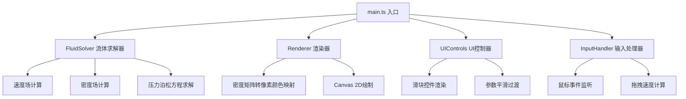

## 1. Architecture Design

## 2. Technology Description
- 前端：TypeScript + Vite + Canvas 2D API
- 初始化工具：Vite vanilla-ts模板
- 核心算法：Naive Navier-Stokes方程有限差分法求解
- 压力求解：Gauss-Seidel迭代法求解泊松方程，迭代步数≤20
- 渲染方式：逐像素操作ImageData，支持颜色渐变插值

## 3. File Structure

| File Path | Purpose |
|-----------|---------|
| `package.json` | 项目依赖：typescript, vite, @types/node |
| `vite.config.js` | Vite构建配置，输出到dist目录 |
| `tsconfig.json` | TypeScript严格模式，target ES2020 |
| `index.html` | 入口页面，全屏Canvas |
| `src/solver.ts` | 流体求解器，Navier-Stokes方程实现 |
| `src/renderer.ts` | 渲染器，密度矩阵到Canvas像素映射 |
| `src/uiControls.ts` | UI控制模块，滑块组件实现 |
| `src/main.ts` | 入口文件，初始化和动画循环 |

## 4. Core Algorithm Specifications

### 4.1 流体求解器 (solver.ts)
- 模拟网格：100x100（可配置）
- 场数据结构：Float32Array存储速度场(u, v)、密度场(d)、压力场(p)
- 时间步长：timeStep控制模拟精度，默认0.01
- 求解步骤：
  1. 扩散项 (diffuse)：显式有限差分
  2. 平流项 (advect)：半拉格朗日方法
  3. 投影步 (project)：求解压力泊松方程，使速度场无散度
  4. 外力项：风力、鼠标注入速度

### 4.2 压力泊松方程求解
- 方程：∇²p = ∇·u / Δt
- 离散化：使用五点差分格式
- 迭代方法：Gauss-Seidel迭代，最多20次迭代
- 边界条件：Dirichlet边界条件，p=0

### 4.3 颜色映射 (renderer.ts)
- 密度值范围：[0, 1]
- 灰度渐变：d ∈ [0, 1] → 从#333333到#cccccc线性插值
- 高光叠加：d > 0.9时，叠加#ffeedd颜色，透明度随d线性增加
- 边缘羽化：使用高斯衰减函数

### 4.4 UI滑块 (uiControls.ts)
- 参数平滑：使用线性插值，过渡时间0.1秒
- 滑钮位置：数值显示在滑钮右侧，圆角背景#1e1e1e
- 过渡动画：CSS transition 0.2s ease

### 4.5 性能指标
- 目标帧率：60FPS
- 最低帧率：30FPS
- 单帧计算时间：≤15ms
- 压力迭代步数：≤20
