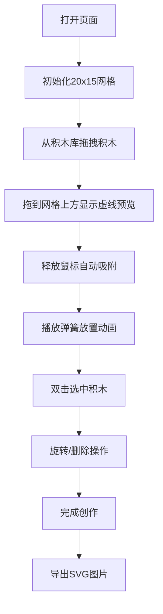

## 1. 产品概述

虚拟乐高搭建器是一个基于浏览器的2D创意工具，让用户能够通过拖拽方式在网格画布上放置不同颜色和形状的积木块，构建创意造型并导出为SVG图片分享。

- 主要目的：提供一个简单易用的在线积木搭建体验，满足用户的创意表达需求
- 目标用户：喜欢创意搭建、积木爱好者、教育场景的普通用户
- 市场价值：轻量级、无需安装，随时随地进行创意搭建和分享

## 2. 核心功能

### 2.1 功能模块

1. **主画布区域**：20x15网格画布，支持积木放置、缩放和平移
2. **积木库面板**：左侧展示四种基础积木，每种6个可拖拽副本
3. **操作栏**：撤销、重做、清空画布、导出SVG
4. **交互系统**：拖拽吸附、弹簧动画、双击删除、旋转图标

### 2.2 页面详情

| 页面名称 | 模块名称 | 功能描述 |
|-----------|-------------|---------------------|
| 主页面 | 网格画布 | 20x15网格，支持积木放置、缩放（0.5x-2x）、平移（中键或Ctrl+左键拖拽）、边界弹性回弹 |
| 主页面 | 积木库面板 | 四种积木类型展示，库存管理，拖拽开始事件处理 |
| 主页面 | 操作栏 | 撤销/重做（Ctrl+Z/Y）、清空确认、SVG导出 |
| 主页面 | 交互反馈 | 拖拽半透明、放置弹簧动画、删除旋转淡出、选中高亮 |

## 3. 核心流程

用户从左侧积木库拖拽积木到网格画布 → 积木自动吸附到网格交叉点 → 放置成功播放弹簧动画 → 用户可双击选中积木进行旋转或删除 → 完成创作后导出SVG分享

## 4. 用户界面设计

### 4.1 设计风格

- **主色调**：白色背景 + 浅灰辅助色
- **积木颜色**：鲜艳饱和（红#ff5252、蓝#448aff、绿#69f0ae、紫#b388ff）
- **按钮风格**：圆角8px，背景#eceff1，悬停#cfd8dc
- **字体**：系统默认无衬线字体
- **布局风格**：三栏布局（左方面板 + 中央画布 + 底部操作栏）
- **圆角统一**：12px（操作栏和侧面板）

### 4.2 页面设计概述

| 页面名称 | 模块名称 | UI元素 |
|-----------|-------------|-------------|
| 主页面 | 网格画布 | 20x15网格（50px格子，浅灰#e0e0e0网格线），缩放百分比显示（12px字号） |
| 主页面 | 积木库面板 | 宽280px，背景#f5f5f5，圆角12px，内边距16px，自定义细滚动条#ccc |
| 主页面 | 操作栏 | 高60px，背景#fff，上阴影2px，四个功能按钮 |
| 主页面 | 交互效果 | 拖拽半透明（0.6）、虚线预览（#ff6f00，2px）、弹簧动画（0.2s）、删除旋转淡出（0.3s） |

### 4.3 响应性

- Desktop-first设计，窗口调整大小时画布自动重新居中，保持比例不变

### 4.4 性能要求

- 拖拽和放置操作帧率保持在55FPS以上
- 网格上同时存在80个积木块时不出现卡顿

