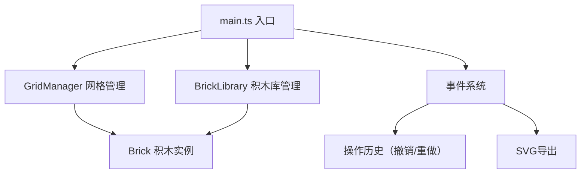

## 1. 架构设计



## 2. 技术描述

- **前端**：TypeScript + 原生Canvas API + Vite
- **无第三方UI框架**：使用原生DOM和Canvas实现
- **依赖库**：
  - typescript: TypeScript编译器
  - vite: 构建工具和开发服务器
  - @types/node: Node.js类型定义
  - file-saver: 文件保存功能

## 3. 文件结构

```
/
├── package.json          # 项目依赖和脚本
├── vite.config.js        # Vite构建配置
├── tsconfig.json        # TypeScript配置
├── index.html           # 入口HTML
└── src/
    ├── main.ts          # 应用入口，初始化和事件绑定
    ├── grid.ts          # GridManager类，网格渲染和管理
    ├── brick.ts         # Brick类，积木实例和绘制
    └── library.ts     # BrickLibrary类，积木库管理
```

## 4. 核心类定义

### 4.1 GridManager (grid.ts)

```typescript
class GridManager {
  // 网格尺寸：20列 x 15行
  // 格子大小：50x50px
  // 网格线：#e0e0e0，1px
  // 二维数组存储积木占用情况
  // 方法：绘制网格、吸附点计算、碰撞检测
}
```

### 4.2 Brick (brick.ts)

```typescript
class Brick {
  // 属性：类型、颜色、位置（行列索引）、尺寸（占格数）
  // 方法：绘制自身（圆角4px，1px边框）
  // 高亮状态切换
  // 删除动画（旋转90度淡出）
}
```

### 4.3 BrickLibrary (library.ts)

```typescript
class BrickLibrary {
  // 管理四种积木类型，每种6个副本
  // 创建可拖拽副本
  // 更新库存显示
  // 响应拖拽开始和放置事件
}
```

## 5. 数据结构

### 5.1 积木类型定义

```typescript
type BrickType = 'square2x2' | 'rect2x4' | 'flat1x2' | 'small1x1';

interface BrickConfig {
  type: BrickType;
  color: string;
  width: number;  // 占格数
  height: number; // 占格数
  name: string;
}
```

### 5.2 操作历史

```typescript
interface HistoryState {
  bricks: Brick[];
}
```

