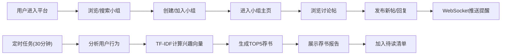

## 1. 产品概述

基于语义分析的在线读书会讨论与荐书平台，用户可创建或加入读书小组，围绕书籍章节进行异步讨论，系统基于用户阅读习惯和讨论内容自动生成个性化荐书报告。旨在为读书爱好者提供深度交流空间和精准阅读推荐。

## 2. 核心功能

### 2.1 用户角色
| 角色 | 注册方式 | 核心权限 |
|------|----------|----------|
| 普通用户 | 默认登录 | 创建/加入小组、发布讨论帖、回复、查看荐书、管理待读清单 |

### 2.2 功能模块
1. **小组管理模块**：创建小组、搜索加入小组、小组主页展示
2. **讨论模块**：发布讨论帖、Markdown正文、回复功能、WebSocket实时提醒
3. **荐书模块**：用户行为分析、TF-IDF算法推荐、荐书报告展示
4. **待读清单模块**：加入待读、取消待读、侧边栏展示、跳转豆瓣

### 2.3 页面详情
| 页面名称 | 模块名称 | 功能描述 |
|----------|----------|----------|
| 首页 | 小组列表 | 展示可加入小组、搜索过滤、创建小组入口 |
| 小组主页 | 小组详情 | 成员列表、本周热帖（按回复数排序，热帖带🔥图标） |
| 讨论帖页面 | 讨论模块 | 帖子列表、新建帖子、回复列表、Markdown渲染 |
| 我的荐书 | 荐书模块 | 个性化问候、TOP5荐书卡片、推荐理由 |
| 待读清单 | 侧边栏 | 待读书籍列表、按时间倒序、跳转豆瓣 |

## 3. 核心流程

## 4. 用户界面设计

### 4.1 设计风格
- 主色调：#ff7043（橙色），辅色：#fff3e0（浅橙），文字色：#3e2723（深棕）
- 卡片圆角：讨论帖卡片12px，荐书卡片16px，小组卡片16px
- 字体：标题使用Google Fonts的Playfair Display，正文使用Source Sans Pro
- 布局：卡片式布局，顶部固定导航栏，左侧可折叠侧边栏
- 图标：使用lucide-react图标库，配合emoji增强情感表达

### 4.2 页面设计概述
| 页面名称 | 模块名称 | UI元素 |
|----------|----------|--------|
| 小组列表页 | 小组卡片 | 宽320px，圆角16px，阴影hover上移4px，两列布局 |
| 讨论帖页面 | 帖子卡片 | 背景#fff8e1，圆角12px，左侧用户头像，右侧滑入动画 |
| 荐书页面 | 荐书卡片 | 宽220px，圆角16px，左侧封面占位#e0e0e0，加入待读按钮 |
| 回复区域 | 回复动画 | 底部向上弹出0.4秒弹性动画，相对时间标签 |

### 4.3 响应式
- Desktop-first设计，断点768px
- 移动端：小组列表单列，帖子卡片100%宽度，字体14px，隐藏楼数信息
- 触控优化：按钮最小高度44px，手势友好

### 4.4 动画规范
- 新帖滑入：右侧滑入淡出，0.3秒过渡
- 回复弹出：底部向上弹性动画，0.4秒
- 按钮反馈：加入待读缩放0.2秒，取消待读水平翻转0.3秒
- 导航栏：选中项下划线滑动动画
- 所有动画使用framer-motion实现
