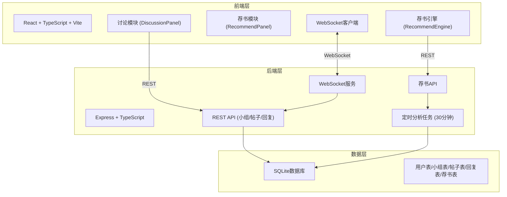
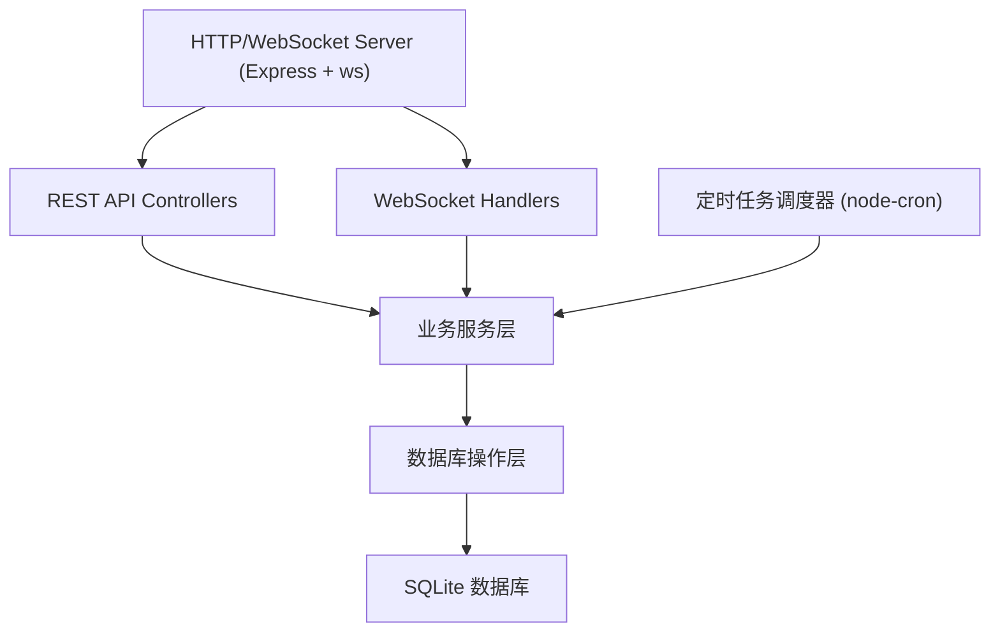
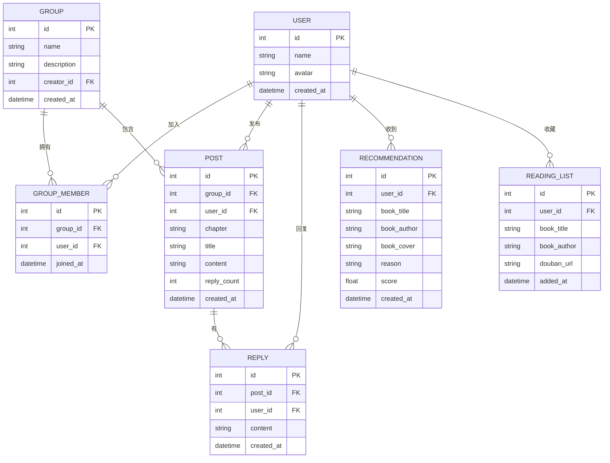

## 1. 架构设计



## 2. 技术描述

- 前端：React@18 + TypeScript + Vite + framer-motion + react-markdown + socket.io-client
- 后端：Express@4 + TypeScript + SQLite3 + ws (WebSocket)
- 构建工具：Vite
- 状态管理：zustand
- 样式：CSS Modules + CSS Variables
- 图标：lucide-react

## 3. 路由定义

| 路由 | 用途 |
|------|------|
| / | 首页，小组列表 |
| /group/:id | 小组主页 |
| /group/:id/discussion | 讨论帖列表页 |
| /recommendations | 我的荐书页面 |

## 4. API 定义

```typescript
// 小组相关
interface Group {
  id: number;
  name: string;
  description: string;
  memberCount: number;
  createdAt: string;
}

// 帖子相关
interface Post {
  id: number;
  groupId: number;
  userId: number;
  chapter: string;
  title: string;
  content: string;
  replyCount: number;
  createdAt: string;
  author: User;
}

// 回复相关
interface Reply {
  id: number;
  postId: number;
  userId: number;
  content: string;
  createdAt: string;
  author: User;
}

// 用户相关
interface User {
  id: number;
  name: string;
  avatar?: string;
}

// 荐书相关
interface BookRecommendation {
  id: number;
  userId: number;
  bookId: string;
  title: string;
  author: string;
  coverUrl: string;
  reason: string;
  score: number;
  createdAt: string;
}

// API Endpoints
GET    /api/groups                  // 获取小组列表
GET    /api/groups?search=xxx       // 搜索小组
POST   /api/groups                  // 创建小组
POST   /api/groups/:id/join         // 加入小组
GET    /api/groups/:id              // 小组详情+成员+热帖
GET    /api/groups/:id/posts        // 获取小组帖子
POST   /api/groups/:id/posts        // 发布新帖
GET    /api/posts/:id/replies       // 获取帖子回复
POST   /api/posts/:id/replies       // 发表回复
GET    /api/recommendations/:userId // 获取用户荐书
POST   /api/reading-list            // 添加待读
DELETE /api/reading-list/:id        // 取消待读
GET    /api/reading-list/:userId    // 获取待读清单
```

## 5. 服务器架构图



## 6. 数据模型

### 6.1 数据模型定义



### 6.2 DDL 语句

```sql
CREATE TABLE IF NOT EXISTS users (
  id INTEGER PRIMARY KEY AUTOINCREMENT,
  name TEXT NOT NULL,
  avatar TEXT,
  created_at DATETIME DEFAULT CURRENT_TIMESTAMP
);

CREATE TABLE IF NOT EXISTS groups (
  id INTEGER PRIMARY KEY AUTOINCREMENT,
  name TEXT NOT NULL,
  description TEXT,
  creator_id INTEGER NOT NULL,
  created_at DATETIME DEFAULT CURRENT_TIMESTAMP,
  FOREIGN KEY (creator_id) REFERENCES users(id)
);

CREATE TABLE IF NOT EXISTS group_members (
  id INTEGER PRIMARY KEY AUTOINCREMENT,
  group_id INTEGER NOT NULL,
  user_id INTEGER NOT NULL,
  joined_at DATETIME DEFAULT CURRENT_TIMESTAMP,
  FOREIGN KEY (group_id) REFERENCES groups(id),
  FOREIGN KEY (user_id) REFERENCES users(id),
  UNIQUE(group_id, user_id)
);

CREATE TABLE IF NOT EXISTS posts (
  id INTEGER PRIMARY KEY AUTOINCREMENT,
  group_id INTEGER NOT NULL,
  user_id INTEGER NOT NULL,
  chapter TEXT,
  title TEXT NOT NULL,
  content TEXT NOT NULL,
  reply_count INTEGER DEFAULT 0,
  created_at DATETIME DEFAULT CURRENT_TIMESTAMP,
  FOREIGN KEY (group_id) REFERENCES groups(id),
  FOREIGN KEY (user_id) REFERENCES users(id)
);

CREATE TABLE IF NOT EXISTS replies (
  id INTEGER PRIMARY KEY AUTOINCREMENT,
  post_id INTEGER NOT NULL,
  user_id INTEGER NOT NULL,
  content TEXT NOT NULL,
  created_at DATETIME DEFAULT CURRENT_TIMESTAMP,
  FOREIGN KEY (post_id) REFERENCES posts(id),
  FOREIGN KEY (user_id) REFERENCES users(id)
);

CREATE TABLE IF NOT EXISTS recommendations (
  id INTEGER PRIMARY KEY AUTOINCREMENT,
  user_id INTEGER NOT NULL,
  book_title TEXT NOT NULL,
  book_author TEXT NOT NULL,
  book_cover TEXT,
  reason TEXT,
  score REAL NOT NULL,
  created_at DATETIME DEFAULT CURRENT_TIMESTAMP,
  FOREIGN KEY (user_id) REFERENCES users(id)
);

CREATE TABLE IF NOT EXISTS reading_list (
  id INTEGER PRIMARY KEY AUTOINCREMENT,
  user_id INTEGER NOT NULL,
  book_title TEXT NOT NULL,
  book_author TEXT NOT NULL,
  douban_url TEXT,
  added_at DATETIME DEFAULT CURRENT_TIMESTAMP,
  FOREIGN KEY (user_id) REFERENCES users(id),
  UNIQUE(user_id, book_title, book_author)
);

-- 索引
CREATE INDEX IF NOT EXISTS idx_posts_group_id ON posts(group_id);
CREATE INDEX IF NOT EXISTS idx_replies_post_id ON replies(post_id);
CREATE INDEX IF NOT EXISTS idx_recommendations_user_id ON recommendations(user_id);
CREATE INDEX IF NOT EXISTS idx_reading_list_user_id ON reading_list(user_id);
```
