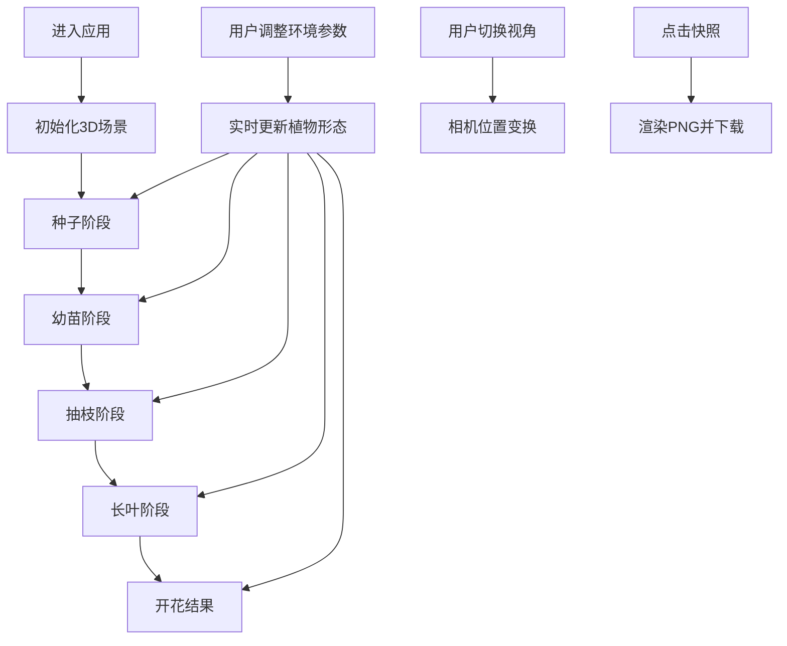

## 1. 产品概述
3D交互式植物生长模拟应用，让用户在网页中直观观察植物从种子到成熟的全过程，提供生动、可交互的视觉反馈。面向教育、科普和园艺爱好者，提供沉浸式的植物生长体验。

## 2. 核心功能

### 2.1 功能模块
1. **3D生长动画场景**：种子萌发→幼苗→抽枝→长叶→开花结果，分阶段动态呈现
2. **环境控制面板**：光照、水分、温度参数调节，实时影响植物形态
3. **多视角观察系统**：鼠标拖拽旋转、滚轮缩放、快捷视角切换
4. **快照分享功能**：一键生成PNG图片并下载

### 2.2 页面详情
| 页面名称 | 模块名称 | 功能描述 |
|-----------|-------------|---------------------|
| 主页面 | 3D场景区 | 居中展示植物生长3D动画，占页面80%宽度，支持鼠标交互 |
| 主页面 | 控制面板 | 右侧固定250px半透明面板，包含生长速度按钮、环境参数滑块、视角切换、快照按钮 |

## 3. 核心流程
用户进入页面后默认开始中速生长动画，可随时调整环境参数观察植物变化，支持拖拽旋转视角查看不同角度，生长完成后可生成快照保存。

## 4. 用户界面设计
### 4.1 设计风格
- 主色调：深绿色(#0d3b1e)到浅绿色(#8bc34a)的渐变背景，营造自然森林氛围
- 控件风格：半透明玻璃效果(backdrop-filter: blur)，圆角12px
- 按钮交互：悬停显示柔光动画(glow)，点击缩小回弹(scale 0.95→1)
- 背景：径向渐变叠加轻微噪点纹理

### 4.2 页面设计概述
| 页面名称 | 模块名称 | UI元素 |
|-----------|-------------|-------------|
| 主页面 | 3D场景区 | Three.js WebGL渲染器，绿色渐变背景，土壤平面 |
| 主页面 | 控制面板 | 半透明玻璃卡片、滑块控件(group)、按钮组、状态标签 |

### 4.3 响应式
- 桌面端：控制面板固定右侧250px
- 移动端：控制面板折叠为底部半高条，点击展开全屏面板，触控手势优化

### 4.4 3D场景指引
- 环境：半球光+方向光组合，模拟自然光照
- 光照强度随用户参数动态调整
- 相机：PerspectiveCamera，初始距离适中
- 轨道控制：OrbitControls，Y轴360度旋转，X轴±60度限制
- 植物组件：茎干(圆柱体)、叶片(拉伸几何体)、花朵(球体+锥体组合)、果实(球体)
- 性能目标：40FPS+，响应时间<150ms
