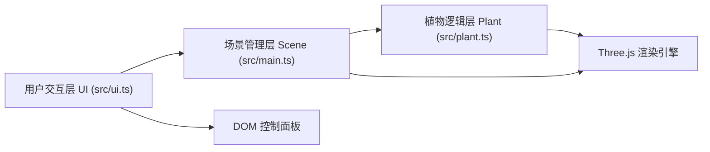

## 1. 架构设计
本项目为纯前端3D应用，采用模块化分层架构。



## 2. 技术描述
- **前端框架**：无(原生TypeScript) + Three.js
- **构建工具**：Vite 5
- **类型系统**：TypeScript 5 (严格模式)
- **3D库**：Three.js 最新版 + @types/three
- **初始化方式**：手动创建项目文件结构（非Vite模板）

## 3. 文件组织
| 文件 | 职责 |
|-------|---------|
| package.json | 依赖定义与脚本配置 |
| index.html | 入口HTML，挂载3D画布和控制面板DOM |
| vite.config.js | Vite构建配置 |
| tsconfig.json | TypeScript编译配置（严格模式） |
| src/main.ts | 场景初始化：场景/相机/渲染器/控制器/动画循环 |
| src/plant.ts | 植物类：生长阶段逻辑、几何体创建、参数响应 |
| src/ui.ts | UI层：控制面板创建、事件绑定、快照导出 |

## 4. 核心数据结构

### 4.1 环境参数 (EnvironmentParams)
```typescript
interface EnvironmentParams {
  light: number;      // 0-100 光照强度，影响叶片颜色
  water: number;      // 0-100 水分值，影响茎干高度和叶片数量
  temperature: number;// 0-100 温度，影响开花时间
}
```

### 4.2 生长阶段枚举
```typescript
enum GrowthStage {
  SEED = 0,      // 种子
  SPROUT = 1,    // 幼苗
  BRANCHING = 2, // 抽枝
  LEAFY = 3,     // 长叶
  FLOWERING = 4, // 开花结果
}
```

### 4.3 植物类接口
```typescript
interface IPlant {
  growthProgress: number;       // 0-1 整体生长进度
  currentStage: GrowthStage;    // 当前阶段
  update(dt: number, speed: GrowthSpeed): void;
  setEnvironment(params: EnvironmentParams): void;
  getMesh(): THREE.Group;
  reset(): void;
}
```

## 5. 性能优化策略
- 几何体复用：同种类型的叶片、花朵使用共享几何体
- 材质池：预创建不同光照等级的叶片材质，动态切换而非重建
- 动画节流：生长进度每帧更新，形态重建仅在阶段切换或参数变化时执行
- 渲染优化：使用MeshStandardMaterial，关闭不必要的阴影计算
- 帧率监控：requestAnimationFrame循环内使用deltaTime确保生长速度独立于帧率

## 6. 快照导出方案
使用Three.js渲染器的domElement.toDataURL('image/png')方法获取画布数据，创建临时<a>标签触发下载，文件名包含时间戳。
