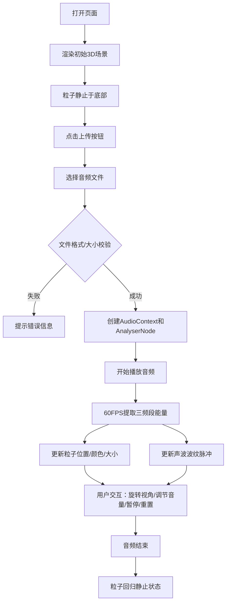

## 1. 产品概述

基于Web的3D音乐可视化应用，让用户上传音频文件并欣赏由彩色粒子构成的动态喷泉随音乐节奏变幻的视觉效果。
- 目标用户：音乐爱好者、科技艺术迷、创意工作者
- 核心价值：将音频转化为沉浸式的3D视觉艺术体验，创造赛博朋克风格的视听享受

## 2. 核心功能

### 2.1 用户角色
本项目无需用户注册登录，所有访问者均为普通用户。

### 2.2 功能模块
1. **音频处理模块**：音频文件上传、Web Audio API频谱分析、三频段能量提取
2. **3D粒子喷泉模块**：1000个粒子的生成、位置更新、颜色映射、大小动态变化
3. **声波波纹模块**：三层环形声波的脉冲式缩放动画
4. **场景渲染模块**：深空背景、星光粒子、雾化效果、相机控制
5. **控制面板模块**：文件上传、播放/暂停、音量控制、视角重置

### 2.3 页面详情

| 页面名称 | 模块名称 | 功能描述 |
|-----------|-------------|---------------------|
| 主页面 | 3D视口 | 全屏Three.js渲染场景，支持鼠标拖拽旋转视角 |
| 主页面 | 控制面板 | 左下角毛玻璃面板，包含上传、播放、音量、重置按钮 |
| 主页面 | 粒子喷泉 | 中央粒子系统，随音频三频段能量动态变化 |
| 主页面 | 声波波纹 | 三层环形波纹，脉冲式缩放 |
| 主页面 | 背景星空 | 深空渐变背景，50颗闪烁星光 |

## 3. 核心流程

用户打开页面 → 看到静止的粒子喷泉和星空背景 → 点击上传按钮选择音频文件（≤10MB的MP3/WAV）→ 系统自动解析音频并开始播放 → 粒子喷泉随音乐节奏喷涌变幻 → 用户可拖拽旋转视角/调节音量/暂停播放/重置视角 → 播放结束后粒子回归静止

## 4. 用户界面设计

### 4.1 设计风格
- **主色调**：深空渐变背景（顶部#0F0F23、底部#1A1A3E）
- **强调色**：蓝色#3182CE、青色#00D4FF、紫色#8B5CF6、品红#FF007F、黄色#FFD700、橙色#FF4500
- **按钮风格**：深灰#2D3748背景圆角8px按钮、圆形播放按钮40px、悬停/点击有交互动画
- **控制面板**：半透明毛玻璃效果#1A1A2ECC、圆角16px、内边距20px、固定于左下角距边20px
- **字体**：现代无衬线字体，深色主题搭配霓虹色调
- **整体氛围**：赛博朋克风格、沉浸式、霓虹感、科技感

### 4.2 页面设计概述

| 页面名称 | 模块名称 | UI元素 |
|-----------|-------------|-------------|
| 主页面 | 3D视口 | 全屏Canvas、深空渐变背景、雾化效果、鼠标阻尼旋转 |
| 主页面 | 控制面板 | 毛玻璃半透明面板、上传按钮、圆形播放按钮、音量滑块、重置按钮 |
| 主页面 | 粒子喷泉 | 1000个Points材质粒子、大小衰减、颜色渐变、随音频律动 |
| 主页面 | 声波波纹 | 三层半透明环形、发光边缘、脉冲缩放动画 |
| 主页面 | 背景星光 | 50颗白色粒子、缓慢旋转、4秒闪烁周期 |

### 4.3 响应式
- Desktop-first设计，全屏渲染无多余边距
- 控制面板固定定位，适配不同屏幕尺寸
- 鼠标交互支持桌面端，响应窗口resize事件

### 4.4 3D场景指引
- **环境**：深空渐变背景（顶部#0F0F23→底部#1A1A3E），雾化起始距离20单位、密度0.02
- **光照**：AmbientLight基础环境光 + PointLight点光源增强粒子立体感
- **相机**：PerspectiveCamera，初始位置(0, 2, 10)，OrbitControls阻尼0.1，可360°旋转
- **构图**：粒子喷泉位于坐标原点，三层波纹环绕Y=2/3/4高度，星光散布远处
- **交互**：鼠标拖拽旋转视角、滚轮缩放、右键平移；点击重置按钮相机1秒平滑归位
- **动画**：粒子喷涌（速度1-5单位/秒）、波纹脉冲缩放（0.8-1.5倍）、星光闪烁（4秒周期）
- **性能**：1000粒子+3层波纹维持≥55FPS，无音频时暂停粒子计算
