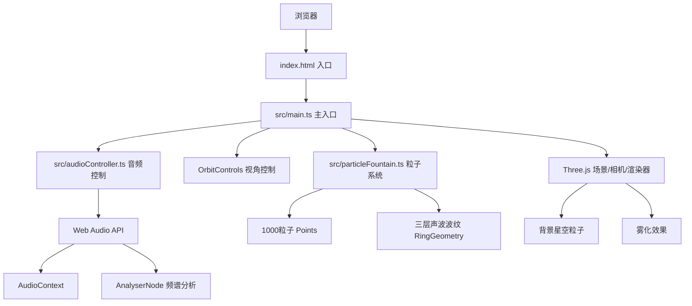

## 1. 架构设计



## 2. 技术描述
- **前端框架**：原生TypeScript（无UI框架）+ Three.js 0.160+
- **构建工具**：Vite 5.x（开发服务器端口3000）
- **音频处理**：Web Audio API（AudioContext、AnalyserNode）
- **3D渲染**：Three.js（Points材质、RingGeometry、OrbitControls、FogExp2）
- **样式**：原生CSS（毛玻璃backdrop-filter、CSS过渡动画）
- **无后端**：纯前端应用，所有处理在浏览器端完成

## 3. 项目文件结构

```
auto100/
├── package.json              # 项目依赖与脚本
├── index.html                # 入口HTML（全屏Canvas）
├── vite.config.js            # Vite配置（端口3000）
├── tsconfig.json             # TypeScript配置（严格模式）
└── src/
    ├── main.ts               # 主入口：场景初始化、动画循环、UI事件
    ├── audioController.ts    # 音频加载、频谱分析、三频段能量提取
    └── particleFountain.ts   # 粒子系统、声波波纹的创建与更新
```

## 4. 核心数据结构与接口

### 4.1 FrequencyData 接口
```typescript
interface FrequencyData {
  low: number;    // 低频 20-250Hz 归一化能量 0-1
  mid: number;    // 中频 250-2000Hz 归一化能量 0-1
  high: number;   // 高频 2000-20000Hz 归一化能量 0-1
  volume: number; // 整体音量 0-1
}
```

### 4.2 AudioController 类
- `constructor()`: 初始化状态
- `async loadFile(file: File): Promise<void>`: 加载并解码音频文件
- `play(): void`: 播放音频
- `pause(): void`: 暂停音频
- `setVolume(value: number): void`: 设置音量(0-100)
- `getFrequencyData(): FrequencyData`: 获取当前帧三频段能量
- `isPlaying: boolean`: 播放状态
- `hasAudio: boolean`: 是否已加载音频

### 4.3 ParticleFountain 类
- `constructor(scene: THREE.Scene)`: 创建1000粒子和3层波纹
- `update(freq: FrequencyData, delta: number): void`: 每帧更新粒子和波纹
- `dispose(): void`: 清理资源

## 5. 关键技术实现方案

### 5.1 频谱分析
- AnalyserNode.fftSize = 256 → 128个频率bin
- 采样率44100Hz → bin频率间隔≈172Hz
- 低频bin: 0-1 (20-250Hz)，中频bin: 2-11 (250-2000Hz)，高频bin: 12-127 (2000Hz+)
- 每频段取平均幅值后归一化到0-1

### 5.2 粒子系统
- THREE.BufferGeometry存储1000粒子的position/color/size属性
- THREE.PointsMaterial + vertexColors: true + sizeAttenuation: true
- 每个粒子维护：velocity(xyz)、lifetime、frequencyBand归属
- 生命周期：底部生成→向上喷涌→到达高度上限→水平扩散→回到底部重生

### 5.3 声波波纹
- THREE.RingGeometry(内径2.8, 外径3.0, 60段) × 3层
- 半透明MeshBasicMaterial + 发光效果模拟
- 缩放平滑插值（lerp）实现0.1秒延迟响应

### 5.4 相机复位动画
- 记录初始相机position和target
- 使用requestAnimationFrame在1秒内lerp过渡到初始值
- 缓动函数：ease-out (1 - Math.pow(1 - t, 3))

## 6. 性能优化
- BufferGeometry批量渲染1000粒子，单次Draw Call
- 无音频时跳过粒子物理计算，仅渲染静态画面
- 60FPS使用requestAnimationFrame，delta时间控制运动速度
- 颜色计算使用THREE.Color.lerpColors预计算渐变
