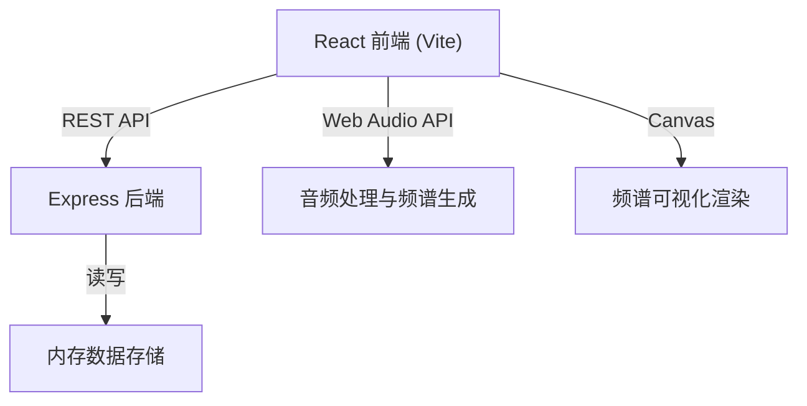
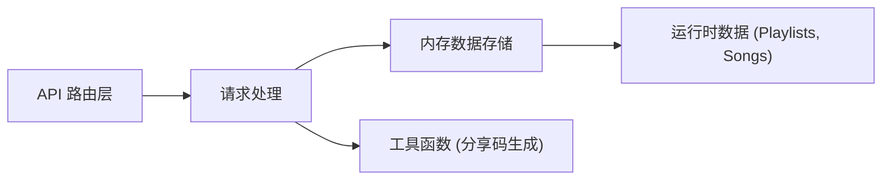
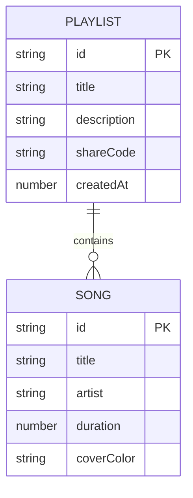

## 1. 架构设计



## 2. 技术说明

- **前端框架**：React@18 + TypeScript + Vite
- **状态管理**：React useState/useEffect（轻量级，符合用户指定架构）
- **样式方案**：原生 CSS（用户指定具体颜色值和样式）
- **后端**：Express@4 + TypeScript
- **数据存储**：内存存储（运行时）
- **音频处理**：Web Audio API (OscillatorNode + AnalyserNode)
- **可视化**：Canvas API
- **后端运行**：tsx 执行 TypeScript

## 3. 文件结构

```
auto101/
├── package.json          # 依赖配置与启动脚本
├── index.html            # 入口HTML
├── tsconfig.json         # TypeScript配置
├── vite.config.js        # Vite构建配置
├── server/
│   └── server.ts         # Express后端API
└── src/
    ├── App.tsx           # 主组件与全局状态
    ├── MusicPlayer.tsx   # 播放器组件
    ├── PlaylistCard.tsx  # 播放列表卡片
    ├── SongList.tsx      # 歌曲列表组件
    └── main.tsx          # React入口
```

## 4. API 定义

### 类型定义

```typescript
interface Song {
  id: string;
  title: string;
  artist: string;
  duration: number;  // 秒
  coverColor: string;
}

interface Playlist {
  id: string;
  title: string;
  description: string;
  shareCode: string;
  songs: Song[];
  createdAt: number;
}
```

### RESTful API

| 方法 | 路由 | 用途 | 请求体 | 响应 |
|-----|------|------|--------|------|
| GET | /api/songs/search?q=xxx | 搜索歌曲 | - | `Song[]` |
| GET | /api/playlists | 获取所有播放列表 | - | `Playlist[]` |
| POST | /api/playlists | 创建播放列表 | `{title, description}` | `Playlist` |
| GET | /api/playlists/:id | 获取单个列表 | - | `Playlist` |
| POST | /api/playlists/:id/songs | 添加歌曲 | `{song}` | `Playlist` |
| DELETE | /api/playlists/:id/songs/:songId | 删除歌曲 | - | `Playlist` |
| PUT | /api/playlists/:id/reorder | 重新排序 | `{songIds: string[]}` | `Playlist` |
| GET | /api/share/:code | 通过分享码获取 | - | `Playlist` |

## 5. 服务端架构



## 6. 数据模型

### 6.1 实体关系



### 6.2 预置示例歌曲数据

| 曲名 | 艺术家 | 时长 | 封面颜色 |
|------|--------|------|---------|
| Midnight Dreams | Luna Wave | 245 | #6366F1 |
| Electric Sunset | Neon Pulse | 198 | #EC4899 |
| Ocean Breeze | Coastal Vibes | 312 | #06B6D4 |
| Urban Nights | City Lights | 267 | #F59E0B |
| Mountain Echo | Alpine Sound | 289 | #10B981 |
| Starlight | Cosmic Journey | 223 | #8B5CF6 |
| Rainy Day | Ambient Mood | 334 | #64748B |
| Summer Heat | Tropical Beat | 201 | #EF4444 |
