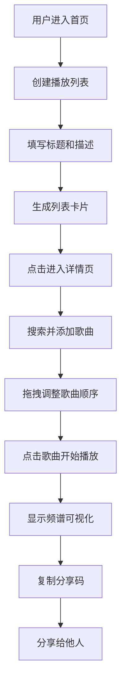

## 1. 产品概述

一个浏览器端音乐播放列表创建与分享应用，为音乐爱好者提供带有同步视觉体验（实时频谱跳动、动态展示）的歌单分享功能。

- 主要目标：让用户能够创建个性化播放列表，并通过实时频谱可视化增强音乐聆听体验
- 目标用户：音乐爱好者、歌单创作者
- 核心价值：将音乐与视觉体验结合，提供更具沉浸感的歌单分享方式

## 2. 核心功能

### 2.1 功能模块

1. **播放列表管理**：创建、查看多个播放列表
2. **歌曲管理**：搜索添加、删除、拖拽排序歌曲
3. **音乐播放器**：播放控制、进度条、实时频谱可视化
4. **分享功能**：生成分享码、一键复制分享链接

### 2.2 页面详情

| 页面名称 | 模块名称 | 功能描述 |
|---------|---------|---------|
| 列表首页 | 创建表单区 | 输入标题和描述创建新播放列表 |
| 列表首页 | 卡片网格区 | 展示所有播放列表卡片，点击进入详情 |
| 列表详情页 | 搜索添加区 | 实时搜索歌曲并添加到列表 |
| 列表详情页 | 歌曲列表区 | 展示歌曲、支持拖拽排序和删除 |
| 全局 | 浮动播放条 | 底部播放器、进度控制、频谱可视化 |

## 3. 核心流程

用户创建播放列表 → 添加歌曲 → 点击歌曲开始播放 → 查看实时频谱 → 复制分享码分享给他人

## 4. 用户界面设计

### 4.1 设计风格

- **主色调**：暗色主题，背景 `#1A202C`，卡片 `#2D3748`
- **强调色**：渐变橙红 `#E53E3E` 至 `#DD6B20`
- **文字颜色**：浅灰 `#E2E8F0`
- **辅助色**：淡蓝 `#63B3ED`（悬停发光），浅灰 `#4A5568`（虚线占位符）
- **按钮样式**：圆角设计，悬停时发光效果
- **字体**：使用现代无衬线字体，层次分明
- **布局风格**：卡片式布局，左侧操作区 + 右侧卡片网格
- **图标**：使用 lucide-react 图标库

### 4.2 页面设计概览

| 页面名称 | 模块名称 | UI 元素 |
|---------|---------|---------|
| 列表首页 | 创建表单 | 标题输入框、描述文本域、创建按钮、渐变强调色 |
| 列表首页 | 卡片网格 | 深灰卡片、圆角12px、悬停上移3px+淡蓝发光、歌曲数量角标 |
| 列表详情页 | 搜索区 | 搜索框、实时搜索建议下拉、添加按钮 |
| 列表详情页 | 歌曲列表 | 每行卡片（序号、封面色块、曲名、艺术家、删除按钮）、拖拽排序 |
| 全局 | 播放条 | 半透明毛玻璃、圆角16px、90%居中、渐变进度条、128条频谱柱状图 |

### 4.3 响应式设计

- **桌面端（>768px）**：卡片网格多列布局，播放条宽度90%，频谱图高度150px
- **移动端（≤768px）**：卡片网格单列，播放条宽度95%，频谱图高度80px

### 4.4 动画与交互

- 详情页过渡：淡入上升动画（0.3s ease-out）
- 卡片悬停：上移3px + 淡蓝外发光
- 频谱图：每帧更新，60FPS，颜色从底部红色渐变至顶部黄色
- 拖拽效果：被拖拽卡片半透明，其他卡片移位，虚线占位符
- Toast提示：绿色"已复制"提示
