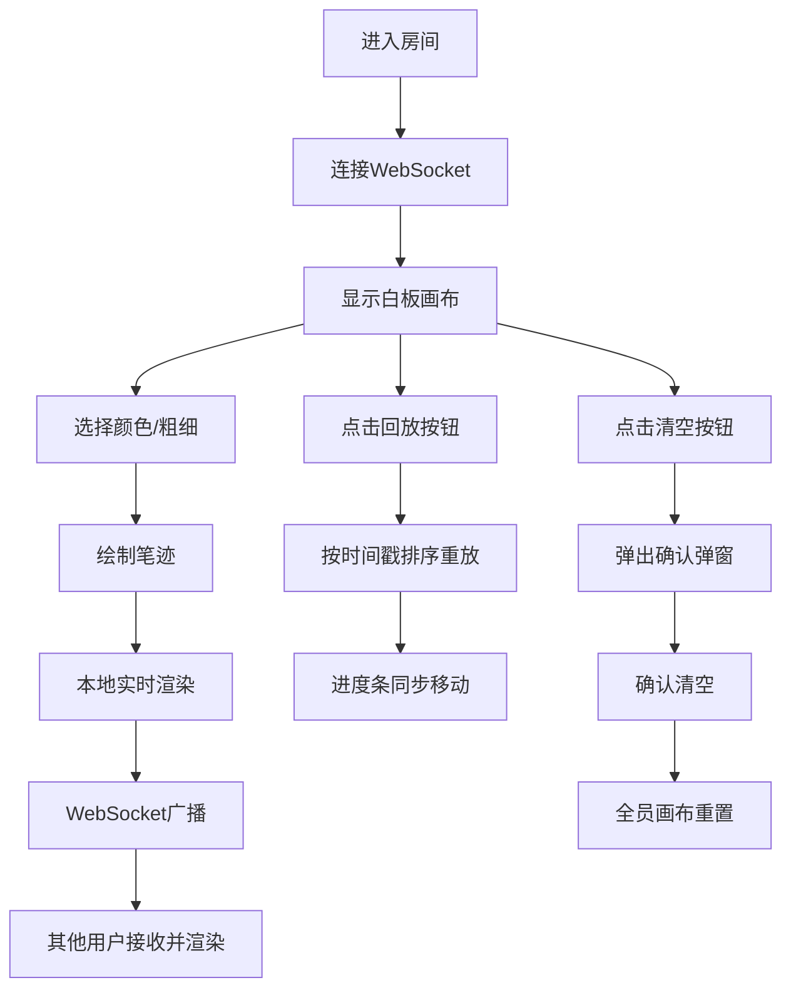

## 1. 产品概述
微型在线协作简笔画白板与回放系统，为设计师团队提供实时同步的简笔画协作工具。
- 主要目的：让远程设计师团队能够实时协作画简笔画，记录创意过程，支持历史回放复盘
- 解决的问题：远程协作时创意表达困难，无法追溯脑暴过程
- 目标用户：设计师团队、远程协作团队

## 2. 核心功能

### 2.1 用户角色
| 角色 | 加入方式 | 核心权限 |
|------|----------|----------|
| 普通用户 | 进入房间即可 | 绘制、查看他人笔迹、回放历史、清空画布 |

### 2.2 功能模块
1. **协作白板页面**：画布区域、左侧工具栏、底部回放控制条
2. **实时同步**：WebSocket笔迹广播、多用户透明度区分
3. **回放系统**：播放/暂停控制、进度条、2倍速重放
4. **清空功能**：确认弹窗、全员同步清空

### 2.3 页面详情
| 页面名称 | 模块名称 | 功能描述 |
|----------|----------|----------|
| 协作白板 | 画布区域 | 浅灰#F0F0F0背景，自适应窗口大小，支持鼠标和触摸绘制 |
| 协作白板 | 左侧工具栏 | 6种颜色选择、3种笔刷粗细、清空按钮，切换动画0.2s |
| 协作白板 | 底部回放控制条 | 播放/暂停按钮、进度滑块、2倍速回放、最长60秒 |
| 协作白板 | 清空确认弹窗 | 居中浮层，白色背景，圆角16px，阴影效果 |

## 3. 核心流程
用户进入房间后看到白板画布，通过左侧工具栏选择颜色和笔刷粗细，按住鼠标或触摸绘制，笔迹实时显示并通过WebSocket广播给其他用户。用户可点击底部回放控制条重放所有笔迹。点击清空按钮触发确认弹窗，确认后清空画布和历史记录。

## 4. 用户界面设计

### 4.1 设计风格
- 主色调：浅灰#F0F0F0（画布）、白色#FFFFFF（侧边栏/弹窗）
- 色板：红#FF6B6B、蓝#339AF0、绿#51CF66、橙#FF922B、紫#CC5DE8、黑#212529
- 按钮样式：圆形颜色选择器、矩形粗细按钮，悬停上浮2px，阴影#00000040
- 字体：系统默认无衬线字体，简洁现代
- 布局风格：左侧固定工具栏、中央画布、底部浮动回放条
- 过渡效果：所有按钮和滑块0.2s ease微过渡

### 4.2 页面设计概述
| 页面名称 | 模块名称 | UI元素 |
|----------|----------|--------|
| 协作白板 | 画布区域 | 浅灰背景、无边框、全屏自适应 |
| 协作白板 | 左侧工具栏 | 垂直排列、白色背景、圆角、阴影、颜色/粗细按钮组、清空按钮 |
| 协作白板 | 底部回放控制条 | 半透明白色背景、圆角、播放/暂停按钮、进度滑块 |
| 协作白板 | 清空确认弹窗 | 居中浮层、白色背景、圆角16px、阴影、确认/取消按钮 |

### 4.3 响应式设计
- 桌面端优先设计，移动端自适应
- 画布支持触摸事件，触摸点平滑跟随
- 工具栏在小屏幕上保持可用尺寸

## 4.4 性能要求
- 同时5人绘制时FPS不低于30
- WebSocket消息延迟不超过100ms
- 回放最长不超过60秒
