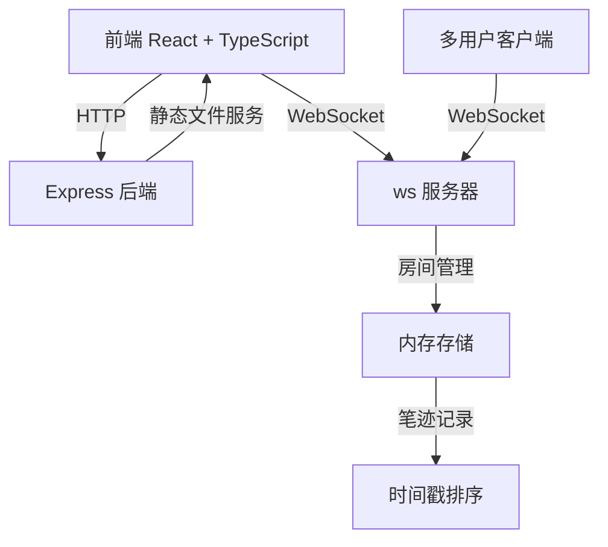
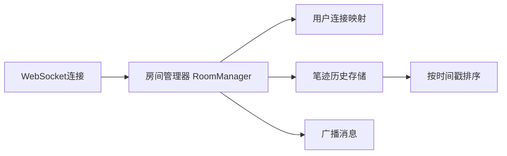

## 1. 架构设计



## 2. 技术描述
- 前端：React@18 + TypeScript + Vite
- 后端：Express@4 + ws (WebSocket库)
- 工具库：nanoid（生成唯一ID）
- 初始化工具：vite-init
- 数据存储：内存存储（房间、笔迹记录）

## 3. 路由定义
| 路由 | 用途 |
|------|------|
| / | 前端主页面，静态文件服务 |
| /ws | WebSocket连接端点 |
| /api/room/:roomId/strokes | 获取房间历史笔迹（可选） |

## 4. API定义（WebSocket消息协议）

### 4.1 消息类型定义
```typescript
// 坐标点
interface Point {
  x: number;
  y: number;
  timestamp: number;
}

// 笔迹数据
interface Stroke {
  id: string;
  userId: string;
  color: string;
  thickness: number;
  points: Point[];
  startTime: number;
  endTime: number;
}

// WebSocket消息类型
type WSMessage =
  | { type: 'join'; roomId: string; userId: string }
  | { type: 'stroke-start'; stroke: Stroke }
  | { type: 'stroke-point'; strokeId: string; point: Point }
  | { type: 'stroke-end'; strokeId: string }
  | { type: 'clear-canvas'; roomId: string }
  | { type: 'init-strokes'; strokes: Stroke[] };
```

## 5. 服务器架构


## 6. 项目文件结构

```
.
├── package.json              # 项目依赖和脚本
├── index.html                # HTML入口
├── vite.config.js            # Vite配置（代理/api和/ws）
├── tsconfig.json             # TypeScript配置
├── server/
│   └── server.ts             # Express + WebSocket后端
└── src/
    ├── App.tsx               # 主组件，房间连接和回放控制
    ├── Canvas.tsx            # Canvas画布组件
    ├── Toolbar.tsx           # 工具栏组件
    └── Playback.tsx          # 回放控制组件
```

## 7. 数据模型

### 7.1 内存数据结构
```typescript
interface Room {
  id: string;
  users: Map<string, WebSocket>;
  strokes: Stroke[];
  createdAt: number;
}

interface User {
  id: string;
  roomId: string;
  ws: WebSocket;
}
```
