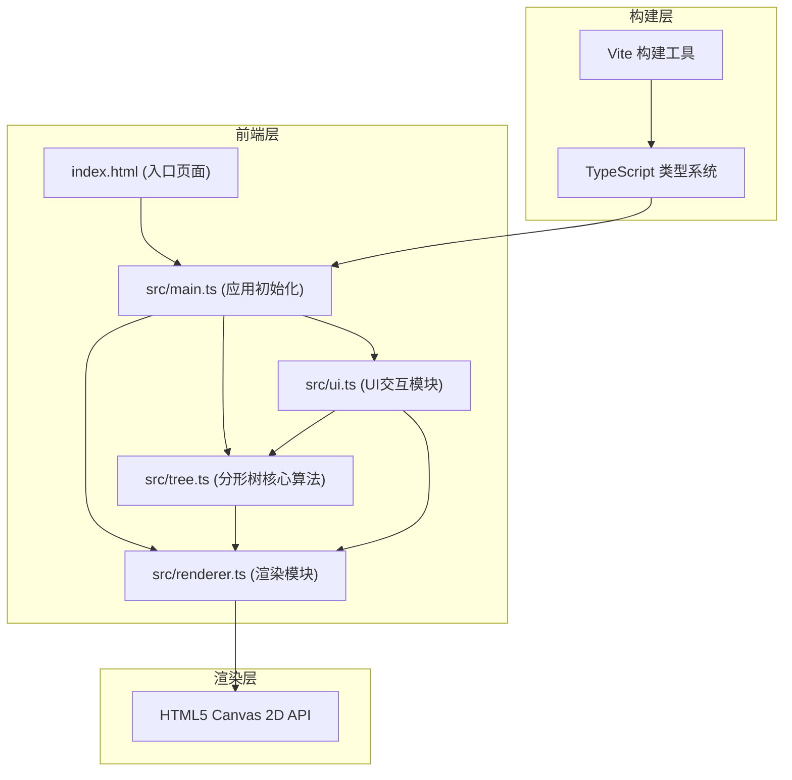

## 1. 架构设计



## 2. 技术描述
- **前端**：TypeScript（严格模式）+ HTML5 Canvas 2D + Vite
- **初始化工具**：Vite vanilla-ts 模板
- **后端**：无（纯前端应用）
- **数据库**：无（本地运行，无持久化存储）

## 3. 项目文件结构
| 文件路径 | 用途 |
|----------|------|
| `/package.json` | 项目依赖与脚本（typescript、vite，启动：npm run dev） |
| `/index.html` | 入口页面，包含Canvas和UI面板DOM结构 |
| `/vite.config.js` | Vite构建配置 |
| `/tsconfig.json` | TypeScript配置（严格模式，DOM+ESNext类型） |
| `/src/main.ts` | 应用入口：创建Canvas、事件监听、启动主循环 |
| `/src/tree.ts` | 分形树核心：递归生成树枝数据结构、修剪逻辑、预设模板参数 |
| `/src/renderer.ts` | 渲染模块：Canvas绘制树、粒子特效、过渡动画、悬停高亮 |
| `/src/ui.ts` | UI交互：滑块、按钮、面板显示、数据绑定、触发重绘与保存 |

## 4. 核心数据结构

### 4.1 树枝节点 (BranchNode)
```typescript
interface BranchNode {
  id: number;
  startX: number;
  startY: number;
  endX: number;
  endY: number;
  depth: number;
  angle: number;
  length: number;
  parentId: number | null;
  children: BranchNode[];
  opacity: number;
  isPruning: boolean;
  pruneStartTime: number;
}
```

### 4.2 分形树参数 (TreeParams)
```typescript
interface TreeParams {
  depth: number;        // 递归深度 1-8
  angle: number;        // 分支角度 10-80度
  lengthRatio: number;  // 长度比 0.3-1.0
  trunkLength: number;  // 主干长度 30-100px
}
```

### 4.3 粒子 (Particle)
```typescript
interface Particle {
  x: number;
  y: number;
  vx: number;
  vy: number;
  size: number;
  color: string;
  life: number;
  maxLife: number;
  rotation: number;
  rotationSpeed: number;
}
```

### 4.4 预设模板 (PresetTemplate)
```typescript
interface PresetTemplate {
  name: string;
  color: string;
  params: TreeParams;
}
```

## 5. 核心接口定义

### 5.1 src/tree.ts 模块
```typescript
// 生成整棵分形树
function generateTree(params: TreeParams, centerX: number, groundY: number): BranchNode;

// 修剪指定节点及其所有子节点
function pruneBranch(root: BranchNode, branchId: number): BranchNode;

// 获取树统计信息
function getTreeStats(root: BranchNode): {
  totalBranches: number;
  totalNodes: number;
  maxHeight: number;
  avgAngle: number;
  currentDepth: number;
};

// 预设模板
const PRESETS: PresetTemplate[];
```

### 5.2 src/renderer.ts 模块
```typescript
// 渲染树
function renderTree(ctx: CanvasRenderingContext2D, root: BranchNode, hoveredId: number | null): void;

// 渲染粒子
function renderParticles(ctx: CanvasRenderingContext2D, particles: Particle[]): void;

// 开始过渡动画
function startTransition(fromTree: BranchNode, toParams: TreeParams, duration: number): void;

// 更新过渡动画状态
function updateTransition(elapsed: number): BranchNode | null;

// 创建修剪粒子
function createPruneParticles(x: number, y: number): Particle[];

// 更新粒子
function updateParticles(particles: Particle[], deltaTime: number): Particle[];
```

### 5.3 src/ui.ts 模块
```typescript
// 初始化UI
function initUI(params: TreeParams, onParamsChange: (p: TreeParams) => void, onPreset: (p: TreeParams) => void, onSave: () => void): void;

// 更新统计信息
function updateStats(stats: TreeStats): void;

// 显示保存成功动画
function showSaveSuccess(): void;

// 响应式布局适配
function handleResponsiveLayout(): void;
```

## 6. 性能优化策略
1. **离屏缓存**：静态树枝状态缓存到离屏Canvas，仅参数变化时重算
2. **对象池**：粒子对象复用，减少GC压力
3. **requestAnimationFrame**：使用标准主循环，保证60FPS
4. **增量渲染**：过渡动画采用插值计算，而非每帧重新生成整棵树
5. **Hit-test优化**：使用空间分区或逐级筛选加速枝干拾取
