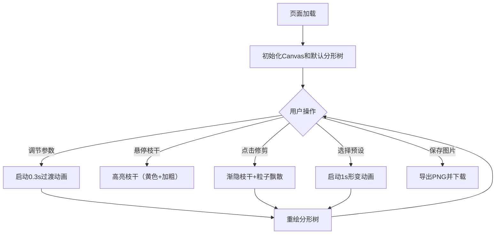

## 1. 产品概述

交互式分形树可视化工具，专为计算机图形学爱好者和创意编程者设计，解决学习递归分形与L-system时缺乏可直接运行、可交互调节参数的可视化演示工具的问题。通过实时Canvas渲染、参数调节、交互式修剪和预设模板，让用户直观理解分形几何原理并创作出独特的树形艺术。

## 2. 核心功能

### 2.1 用户角色
| 角色 | 核心权限 |
|------|----------|
| 图形学学习者 | 浏览、调节参数、修剪树木、保存作品、使用预设模板 |

### 2.2 功能模块
1. **主画布区域**：全屏Canvas渲染分形树、粒子特效、悬停高亮、过渡动画
2. **控制面板**：参数滑块、数值输入、预设模板按钮、统计信息展示、保存按钮
3. **交互系统**：鼠标悬停枝干高亮、点击修剪、叶子粒子飘散效果
4. **动画引擎**：参数变化过渡动画、预设模板形变动画、修剪渐隐动画

### 2.3 页面详情
| 页面名称 | 模块名称 | 功能描述 |
|-----------|-------------|---------------------|
| 主页面 | Canvas画布 | 实时渲染分形树，背景#1A202C，支持悬停高亮和点击修剪 |
| 主页面 | 侧边控制面板 | 显示参数滑块（递归深度、分支角度、长度比、主干长度）、数值输入框、统计信息、预设模板按钮、保存按钮 |
| 主页面 | 响应式布局 | 桌面端右侧面板，移动端（<768px）底部可折叠工具栏 |

## 3. 核心流程

用户打开应用 → 默认渲染一棵分形树（深度6，主干50px，角度30°，长度比0.7） → 用户可通过滑块/输入框调整参数（平滑过渡动画0.3s） → 用户可悬停枝干查看高亮 → 用户点击枝干末端触发修剪（渐隐0.5s + 叶子粒子1s） → 用户可点击预设模板切换树形（1s平滑动画） → 用户可点击保存按钮导出PNG图片。

## 4. 用户界面设计

### 4.1 设计风格
- **主色调**：深灰背景 #1A202C，面板半透明深灰 rgba(45,55,72,0.8)
- **强调色**：蓝色 #3182CE（滑块/按钮）、悬停亮蓝 #63B3ED
- **树形配色**：根部深棕 #8B4513 → 末端嫩绿 #48BB78 渐变
- **高亮色**：黄色 #F6E05E（悬停枝干）
- **粒子色**：嫩绿 #48BB78、金黄 #ECC94B
- **预设按钮色**：红 #E53E3E、绿 #38A169、紫 #805AD5
- **文字色**：浅灰 #E2E8F0
- **按钮风格**：圆角、悬停变亮、点击缩放0.9反馈
- **滑块风格**：蓝色轨道、白色圆形旋钮、悬停轨道变亮
- **面板风格**：毛玻璃效果、圆角8px、边框#4A5568、内边距20px

### 4.2 页面设计概述
| 页面名称 | 模块名称 | UI元素 |
|-----------|-------------|-------------|
| 主页面 | Canvas画布 | 全屏背景#1A202C，居中渲染分形树，支持鼠标交互 |
| 主页面 | 侧边面板 | 固定右侧280px宽，毛玻璃背景，包含：顶部3个预设按钮、4组参数滑块+数值输入、统计信息区（总枝干数、总节点数、最高高度、平均分支角度、当前递归深度）、底部保存按钮 |
| 主页面 | 响应式布局 | <768px时面板变为底部水平可折叠工具栏 |

### 4.3 响应性
桌面优先设计，窗口宽度<768px时，右侧控制面板变为底部水平面板并折叠为可展开的工具栏，触摸操作友好优化。

## 5. 性能要求
- 递归深度8级时，树生成和绘制时间≤150ms
- 常规帧率稳定60FPS
- 修剪动画+粒子特效（≤100个粒子）时帧率≥55FPS
