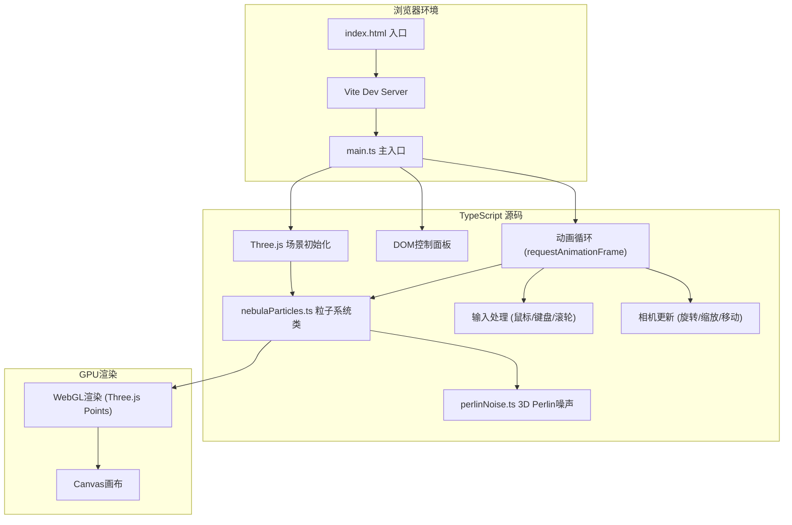

## 1. 架构设计



## 2. 技术说明

- **前端框架**：原生 TypeScript（无React/Vue，纯Three.js项目）
- **3D引擎**：Three.js @0.160+
- **构建工具**：Vite @5+
- **语言**：TypeScript @5+（严格模式，target ESNext）
- **后端**：无（纯前端项目）
- **数据库**：无

## 3. 目录结构

```
├── index.html              # 入口HTML，包含Canvas和控制面板容器
├── package.json            # 依赖与脚本配置
├── vite.config.js          # Vite构建配置
├── tsconfig.json           # TypeScript配置
└── src/
    ├── main.ts             # 主入口：场景/相机/渲染器/输入/UI
    ├── nebulaParticles.ts  # 星云粒子系统核心类
    └── perlinNoise.ts      # 3D Perlin噪声实现
```

## 4. 核心类与接口定义

### 4.1 NebulaParticles 类

```typescript
type NebulaType = 'spiral' | 'ring' | 'chaos';

interface NebulaConfig {
  type: NebulaType;
  particleCount: number;
  diffusionSpeed: number;
}

class NebulaParticles {
  public points: THREE.Points;
  private positions: Float32Array;
  private targetPositions: Float32Array;
  private colors: Float32Array;
  private sizes: Float32Array;
  private baseSizes: Float32Array;

  constructor(scene: THREE.Scene);
  public generate(type: NebulaType): void;
  public update(delta: number, camera: THREE.Camera, speedMultiplier: number): void;
  public fadeOut(duration: number): Promise<void>;
  public burstIn(duration: number): Promise<void>;
  public dispose(): void;

  private generateSpiral(): void;
  private generateRing(): void;
  private generateChaos(): void;
  private updateColorsByDistance(camera: THREE.Camera): void;
  private updateSizeTwinkle(delta: number): void;
}
```

### 4.2 PerlinNoise 模块

```typescript
export function perlinNoise3D(x: number, y: number, z: number): number;
```

## 5. 性能优化策略

1. **TypedArray存储**：使用Float32Array存储位置/颜色/大小数据，减少GC压力
2. **BufferGeometry**：使用THREE.BufferGeometry而非Geometry，GPU友好
3. **单Draw Call**：所有粒子在单个Points对象中渲染
4. **AdditiveBlending**：无需深度写入，减少overdraw开销
5. **数学计算优化**：预计算渐变查找表，避免每帧重复颜色插值
6. **帧率控制**：使用deltaTime计算，确保不同帧率下动画速度一致

## 6. 输入处理

| 输入类型 | 行为 | 参数 |
|----------|------|------|
| 鼠标左键拖拽 | 水平/垂直旋转相机 | 水平360°，垂直-60°~60°，阻尼0.95 |
| 鼠标滚轮 | 缩放相机距离 | 范围0.5x~4x，平滑插值0.08 |
| W/A/S/D键 | XZ平面移动相机 | 基础速度0.5单位/帧，Shift加速1.2 |
| 预设按钮点击 | 切换星云类型 | 淡出1.5s + 展开1.2s |
| 滑块拖动 | 调整扩散速度 | 范围0.5x~3.0x，实时生效 |
