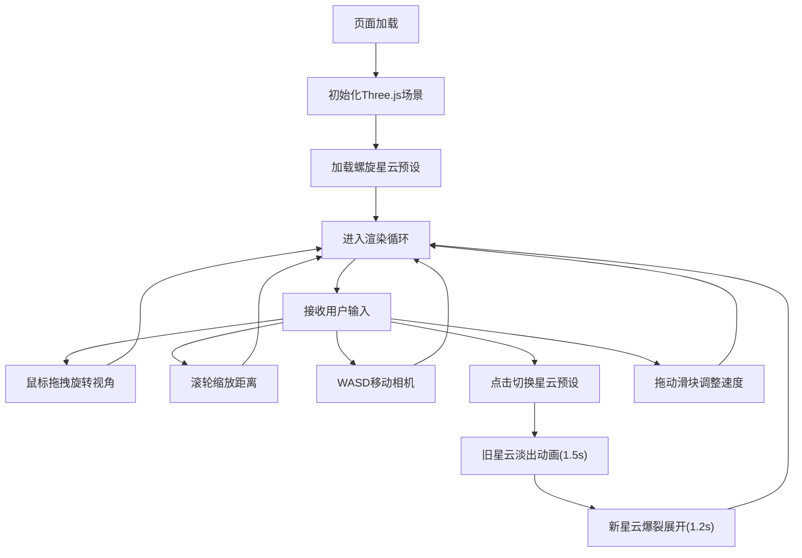

## 1. 产品概述

交互式3D星云粒子画廊，面向天文爱好者和数字艺术家，在浏览器中沉浸式体验三种形态各异的星云粒子系统。用户可自由穿梭、旋转视角、切换预设，营造太空漫游的沉浸感。

- 目标用户：天文爱好者、数字艺术家、对宇宙美学感兴趣的普通用户
- 产品价值：提供无需安装的沉浸式3D宇宙漫游体验，将艺术与科学可视化结合

## 2. 核心功能

### 2.1 用户角色

| 角色 | 注册方式 | 核心权限 |
|------|----------|----------|
| 访客用户 | 无需注册 | 浏览星云、切换预设、自由操控视角、调整参数 |

### 2.2 功能模块

1. **3D星云粒子系统**：螺旋星云、环状星云、混沌星云三种预设
2. **视角操控**：鼠标拖拽旋转、滚轮缩放、WASD键盘移动
3. **切换动画**：星云淡出消散 + 新星云爆裂展开
4. **控制面板**：预设切换按钮、粒子扩散速度滑块、FPS显示
5. **视觉效果**：距离感知颜色渐变、粒子闪烁、光晕、星空背景

### 2.3 页面详情

| 页面名称 | 模块名称 | 功能描述 |
|----------|----------|----------|
| 主界面 | 3D画布 | 全屏3D渲染，星云粒子系统展示 |
| 主界面 | 控制面板 | 左下角悬浮面板，包含预设切换按钮、速度滑块、FPS显示 |
| 主界面 | 星空背景 | 200颗微小白点缓慢旋转的纯黑背景 |

## 3. 核心流程

用户打开页面 → 初始加载螺旋星云 → 通过鼠标拖拽/滚轮/WASD自由漫游 → 点击控制面板按钮切换星云预设（旧星云淡出+新星云展开）→ 拖动滑块调整粒子扩散速度 → 持续体验沉浸漫游。

## 4. 用户界面设计

### 4.1 设计风格

- **主色调**：纯黑背景 #000000，深空氛围
- **强调色**：紫红 #FF6B9C（螺旋）、暖黄 #FFD54F（环状）、青绿 #00E676（混沌）
- **渐变带**：深蓝 #0A0A2E → 浅紫 #9C27B0 → 亮粉 #FF6F91（256级距离采样）
- **按钮风格**：圆形 48px，悬停放大1.1倍+白色外发光，点击缩放回弹
- **字体**：monospace（FPS显示），14px 白色
- **布局**：全屏沉浸式画布，左下角半透明控制面板
- **视觉风格**：宇宙深空、粒子发光、极简科技感

### 4.2 页面设计概述

| 页面名称 | 模块名称 | UI元素 |
|----------|----------|--------|
| 主界面 | 3D画布 | 全屏Canvas，背景纯黑，粒子带光晕，视差移动 |
| 主界面 | 控制面板 | 深灰半透明 #1E1E1E(0.85)，圆角16px，内边距20px |
| 主界面 | 预设按钮 | 3个圆形按钮(48px)，颜色分别为紫红/暖黄/青绿 |
| 主界面 | 速度滑块 | 宽度160px，轨道 #333333，滑块直径20px |
| 主界面 | FPS显示 | 左上角白色monospace字体14px |
| 主界面 | 星空背景 | 200颗白点(0.5px, 0.4透明度)绕Y轴缓慢旋转 |

### 4.3 响应式

- Desktop-first设计，Canvas自适应视口大小
- 控制面板固定左下角，移动端适当缩小
- 触摸设备支持单指拖拽旋转、双指缩放

### 4.4 3D场景指引

- **环境**：纯黑背景，无光源，粒子自发光
- **光照**：粒子使用Additive Blending实现发光效果，无需场景光源
- **相机**：PerspectiveCamera，初始距离5单位，FOV 75°
- **相机运动**：轨道式旋转(水平360°，垂直±60°)，缩放0.5x-4x，WASD在XZ平面移动
- **粒子渲染**：Points + ShaderMaterial / PointsMaterial，AdditiveBlending
- **后处理**：无需后处理，通过粒子材质透明度和AdditiveBlending实现辉光感
- **性能预算**：≤8000粒子，每帧更新≤2ms，帧率≥55FPS
