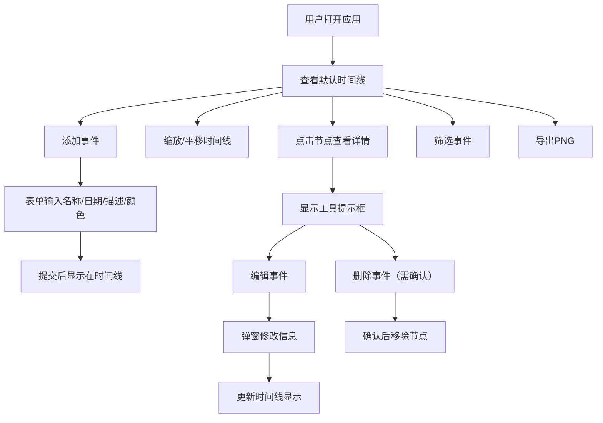

## 1. 产品概述

交互式时间线可视化应用，让用户能够创建、管理和可视化个人或项目的重要事件节点。通过直观的时间线界面，用户可以添加、编辑、删除事件，并支持缩放、平移、筛选和导出功能。

- 主要用途：事件管理与可视化展示
- 目标用户：需要跟踪项目进度、记录个人重要事件、展示历史时间线的用户
- 产品价值：将零散事件以可视化时间线方式呈现，便于理解时间脉络和事件关联

## 2. 核心功能

### 2.1 用户角色
| 角色 | 注册方式 | 核心权限 |
|------|----------|----------|
| 普通用户 | 无需注册 | 完整使用所有功能，事件数据存储于浏览器本地 |

### 2.2 功能模块
1. **事件管理模块**：事件添加表单、事件编辑、事件删除（含确认）
2. **时间线可视化模块**：D3时间线轴、事件节点圆点、连接线、工具提示框
3. **交互控制模块**：滚轮缩放、拖拽平移、事件点击选中、右键菜单
4. **筛选模块**：按年份筛选、按颜色标签筛选
5. **导出模块**：导出PNG图片（含标题、图例、可见事件）

### 2.3 页面详情
| 页面名称 | 模块名称 | 功能描述 |
|----------|----------|----------|
| 主页面 | 顶部表单区 | 事件添加表单（名称、日期、描述、颜色标签），筛选控件，响应式汉堡菜单 |
| 主页面 | 时间线展示区 | D3渲染的时间线，支持缩放平移，事件节点圆点，选中发光效果，工具提示框 |
| 主页面 | 导出功能 | 一键导出PNG图片 |

## 3. 核心流程

用户打开应用后，可看到默认示例事件的时间线。用户通过顶部表单添加新事件，事件按日期升序排列显示在时间线上。用户可通过滚轮缩放时间线查看细节或宏观视图，通过拖拽平移浏览不同时间段。点击事件节点查看详情，右键点击或通过工具提示框编辑/删除事件。使用筛选控件按年份或颜色过滤显示事件。最后可将时间线导出为PNG图片。

## 4. 用户界面设计

### 4.1 设计风格
- **主色调**：极浅灰色背景(#f7f9fc)，时间轴线灰色(#b0b8c4)
- **颜色标签**：Material Design 300色阶8色（红#e57373、橙#ffb74d、黄#fff176、绿#81c784、青#4dd0e1、蓝#64b5f6、紫#ba68c8、粉#f06292）
- **按钮风格**：圆角设计，悬停状态有微妙阴影
- **字体**：使用现代无衬线字体，层次分明
- **布局风格**：上下布局，顶部表单区（毛玻璃效果），底部时间线展示区
- **视觉细节**：节点选中发光效果、工具提示框阴影、添加/删除300ms淡入淡出动画

### 4.2 页面设计概述
| 页面名称 | 模块名称 | UI元素 |
|----------|----------|--------|
| 主页面 | 顶部表单区 | 毛玻璃背景、表单输入框、颜色选择器、下拉筛选、汉堡菜单（<768px）、导出按钮 |
| 主页面 | 时间线展示区 | 浅灰背景、时间轴线、年份刻度、彩色圆点节点、连接线、工具提示框、缩放平移交互 |

### 4.3 响应式设计
- 桌面端（>768px）：顶部水平排列表单和筛选控件
- 移动端（≤768px）：表单和筛选控件折叠为汉堡菜单，点击展开
- 触摸优化：支持触摸手势缩放和平移

