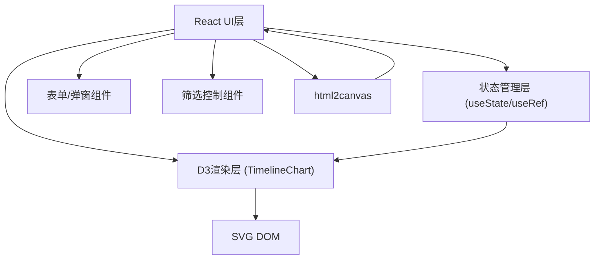

## 1. 架构设计



## 2. 技术描述

- **前端框架**：React 18 + TypeScript
- **构建工具**：Vite
- **可视化库**：D3.js v7
- **导出库**：html2canvas
- **状态管理**：React useState/useRef（轻量级场景无需额外状态库）
- **样式方案**：原生CSS + CSS Modules（毛玻璃、动画、响应式）

## 3. 文件结构

```
/
├── package.json
├── index.html
├── vite.config.js
├── tsconfig.json
└── src/
    ├── main.tsx          # React入口
    ├── App.tsx           # 主组件（状态管理、事件列表、UI）
    ├── TimelineChart.ts  # D3时间线渲染模块
    ├── types.ts          # 类型定义（可选）
    └── styles/
        └── App.css       # 全局样式
```

## 4. 数据模型

### 4.1 TimelineEvent 类型

```typescript
interface TimelineEvent {
  id: string;
  name: string;
  date: string;       // ISO日期格式 YYYY-MM-DD
  description: string;
  color: string;      // Material Design 300色阶之一
}
```

### 4.2 Color Palette

```typescript
const COLOR_PALETTE = [
  '#e57373', // 红色
  '#ffb74d', // 橙色
  '#fff176', // 黄色
  '#81c784', // 绿色
  '#4dd0e1', // 青色
  '#64b5f6', // 蓝色
  '#ba68c8', // 紫色
  '#f06292', // 粉色
];
```

## 5. 核心模块设计

### 5.1 TimelineChart.ts (D3渲染模块)

核心函数签名：
```typescript
export function createTimeline(
  container: HTMLElement,
  options: {
    data: TimelineEvent[];
    filteredIds: Set<string>;
    selectedId: string | null;
    onEventClick: (id: string) => void;
    onEventContextMenu: (id: string, x: number, y: number) => void;
    onTooltipClose: () => void;
  }
): {
  update: (data: TimelineEvent[]) => void;
  updateFilter: (filteredIds: Set<string>) => void;
  updateSelected: (id: string | null) => void;
  destroy: () => void;
  getSvgNode: () => SVGSVGElement;
};
```

职责：
- 创建SVG画布和D3缩放行为（zoom，scaleExtent: [1个月, 50年]）
- 渲染时间线轴（xAxis，年份刻度）
- 渲染事件节点圆点（按日期映射x坐标，颜色匹配标签）
- 渲染连接线
- 处理点击、右键菜单、工具提示框显示
- 缩放平移时平滑过渡动画
- 提供update方法响应数据变化

### 5.2 App.tsx (主组件)

状态：
- `events: TimelineEvent[]` - 事件列表
- `selectedEventId: string | null` - 当前选中的事件ID
- `filterYear: string | null` - 年份筛选
- `filterColor: string | null` - 颜色筛选
- `editingEvent: TimelineEvent | null` - 正在编辑的事件
- `showMobileMenu: boolean` - 移动端菜单展开状态
- `showDeleteConfirm: boolean` - 删除确认弹窗状态
- `tooltipPosition: {x: number, y: number} | null` - 工具提示框位置

职责：
- 管理事件CRUD操作
- 处理表单提交、验证
- 计算筛选后的可见事件集合
- 渲染表单、筛选控件、编辑弹窗、删除确认框
- 调用D3模块渲染时间线
- 处理导出PNG逻辑

## 6. 性能优化策略

- **D3数据绑定**：使用D3的enter/update/exit模式，避免全量重绘
- **requestAnimationFrame**：缩放平移时使用D3内置的平滑过渡
- **节流/防抖**：高频事件（如滚轮）使用D3 zoom内置优化
- **CSS硬件加速**：节点动画使用transform和opacity属性
- **虚拟DOM优化**：React组件使用useMemo/useCallback减少重渲染
- **事件委托**：D3使用事件委托处理多个节点交互

