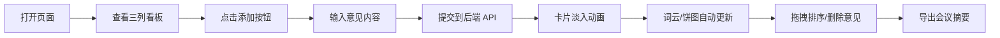

## 1. 产品概述

匿团队回顾是一款面向中小企业HR和团队主管的轻量级在线团队回顾会议工具。通过匿名方式收集成员对"做得好的"、"有待改进的"、"行动计划"三类意见，并自动生成词云和情感倾向统计图表，帮助团队高效复盘和决策。

- 目标用户：中小企业HR、团队主管、敏捷开发团队
- 核心价值：匿名收集真实反馈、可视化数据分析、快速导出会议摘要

## 2. 核心功能

### 2.1 用户角色

| 角色 | 注册方式 | 核心权限 |
|------|----------|----------|
| 会议主持者 | 无需注册，直接使用 | 创建回顾会议、添加意见、删除意见、导出摘要 |
| 团队成员 | 无需注册，匿名参与 | 提交三类意见 |

### 2.2 功能模块

1. **主页面**：顶部标题栏、三列意见看板（Good/Improve/Action）、右侧分析面板
2. **意见管理**：添加意见卡片、删除意见、拖拽排序、相对时间显示
3. **词云分析**：自动根据所有意见生成词云，每30秒刷新，支持平滑过渡动画
4. **情感分析**：积极/中性/消极情感倾向饼图，支持手动刷新统计
5. **摘要导出**：生成纯文本摘要，自动下载为txt文件

### 2.3 页面详情

| 页面名称 | 模块名称 | 功能描述 |
|----------|----------|----------|
| 主页面 | 顶部标题栏 | 显示应用名称"匿团队回顾"，垂直居中 |
| 主页面 | 三列意见看板 | Good（绿）、Improve（橙）、Action（蓝）三列，每列支持添加、删除、拖拽排序 |
| 主页面 | 意见卡片 | 显示内容（最多140字）、相对时间、删除按钮，hover高亮效果 |
| 主页面 | 词云面板 | Canvas渲染词云，随机颜色，按频次映射字体大小，hover放大显示频次 |
| 主页面 | 情感饼图 | Chart.js渲染情感倾向饼图，支持刷新按钮 |
| 主页面 | 底部导出按钮 | 生成并下载会议摘要txt文件 |

## 3. 核心流程

用户打开页面 → 看到三列意见看板和右侧分析面板 → 点击任意列的添加按钮 → 输入意见内容并提交 → 新卡片淡入动画出现 → 右侧词云和饼图自动更新（每30秒）→ 可拖拽排序卡片 → 可删除意见（确认对话框）→ 点击底部导出按钮 → 自动下载摘要文件

## 4. 用户界面设计

### 4.1 设计风格

- **主色调**：深色主题 #0F172A（背景）、#1E293B（卡片背景）
- **强调色**：绿色 #22C55E（Good）、橙色 #F97316（Improve）、蓝色 #3B82F6（Action）
- **文字颜色**：主色 #F1F5F9、次级 #94A3B8
- **按钮风格**：圆角8px，hover状态有过渡动画（transition 0.2s ease）
- **字体**：系统默认无衬线字体，标题24px，正文14-16px
- **布局风格**：卡片式布局，左侧三列看板，右侧固定分析面板
- **图标风格**：简洁线条图标（加号、删除、刷新等）

### 4.2 页面设计概览

| 页面名称 | 模块名称 | UI元素 |
|----------|----------|--------|
| 主页面 | 顶部标题栏 | 高度60px，文字"匿团队回顾"24px #F1F5F9，居中垂直 |
| 主页面 | 三列看板 | flex布局，每列最小280px，间距16px，列背景#1E293B圆角12px |
| 主页面 | 列标题卡片 | 顶部渐变背景（绿/橙/蓝），标题文字+圆形添加按钮 |
| 主页面 | 意见卡片 | 背景#1E293B，圆角8px，轻微阴影，hover上移2px+左侧蓝边框 |
| 主页面 | 输入框 | 背景#0F172A，边框#334155，focus时#3B82F6边框 |
| 主页面 | 词云Canvas | 高度240px，随机颜色，字体12-48px |
| 主页面 | 情感饼图 | Chart.js动画0.5秒，绿/灰/红三色 |
| 主页面 | 底部按钮 | 蓝色#3B82F6，圆角8px，padding 8px 20px |

### 4.3 响应式设计

- **桌面端（≥1024px）**：三列横向布局 + 右侧固定面板（宽320px）
- **平板端（768px-1023px）**：侧面板折叠为底部固定条（高60px），三列垂直堆叠，点击面板图标展开全屏覆盖层
- **移动端（<768px）**：每列全宽，卡片文字14px，底部固定面板条

### 4.4 动画与交互

- 卡片添加：淡入动画 0.3秒
- 卡片删除：淡出动画 0.2秒
- 词云更新：旧词云渐变消失 → 新词云渐变出现，共0.5秒
- 饼图动画：持续0.5秒，帧率≥30fps
- 按钮hover：transition 0.2s ease
