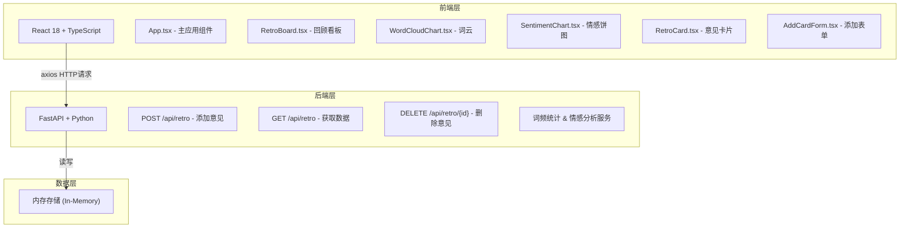
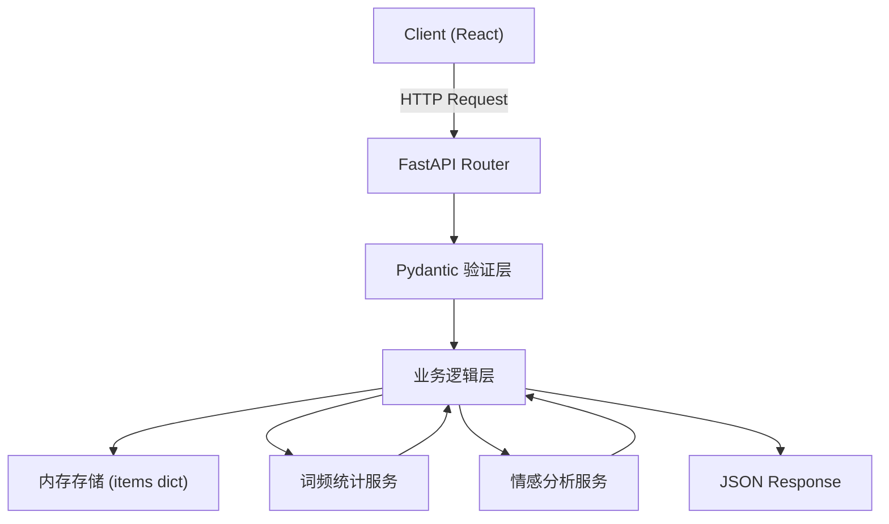
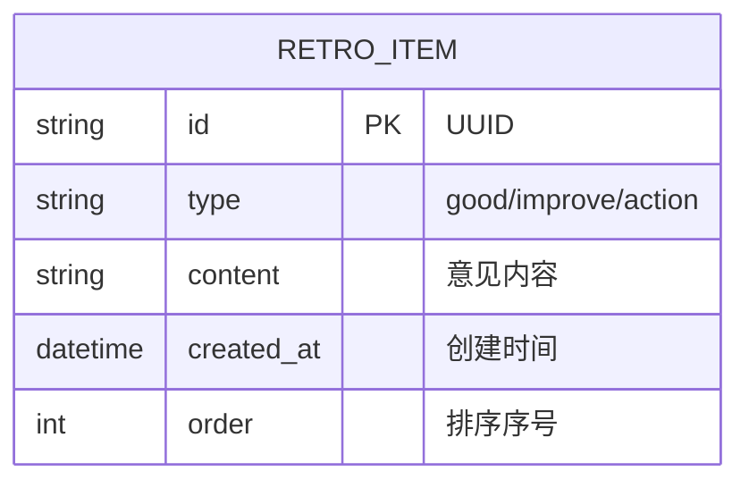

## 1. 架构设计



## 2. 技术描述

- **前端框架**：React 18 + TypeScript
- **构建工具**：Vite
- **状态管理**：React useState/useEffect（轻量级，无需额外状态库）
- **图表库**：Chart.js + react-chartjs-2（情感饼图）
- **词云库**：wordcloud（Canvas词云渲染）
- **HTTP客户端**：axios
- **ID生成**：uuid
- **后端框架**：FastAPI + Python 3.10+
- **ASGI服务器**：uvicorn
- **数据验证**：pydantic
- **数据存储**：内存字典存储（演示用途）

## 3. 路由定义

| 路由 | 用途 |
|------|------|
| / | 主页面，包含三列看板和分析面板 |

（本应用为单页应用，无需多页面路由）

## 4. API定义

### 4.1 数据类型定义

```typescript
// 意见类型
type RetroType = 'good' | 'improve' | 'action';

// 意见项
interface RetroItem {
  id: string;
  type: RetroType;
  content: string;
  created_at: string; // ISO 8601
  order: number;
}

// 词频项
interface WordFreq {
  text: string;
  value: number;
}

// 情感统计
interface SentimentStats {
  positive: number;
  neutral: number;
  negative: number;
}

// API响应
interface RetroResponse {
  items: RetroItem[];
  word_freq: WordFreq[];
  sentiment: SentimentStats;
}
```

### 4.2 接口列表

| 方法 | 路径 | 请求体 | 响应 | 说明 |
|------|------|--------|------|------|
| POST | /api/retro | { type: string, content: string } | RetroResponse | 添加新意见 |
| GET | /api/retro | - | RetroResponse | 获取所有意见和统计数据 |
| DELETE | /api/retro/{id} | - | RetroResponse | 删除指定意见 |

## 5. 服务器架构图



## 6. 数据模型

### 6.1 数据模型定义



### 6.2 内存存储结构

```python
# Python 后端内存存储
retro_items: Dict[str, RetroItem] = {}
# 按类型分组索引
items_by_type: Dict[str, List[str]] = {
    'good': [],
    'improve': [],
    'action': []
}
```

## 7. 前端目录结构

```
src/
├── App.tsx                    # 主应用组件，状态管理，数据流向控制
├── components/
│   ├── RetroBoard.tsx         # 三列看板组件，拖拽排序
│   ├── RetroCard.tsx          # 单个意见卡片
│   ├── AddCardForm.tsx        # 添加意见表单（可折叠）
│   ├── WordCloudChart.tsx     # 词云渲染组件
│   ├── SentimentChart.tsx     # 情感饼图组件
│   └── SidePanel.tsx          # 右侧分析面板
├── utils/
│   ├── api.ts                 # axios API封装
│   └── time.ts                # 相对时间格式化工具
├── types/
│   └── index.ts               # TypeScript类型定义
└── main.tsx                   # React入口
```

## 8. 后端目录结构

```
api/
├── main.py                    # FastAPI应用入口
├── models.py                  # Pydantic数据模型
├── storage.py                 # 内存存储层
├── services/
│   ├── word_freq.py           # 词频统计服务
│   └── sentiment.py           # 情感分析服务
└── requirements.txt           # Python依赖
```

## 9. 数据流向说明

1. **添加意见**：用户输入 → AddCardForm → App.tsx (POST /api/retro) → 后端存储+统计 → 返回更新数据 → App.tsx更新状态 → RetroBoard/WordCloudChart/SentimentChart重新渲染

2. **删除意见**：点击删除按钮 → RetroCard → 确认对话框 → App.tsx (DELETE /api/retro/{id}) → 后端删除+重算统计 → 返回更新数据 → 前端状态更新

3. **词云更新**：setInterval每30秒 → App.tsx (GET /api/retro) → 获取最新词频 → WordCloudChart重绘（带过渡动画）

4. **手动刷新统计**：点击刷新按钮 → App.tsx (GET /api/retro) → 获取最新情感数据 → SentimentChart重新渲染
