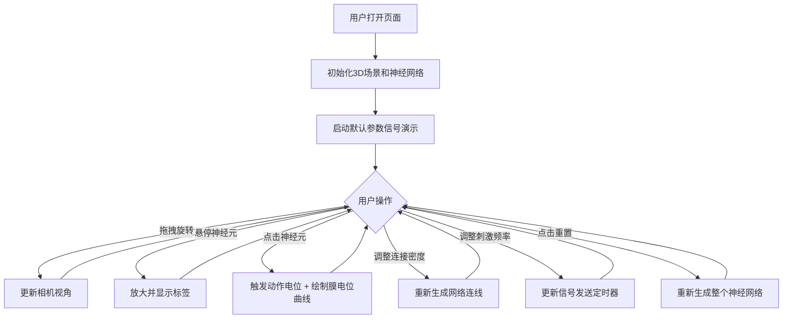

## 1. 产品概述

微型交互式3D神经元网络信号传导可视化器，帮助神经科学初学者和生物爱好者直观观察神经元之间通过突触传递电信号的过程，模拟动作电位传播、神经递质释放与接收，展示IPSP/EPSP在神经网络中的叠加效果。

## 2. 核心功能

### 2.1 用户角色
| 角色 | 注册方式 | 核心权限 |
|------|----------|----------|
| 普通用户 | 无需注册，直接使用 | 浏览神经网络、调整参数、触发信号、查看膜电位曲线 |

### 2.2 功能模块
1. **3D神经网络场景**：20-30个神经元球体、突触连线、粒子效果、背景星点
2. **信号传导系统**：动作电位触发、脉冲光球传播、神经递质粒子爆发
3. **交互控制模块**：鼠标拖拽旋转视角、悬停放大、点击神经元触发信号
4. **控制面板**：连接密度滑块、刺激频率滑块、重置按钮
5. **数据可视化**：FPS计数器、膜电位变化折线图

### 2.3 页面详情
| 页面名称 | 模块名称 | 功能描述 |
|----------|----------|----------|
| 主页面 | 3D场景区（占5/6高度） | 展示神经元网络3D可视化，支持交互 |
| 主页面 | 控制面板区（占1/6高度） | 滑块参数控制、重置按钮 |
| 主页面 | 右侧膜电位图表 | 实时绘制已选神经元的膜电位变化曲线 |
| 主页面 | 右上角FPS计数器 | 显示当前帧率 |

## 3. 核心流程

用户打开页面 → 自动加载默认参数的神经网络 → 场景开始自动演示信号传导 → 用户可：
- 拖拽旋转3D视角
- 悬停神经元查看标签
- 点击神经元触发动作电位并查看膜电位曲线
- 调整连接密度滑块改变网络结构
- 调整刺激频率滑块改变信号发送频率
- 点击重置按钮重新生成网络

## 4. 用户界面设计

### 4.1 设计风格
- **主色调**：深紫黑#0D0D1A（背景）、深蓝#0A0A23（控制面板渐变）、橙红#FF6B35（兴奋性神经元）、青蓝#00B4D8（抑制性神经元）
- **辅助色**：浅蓝#4DA6FF（滑块手柄/按钮边框）、浅灰#AAAAAA（FPS文字）、半透明白#FFFFFFAA（UI文字）
- **按钮样式**：圆角8px、边框1px、透明深灰背景、点击凹陷动画
- **字体**：使用系统无衬线字体，UI文字统一半透明白色
- **布局风格**：全屏暗色调，上5/6为3D场景，下1/6为控制面板
- **视觉效果**：神经元脉动光晕、脉冲光球、粒子爆发、连线高亮

### 4.2 页面设计概述
| 页面名称 | 模块名称 | UI元素 |
|----------|----------|--------|
| 主页面 | 3D场景区 | 神经元球体（带脉动光晕）、连线（兴奋性半透明白/抑制性半透明灰）、背景星点闪烁、蓝色脉冲光球、彩色粒子 |
| 主页面 | 控制面板区 | 连接密度滑块（0.2-0.8）、刺激频率滑块（0.5-5Hz）、重置网络按钮 |
| 主页面 | 右侧图表 | 膜电位折线图（背景深灰#1A1A2E，颜色渐变：绿→黄→红） |
| 主页面 | 顶部UI | FPS计数器（右上角）、神经元悬停标签 |

### 4.3 响应式
- 桌面优先设计，最小支持800x600px
- 浏览器宽度低于900px时，控制面板调整为两行布局
- 所有元素自适应缩放

### 4.4 3D场景指导
- **环境**：深紫黑背景，散布微弱闪烁星点模拟细胞外环境
- **光照**：环境光 + 点光源，突出神经元3D感
- **相机**：PerspectiveCamera，支持OrbitControls拖拽旋转
- **组成**：20-30个神经元球体随机分布在3D空间中，通过突触连线连接
- **交互**：Raycaster检测鼠标悬停和点击
- **动画**：神经元脉动光晕、脉冲光球沿连线传播、粒子爆发消散、连线高亮闪烁
- **性能**：使用BufferGeometry批量渲染，粒子总数不超过1500，目标30FPS以上
