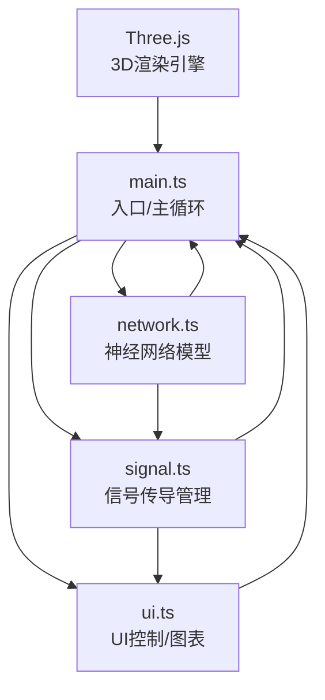

## 1. 架构设计



## 2. 技术描述
- **前端框架**：纯TypeScript + Three.js（无React/Vue框架，按用户需求）
- **构建工具**：Vite
- **3D渲染**：Three.js rlatest版本
- **类型系统**：TypeScript严格模式
- **无后端**：纯前端项目，所有逻辑在浏览器端运行

## 3. 文件结构
| 文件路径 | 用途 |
|----------|------|
| package.json | 项目依赖与脚本配置 |
| index.html | HTML入口，包含Canvas容器和CSS样式 |
| vite.config.js | Vite构建配置 |
| tsconfig.json | TypeScript配置（严格模式、DOM+ESNext类型） |
| src/main.ts | 入口文件：初始化场景/渲染器/相机，创建神经网络，启动动画循环，整合所有模块 |
| src/network.ts | 神经网络数据模型：神经元/连线生成、连接密度调整、类型分配、突触计算 |
| src/signal.ts | 信号管理：动作电位触发、脉冲传播、粒子爆发、刺激频率调度 |
| src/ui.ts | UI层：滑块、按钮、FPS计数器、膜电位折线图绘制、DOM事件监听 |

## 4. 核心数据模型

### 4.1 神经元（Neuron）
```typescript
interface Neuron {
  id: number;
  type: 'excitatory' | 'inhibitory';
  position: THREE.Vector3;
  membranePotential: number;  // mV, 静息-70
  mesh: THREE.Mesh;           // 神经元球体
  glowMesh: THREE.Mesh;       // 脉动光晕
  pulsePhase: number;         // 光晕脉动相位
  connections: Connection[];  // 传出连接
  potentialHistory: { time: number; value: number }[];
}
```

### 4.2 连接/突触（Connection）
```typescript
interface Connection {
  id: number;
  type: 'excitatory' | 'inhibitory';
  from: Neuron;
  to: Neuron;
  line: THREE.Line;
  highlightUntil: number;     // 连线高亮截止时间戳
}
```

### 4.3 信号脉冲（SignalPulse）
```typescript
interface SignalPulse {
  id: number;
  connection: Connection;
  progress: number;           // 0-1, 在连线上的进度
  speed: number;              // 单位/秒
  mesh: THREE.Mesh;           // 脉冲光球
}
```

### 4.4 粒子（Particle）
```typescript
interface Particle {
  id: number;
  mesh: THREE.Mesh;
  velocity: THREE.Vector3;
  life: number;               // 剩余生命(秒)
  maxLife: number;
}
```

## 5. 模块接口定义

### network.ts
```typescript
export class NeuralNetwork {
  neurons: Neuron[];
  connections: Connection[];
  scene: THREE.Scene;
  
  constructor(scene: THREE.Scene);
  generate(neuronCount?: number, density?: number): void;
  setConnectionDensity(density: number): void;
  getNeuronByMesh(mesh: THREE.Object3D): Neuron | null;
  clear(): void;
}
```

### signal.ts
```typescript
export class SignalManager {
  pulses: SignalPulse[];
  particles: Particle[];
  network: NeuralNetwork;
  scene: THREE.Scene;
  stimulationFrequency: number;
  
  constructor(network: NeuralNetwork, scene: THREE.Scene);
  triggerActionPotential(neuron: Neuron): void;
  setStimulationFrequency(freq: number): void;
  update(deltaTime: number, currentTime: number): void;
  onPotentialUpdate?: (neuron: Neuron) => void;
}
```

### ui.ts
```typescript
export class UIManager {
  fpsElement: HTMLElement;
  chartCanvas: HTMLCanvasElement;
  selectedNeuron: Neuron | null;
  
  constructor();
  bindControls(
    onDensityChange: (v: number) => void,
    onFrequencyChange: (v: number) => void,
    onReset: () => void
  ): void;
  updateFPS(fps: number): void;
  updateChart(neuron: Neuron, currentTime: number): void;
  selectNeuron(neuron: Neuron | null): void;
  showTooltip(neuron: Neuron, x: number, y: number): void;
  hideTooltip(): void;
}
```

## 6. 性能优化策略
- 使用BufferGeometry批量渲染神经元和连线
- 粒子对象池复用，总粒子数上限1500
- 膜电位历史数据仅保留最近10秒
- Raycaster每帧最多执行一次检测
- 使用requestAnimationFrame驱动动画循环
- 连线段数优化，使用2点Line即可
