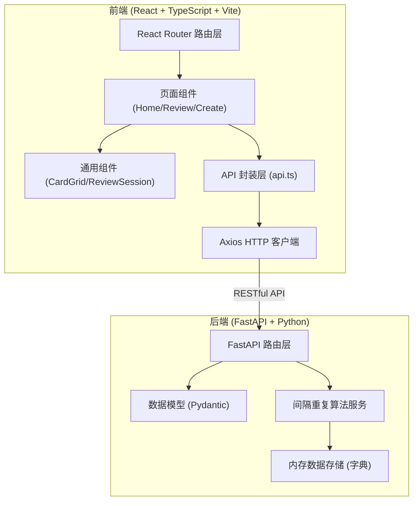
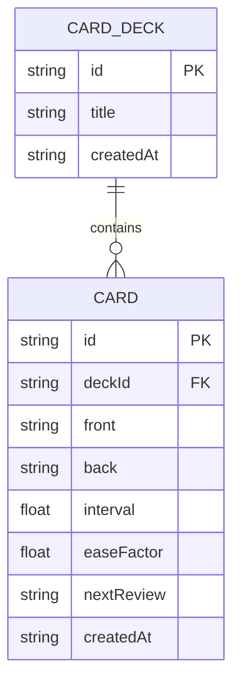

## 1. 架构设计


## 2. 技术说明
- **前端框架**：React@18 + TypeScript@5
- **构建工具**：Vite@5
- **路由管理**：React Router@6
- **HTTP 客户端**：Axios@1
- **唯一 ID 生成**：uuid@9
- **后端框架**：FastAPI@0.100+
- **ASGI 服务器**：uvicorn@0.20+
- **数据存储**：内存字典（预置两组示例数据）
- **样式方案**：纯 CSS，CSS3 动画，CSS 变量

## 3. 路由定义
| 前端路由 | 页面 | 用途 |
|-------|------|---------|
| / | Home 首页 | 展示所有卡片组网格 |
| /review/:deckId | Review 复习页 | 复习指定卡片组 |
| /create | Create 创建页 | 创建新卡片组和卡片 |

| 后端 API 路由 | 方法 | 用途 |
|-------|------|---------|
| /api/decks | GET | 获取所有卡片组列表 |
| /api/decks/{deck_id} | GET | 获取单个卡片组详情（含所有卡片） |
| /api/decks | POST | 创建新卡片组 |
| /api/decks/{deck_id}/cards | POST | 向卡片组添加新卡片 |
| /api/cards/{card_id}/review | POST | 提交评分并计算下次复习时间 |

## 4. API 数据结构

```typescript
interface Card {
  id: string;
  front: string;
  back: string;
  interval: number;          // 当前复习间隔（天）
  easeFactor: number;        // 难度系数
  nextReview: string;        // 下次复习时间 ISO 字符串
  createdAt: string;
}

interface CardDeck {
  id: string;
  title: string;
  cards: Card[];
  createdAt: string;
}

interface ReviewRequest {
  rating: 'hard' | 'good' | 'easy';
}

interface ReviewResponse {
  cardId: string;
  nextReview: string;
  newInterval: number;
  newEaseFactor: number;
}
```

## 5. 数据模型


## 6. 间隔重复算法（SM-2 简化版）
- **初始状态**：interval = 1 天，easeFactor = 2.5
- **评分处理**：
  - 困难 (hard)：interval = interval × 1.2，easeFactor = max(1.3, easeFactor - 0.2)
  - 良好 (good)：interval = interval × easeFactor
  - 简单 (easy)：interval = interval × easeFactor × 1.3，easeFactor = easeFactor + 0.15
- **最小间隔**：1 天
- **最大间隔**：365 天
