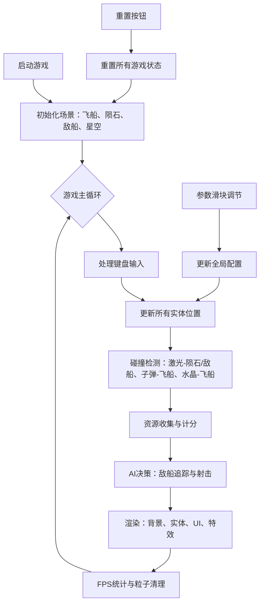

## 1. 产品概述
这是一款基于浏览器的2D像素风太空采矿与资源管理游戏演示原型，主要面向游戏设计爱好者，帮助学习资源收集循环、飞行物理与AI敌船追踪机制。
- 解决问题：缺乏可直接运行、可交互调节参数的游戏演示原型，降低学习门槛
- 目标价值：提供一个可交互、可调节参数的完整游戏循环演示

## 2. 核心功能

### 2.1 用户角色
无需注册，单用户直接使用。

### 2.2 功能模块
1. **游戏主画布**：800x600深空场景，包含玩家飞船、陨石、水晶、AI敌船、子弹和粒子特效
2. **资源管理系统**：水晶库存统计、总开采量记录、水晶飘向飞船的收集动画
3. **AI追踪系统**：2艘敌船追踪玩家、近距离加速射击、被击毁后延迟重生
4. **参数控制面板**：AI追踪速度、敌船再生延迟、水晶掉落率滑块，重置按钮
5. **性能监控**：右上角FPS显示，自动清理超量粒子

### 2.3 页面详情
| 页面名称 | 模块名称 | 功能描述 |
|---------|---------|----------|
| 游戏主页 | 游戏画布 | 渲染800x600深空场景，所有游戏实体的绘制与更新 |
| 游戏主页 | 资源面板 | 左上角显示水晶库存和总开采量 |
| 游戏主页 | 参数控制面板 | 左侧滑块和重置按钮，实时调节游戏参数 |
| 游戏主页 | FPS显示 | 右上角实时帧率显示 |
| 游戏主页 | 特效系统 | 激光击中闪光、水晶尾迹、屏幕闪红、无敌闪烁、敌船发光效果 |

## 3. 核心流程
玩家通过WASD控制飞船移动，空格键发射激光击碎陨石收集水晶，同时躲避或击毁AI敌船。玩家可通过左侧滑块实时调整游戏参数，观察不同参数对游戏体验的影响。

## 4. 用户界面设计

### 4.1 设计风格
- **主色调**：深空背景渐变 #0B0C10 → #1A202C
- **玩家飞船**：青色 #4FD1C5 像素三角形
- **水晶矿**：黄色 #F6E05E
- **AI敌船**：红色 #FC8181 六边形
- **陨石**：灰调 #A0AEC0 至 #718096
- **UI控件**：深灰 #2D3748 背景，浅蓝 #63B3ED 强调色
- **字体颜色**：浅白 #E2E8F0

### 4.2 页面设计概览
| 页面名称 | 模块名称 | UI元素 |
|---------|---------|--------|
| 游戏主页 | 游戏画布 | 居中800x600 Canvas，深空渐变背景，闪烁星星，所有游戏实体 |
| 游戏主页 | 资源面板 | 左上角半透明深色卡片（rgba(11,12,16,0.8)，圆角8px，内边距12px） |
| 游戏主页 | 参数面板 | 左侧垂直排列三个滑块和重置按钮，统一深灰风格 |
| 游戏主页 | FPS显示 | 右上角小字体显示帧率 |

### 4.3 响应式设计
- 桌面端：800x600画布，UI控件水平/垂直排列
- 移动端（<768px）：画布缩小至400x300，UI控件堆叠排列

### 4.4 特效设计
- 星空背景随机40颗星星，大小1-2px，亮度随机闪烁
- 激光击中陨石时白色闪光（0.1秒）
- 水晶飘向飞船时带黄色尾迹（透明度递减）
- 敌船追踪时周围淡红发光效果
- 玩家被击中时屏幕闪红（0.15秒），无敌时飞船闪烁
- 敌船爆炸时10颗红色粒子飞散
