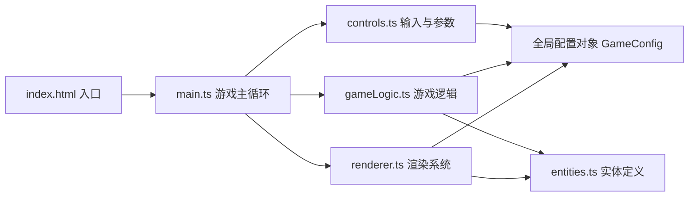

## 1. 架构设计



## 2. 技术说明
- **前端框架**：原生 TypeScript + HTML5 Canvas（用户明确指定，不使用React/Vue）
- **构建工具**：Vite 5.x
- **类型系统**：TypeScript 严格模式，包含 DOM 和 ESNext 类型
- **无后端**：纯前端演示，所有状态在浏览器内存中

## 3. 项目文件结构
| 文件路径 | 用途 |
|---------|------|
| package.json | 依赖与脚本配置（typescript、vite） |
| index.html | 入口页面，包含Canvas和UI控件 |
| vite.config.js | Vite构建配置 |
| tsconfig.json | TypeScript配置 |
| src/main.ts | 游戏主循环，初始化场景、创建画布、update/render循环 |
| src/entities.ts | 所有实体数据结构、生成与销毁逻辑 |
| src/gameLogic.ts | 碰撞检测、资源管理、AI追踪、粒子生命周期、性能优化 |
| src/renderer.ts | 绘制游戏元素、UI面板、特效、背景星空 |
| src/controls.ts | 键盘监听、滑块UI绑定、重置按钮、全局配置对象 |

## 4. 核心数据模型

### 4.1 全局配置
```typescript
interface GameConfig {
  aiSpeed: number;          // AI追踪速度 1-3 px/帧
  respawnDelay: number;     // 敌船再生延迟 10-25 秒
  crystalDropRate: number;  // 水晶掉落率 1-5 颗/陨石
  canvasWidth: number;
  canvasHeight: number;
}
```

### 4.2 实体定义
```typescript
interface Player {
  x, y: number;
  vx, vy: number;
  invincibleTimer: number;
  hitFlashTimer: number;
}

interface Asteroid {
  x, y: number;
  size: number;
  points: number[];  // 不规则多边形顶点
  crystalCount: number;
  hp: number;
}

interface Crystal {
  x, y: number;
  vx, vy: number;
  trail: {x, y, alpha}[];
  collected: boolean;
}

interface Enemy {
  x, y: number;
  hp: number;
  respawnTimer: number;
  active: boolean;
  shootCooldown: number;
}

interface Bullet {
  x, y: number;
  vx, vy: number;
  isEnemy: boolean;
}

interface Particle {
  x, y: number;
  vx, vy: number;
  life: number;
  maxLife: number;
  color: string;
  size: number;
}

interface LaserBeam {
  x1, y1, x2, y2: number;
  active: boolean;
  flashTimer: number;
}
```

## 5. 性能优化策略
1. **静态背景缓存**：星空背景绘制到离屏Canvas，每帧直接贴图
2. **粒子数量控制**：碎片+粒子总数超过200时自动清理最早生成的粒子
3. **requestAnimationFrame主循环**：保证流畅帧率，目标50fps+
4. **对象池模式**：粒子和子弹对象复用，减少GC开销
5. **增量渲染**：仅重绘动态物体，静态背景缓存复用
