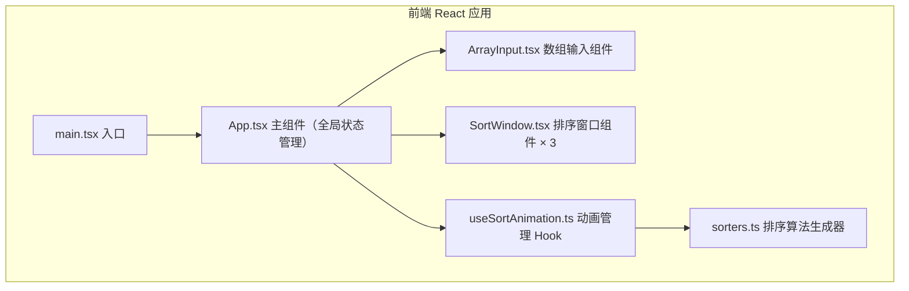

## 1. 架构设计



## 2. 技术描述

- **前端框架**：React 18 + TypeScript 5 + Vite 6
- **构建工具**：Vite 6
- **UI 样式**：原生 CSS（无需额外 UI 库，通过 CSS variables 和 className 管理）
- **状态管理**：React useState + 自定义 Hook useSortAnimation
- **动画方案**：CSS Transition（条柱位置与颜色平滑过渡）+ requestAnimationFrame 驱动动画帧

## 3. 项目文件结构与职责

| 文件 | 职责 | 调用关系 |
|------|------|---------|
| package.json | 依赖声明与脚本配置 | npm 读取，声明 react/react-dom/typescript/vite |
| vite.config.js | Vite 构建配置 | Vite 启动时读取，配置 React 插件 |
| tsconfig.json | TypeScript 编译配置（严格模式） | tsc/Vite 读取，配置 DOM 与 JSX 类型 |
| index.html | HTML 入口，包含 div#root 挂载点 | 浏览器加载入口 |
| src/main.tsx | React 渲染入口 | 渲染 <App /> 到 div#root |
| src/App.tsx | 主组件，管理全局数组状态、排序状态 | 调用 ArrayInput 的回调，使用 useSortAnimation Hook，渲染 SortWindow 组件 |
| src/components/ArrayInput.tsx | 数组输入组件 | 接收 onArrayChange 回调，触发父组件更新数组 |
| src/components/SortWindow.tsx | 单个排序算法展示窗口 | 接收 barHeights、barColors、comparisons、swaps、progress、isComplete、algorithmName 等 props，渲染条柱与统计信息 |
| src/hooks/useSortAnimation.ts | 自定义 Hook，管理三个算法并行动画 | 接收初始数组和三个排序生成器，每帧推进并返回各算法当前状态 |
| src/utils/sorters.ts | 排序算法实现与动画生成器 | 导出 bubbleSort / selectionSort / quickSort Generator 函数，返回 SwapOperation 步骤 |

## 4. 核心数据结构与数据流向

### 4.1 核心类型定义

```typescript
type OperationType = 'compare' | 'swap' | 'sorted' | 'complete';

interface SwapOperation {
  type: OperationType;
  indices: number[];        // 涉及的元素索引
  values?: number[];        // 交换后的数组值快照（用于更新条柱高度）
}

interface BarState {
  height: number;           // 条柱高度（数值）
  color: string;            // 当前颜色
  glow: boolean;            // 是否显示金色光晕
}

interface SortState {
  bars: BarState[];         // 当前条柱状态数组
  comparisons: number;      // 累计比较次数
  swaps: number;            // 累计交换次数
  sortedCount: number;      // 已排序元素数量
  isComplete: boolean;      // 是否完成
  showCompleteTip: boolean; // 是否显示完成提示
}
```

### 4.2 数据流向

1. **用户输入 → App 状态**：用户在 ArrayInput 输入或点击按钮 → ArrayInput 调用 onArrayChange → App 更新 array 状态
2. **开始排序 → Hook 初始化**：App 点击开始排序 → 将 array 传入 useSortAnimation → Hook 创建三个 Generator 并初始化 SortState
3. **动画推进 → 状态更新**：requestAnimationFrame/setInterval 每帧调用 generator.next() → 解析 SwapOperation → 更新对应 SortState（条柱颜色、比较次数、交换次数）→ 通过 props 传递给 SortWindow
4. **SortWindow 渲染**：接收 SortState → 用 CSS transition 渲染条柱高度与颜色变化 → 显示统计信息和完成提示

### 4.3 同步策略

三个算法使用统一的推进节奏，每一步（无论 compare 还是 swap）消耗相同时间间隔（~100ms）。Hook 内部使用单一定时器，每帧同时推进三个 Generator 各一步，保证对比公平。
