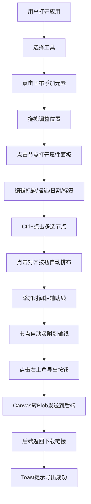

## 1. 产品概述
时间线工坊（Timeline Story Workshop）是一款面向内容创作者的轻量级浏览器应用，用于创建和分享微型交互式数据叙事时间线。

- 核心目的：解决内容创作者在展示事件演进过程时缺乏兼具视觉叙事张力、自定义排版和动画过渡工具的问题
- 目标用户：内容创作者、数据记者、教育工作者、产品经理
- 市场价值：提供零依赖、高性能、可视化的时间线叙事创作体验，无需专业设计软件即可产出高质量时间线作品

## 2. 核心功能

### 2.1 功能模块
1. **画布编辑区**：空白画布，支持事件节点、连接线、文本标签、时间轴辅助线的绘制与交互
2. **左侧工具栏**：提供添加节点、连接箭头、文本标签、添加时间轴、对齐工具等功能入口
3. **右侧属性编辑面板**：编辑事件节点的标题、描述、日期、标签等属性
4. **顶部导航栏**：展示应用标题及导出功能
5. **导出系统**：将画布内容导出为2x分辨率PNG图片

### 2.2 页面详情
| 页面名称 | 模块名称 | 功能描述 |
|-----------|-------------|---------------------|
| 主画布页 | 左侧工具栏 | 添加节点/箭头/文本/时间轴、多选对齐、间距设置下拉选择 |
| 主画布页 | 画布区域 | 元素拖拽、多选、吸附、绘制渲染、动画更新 |
| 主画布页 | 右侧编辑面板 | 事件标题（50字符）、描述（200字符换行）、日期选择器、标签（最多3个6色可选） |
| 主画布页 | 顶部导航栏 | 应用标题"时间线工坊"、右上角导出按钮 |
| 主画布页 | 通知系统 | 导出成功Toast提示（底部居中，绿色背景，3秒自动消失） |

## 3. 核心流程
用户打开应用 → 在左侧工具栏选择元素类型 → 点击画布添加元素 → 拖拽调整位置 → 点击节点弹出右侧面板编辑属性 → 多选节点进行对齐排布 → 添加时间轴辅助线并吸附节点 → 点击导出按钮生成PNG → 后端返回下载链接 → Toast提示导出成功。

## 4. 用户界面设计

### 4.1 设计风格
- **主色调**：暖灰白画布背景 #F7FAFC，深灰导航栏 #2D3748，浅灰工具栏 #EDF2F7
- **节点色**：默认 #EBF4FF，选中外发光 #63B3ED（模糊8px）
- **连接线**：默认 #4A5568，悬停高亮 #3182CE
- **时间轴**：灰色虚线 #CBD5E0（2px），吸附连接线 #A0AEC0（透明度0.5）
- **按钮反馈**：点击0.1秒缩小放大动画
- **动画**：面板滑入0.3秒，对齐弹性动画0.4秒（bounce效果）
- **字体**：无衬线系统字体，标签字号12-24px可调
- **交互光标**：拖拽时 grab，拖拽过程中 grabbing
- **Toast**：底部居中，绿色背景 #48BB78，白色文字，3秒自动消失

### 4.2 页面设计概述
| 页面名称 | 模块名称 | UI元素 |
|-----------|-------------|-------------|
| 主画布页 | 顶部导航栏 | 高度56px，深灰背景，左侧标题"时间线工坊"，右侧导出按钮 |
| 主画布页 | 左侧工具栏 | 宽度240px，浅灰背景，垂直排列工具按钮，每组含图标+文字说明 |
| 主画布页 | 画布区域 | 暖灰白背景，全屏自适应，Canvas渲染所有元素 |
| 主画布页 | 右侧编辑面板 | 从右向左滑入动画0.3秒，白底，表单项排列 |
| 主画布页 | Toast通知 | 底部居中，圆角绿色提示条，自动淡出 |

### 4.3 响应式设计
- 窗口宽度 < 768px：左侧工具栏折叠为汉堡菜单图标，点击展开
- 窗口宽度 < 480px：所有节点文本大小自动缩小12%
- 触摸设备：支持触摸拖拽与点击交互

### 4.4 性能要求
- 拖拽与动画帧率 ≥ 50fps（使用 requestAnimationFrame 优化）
- 导出PNG响应时间 ≤ 800ms
- Canvas绘制采用脏矩形区域优化
