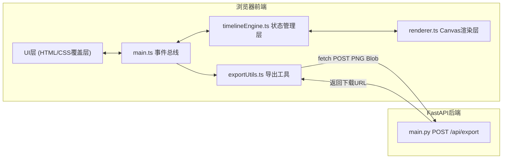

## 1. 架构设计



## 2. 技术描述
- **前端**：TypeScript + 原生Canvas API（无第三方UI框架）+ Vite 构建工具
- **构建工具**：Vite（开发服务器 + 构建）
- **后端**：Python FastAPI + Uvicorn ASGI服务器
- **后端依赖**：fastapi、uvicorn、python-multipart
- **前端依赖**：typescript、vite、@types/node

## 3. 目录结构
```
auto119/
├── package.json
├── index.html
├── vite.config.js
├── tsconfig.json
├── src/
│   ├── main.ts              # 入口文件，初始化画布、工具栏、全局事件
│   ├── timelineEngine.ts    # 核心逻辑：数据结构、增删改、对齐、吸附
│   ├── renderer.ts          # Canvas绘制：背景、节点、连线、时间轴、动画
│   └── exportUtils.ts       # 导出功能：Canvas→Blob→后端API
└── backend/
    └── main.py              # FastAPI应用，/api/export 接口
```

## 4. API定义

### POST /api/export
- **请求**：`multipart/form-data`
  - `file`: PNG Blob
  - `filename`: string (可选)
- **响应**：`application/json`
  ```json
  {
    "success": true,
    "downloadUrl": "/api/download/<timestamp>.png",
    "filename": "timeline-<timestamp>.png"
  }
  ```

### GET /api/download/{filename}
- **响应**：`image/png` 文件流

## 5. 数据模型

### 事件节点 (EventNode)
```typescript
interface EventNode {
  id: string;
  x: number;
  y: number;
  width: number;       // 默认120
  height: number;      // 默认60
  bgColor: string;     // 默认#EBF4FF
  title: string;       // 最多50字符
  description: string; // 最多200字符
  date: string;        // YYYY-MM-DD
  tags: Tag[];         // 最多3个
  selected: boolean;
  snappedToTimelineId: string | null;
  animTargetX: number | null;
  animTargetY: number | null;
  animProgress: number;
}
```

### 标签 (Tag)
```typescript
interface Tag {
  id: string;
  text: string;
  color: string; // #E53E3E / #DD6B20 / #D69E2E / #38A169 / #3182CE / #805AD5
}
```

### 连接线 (ConnectionArrow)
```typescript
interface ConnectionArrow {
  id: string;
  fromNodeId: string;
  toNodeId: string;
  color: string;     // 默认#4A5568
  hoverColor: string; // #3182CE
  isHovered: boolean;
}
```

### 文本标签 (TextLabel)
```typescript
interface TextLabel {
  id: string;
  x: number;
  y: number;
  text: string;
  fontSize: number;   // 12-24
  isBold: boolean;
  isItalic: boolean;
  selected: boolean;
}
```

### 时间轴 (Timeline)
```typescript
interface Timeline {
  id: string;
  x1: number;
  y1: number;
  x2: number;
  y2: number;        // 与y1相同（水平线）
  minLength: 200;
  strokeColor: string; // #CBD5E0
  strokeWidth: 2;
  anchorDragging: 'start' | 'end' | null;
}
```

### 全局状态 (TimelineState)
```typescript
interface TimelineState {
  nodes: EventNode[];
  arrows: ConnectionArrow[];
  labels: TextLabel[];
  timelines: Timeline[];
  selectedIds: string[];
  activeTool: 'select' | 'node' | 'arrow' | 'label' | 'timeline';
  snapDistance: 10;
}
```

## 6. 核心算法

### 6.1 对齐算法 (alignNodes)
- 输入：选中节点ID数组、对齐方向（horizontal/vertical）、间距（20/40/60）
- 计算所有节点边界框的 min/max
- 按节点当前坐标排序
- 计算每个节点的目标位置 = 起始位置 + index * (节点尺寸 + 间距)
- 使用bounce缓动函数在0.4秒内动画移动

### 6.2 吸附算法 (snapToTimelines)
- 遍历所有时间轴
- 对每个未吸附节点，计算节点中心到时间轴线的垂直距离
- 若距离 < 10px，则 y = timeline.y，记录 snappedToTimelineId
- 绘制节点中心到时间轴的细实线

### 6.3 缓动函数
```typescript
function easeOutBounce(t: number): number {
  const n1 = 7.5625, d1 = 2.75;
  if (t < 1/d1) return n1*t*t;
  if (t < 2/d1) return n1*(t-=1.5/d1)*t+0.75;
  if (t < 2.5/d1) return n1*(t-=2.25/d1)*t+0.9375;
  return n1*(t-=2.625/d1)*t+0.984375;
}
```
