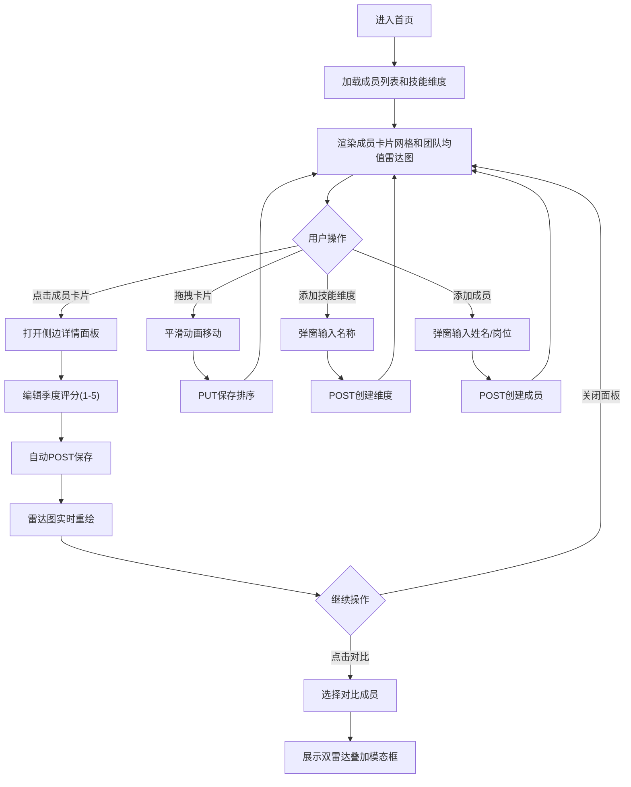

## 1. 产品概述
团队技能矩阵动态评估与可视化看板，帮助团队负责人高效管理和可视化团队成员的技能水平。
- 核心目的：通过雷达图直观展示团队成员的多维度技能分布，支持季度评分、趋势对比和拖拽排序
- 目标用户：团队负责人、项目经理、技术主管

## 2. 核心功能

### 2.1 用户角色
| 角色 | 注册方式 | 核心权限 |
|------|----------|----------|
| 团队负责人 | 无需注册，直接使用 | 查看所有成员技能、编辑评分、管理技能维度和成员、拖拽排序、趋势对比 |

### 2.2 功能模块
1. **首页看板**：成员卡片网格、团队技能均值雷达图、顶部管理导航栏
2. **成员详情面板**：完整技能雷达图、季度评分编辑表格、对比功能
3. **对比模态框**：双成员雷达图叠加对比
4. **管理功能**：添加技能维度、添加成员

### 2.3 页面详情
| 页面名称 | 模块名称 | 功能描述 |
|-----------|-------------|---------------------|
| 首页看板 | 顶部导航栏 | 应用名称展示、添加技能维度按钮、添加成员按钮 |
| 首页看板 | 团队均值雷达图 | 左上角展示所有成员最新季度评分平均值，直径250px |
| 首页看板 | 成员卡片网格 | 4列自适应网格布局，展示成员基本信息和微型雷达图 |
| 成员详情面板 | 完整雷达图 | 直径350px，6个维度，带刻度线，实时更新 |
| 成员详情面板 | 季度评分表格 | 4季度(2024Q1-Q4) × N维度，单元格可编辑1-5评分，自动保存 |
| 成员详情面板 | 对比按钮 | 弹出模态框选择对比成员，展示双雷达叠加 |
| 对比模态框 | 雷达图叠加 | 蓝色#4299E1(当前)与橙色#ED8936(对比)半透明填充，悬停图例放大 |
| 管理弹窗 | 添加技能维度 | 输入维度名称，确认后所有成员雷达图新增轴线 |
| 管理弹窗 | 添加成员 | 输入姓名和岗位，新卡片插入网格最左列 |

## 3. 核心流程
用户进入首页→查看成员卡片网格和团队均值雷达图→点击成员卡片查看详情→在侧边面板编辑季度评分→雷达图实时重绘→点击对比按钮选择成员进行对比→通过拖拽调整成员顺序→使用顶部管理按钮添加技能维度或新成员

## 4. 用户界面设计

### 4.1 设计风格
- **主色调**：主蓝#4299E1，悬停深#3182CE，对比橙#ED8936
- **背景色**：页面#F7FAFC，卡片#FFFFFF，导航栏#E2E8F0
- **文字色**：标题深灰#2D3748，轴线#A0AEC0，刻度线#CBD5E0
- **按钮样式**：圆角8px，主蓝背景，悬停过渡0.2秒变深
- **卡片样式**：圆角12px，阴影rgba(0,0,0,0.08)，悬停上移5px加深投影，过渡0.3秒
- **字体**：IBM Plex Sans，标题24px，成员姓名18px
- **布局风格**：顶部导航栏(60px高) + 左侧团队雷达图 + 中部成员卡片网格 + 可滑动侧边详情面板

### 4.2 页面设计概述
| 页面名称 | 模块名称 | UI元素 |
|-----------|-------------|-------------|
| 首页看板 | 顶部导航栏 | 浅灰背景#E2E8F0，高60px，居中应用名称"技能矩阵看板"，右侧两个管理按钮 |
| 首页看板 | 团队均值雷达图 | 左上角直径250px，白色背景透明，轴线淡灰，5档刻度线 |
| 首页看板 | 成员卡片网格 | 4列响应式网格，卡片内顶部居中显示姓名/岗位(18px)，中间微型雷达图(120px)，底部技能总分 |
| 侧边详情面板 | 完整雷达图 | 直径350px，6个维度带刻度线，数据填充半透明，入场旋转动画0.5秒 |
| 侧边详情面板 | 评分表格 | 表头为季度，行头为维度名，单元格数字输入框(1-5)，编辑自动保存 |
| 侧边详情面板 | 对比按钮 | 底部主蓝按钮，点击弹出成员选择下拉 |
| 对比模态框 | 叠加雷达图 | 双雷达半透明叠加，蓝色当前成员橙色对比成员，图例悬停放大 |
| 管理弹窗 | 表单输入 | 输入框带占位符提示，确认取消按钮 |

### 4.3 响应式
- **桌面端（≥768px）**：4列卡片网格，侧边面板从右侧滑入占约40%宽度
- **移动端（<768px）**：2列卡片网格，侧边面板全宽覆盖
- **拖拽排序动画**：持续0.3秒，ease-out缓动，帧率≥55fps
- **评分编辑响应**：雷达图重绘<100ms

### 4.4 动画规范
- 卡片悬停：0.3秒上移5px，阴影加深
- 雷达图入场：0.5秒旋转动画
- 拖拽排序：0.3秒平滑位移，ease-out
- 按钮悬停：0.2秒颜色加深
- 新增维度/成员：动画插入
