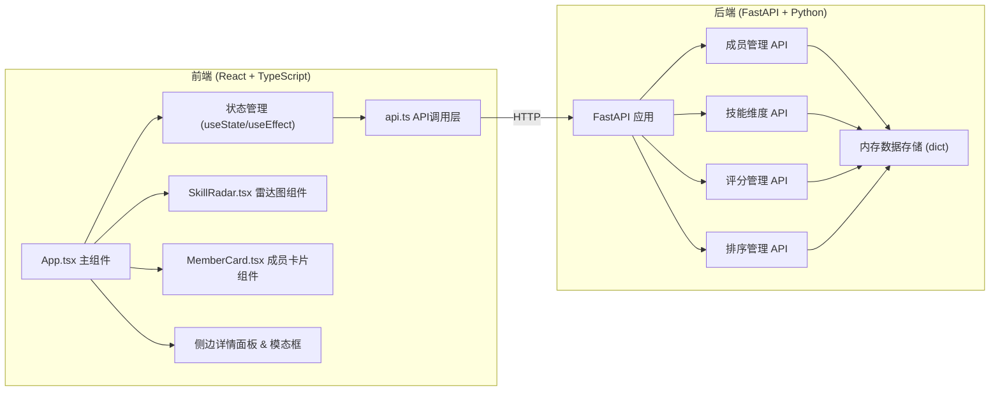
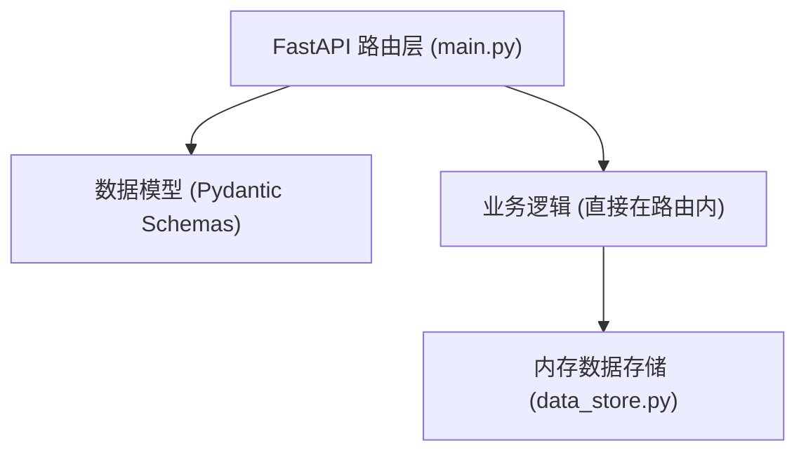
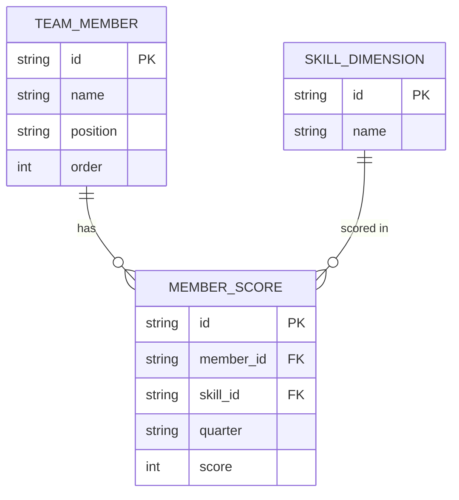

## 1. 架构设计



## 2. 技术描述

* **前端**: React 18 + TypeScript 5 + Vite 5

* **图表库**: Recharts 2

* **HTTP客户端**: Axios

* **唯一ID**: uuid

* **样式方案**: 原生 CSS（内联样式 + CSS文件），不使用 Tailwind CSS

* **后端**: FastAPI (Python 3.9+)

* **后端依赖**: uvicorn, fastapi, pydantic, python-multipart

* **数据存储**: 内存字典（含初始mock数据）

* **初始化方式**: 手动创建项目结构和配置文件

## 3. 路由定义

| 路由                     | 用途               |
| ---------------------- | ---------------- |
| /                      | 首页看板（单页应用，前端无路由） |
| GET /api/members       | 获取所有成员列表         |
| POST /api/members      | 创建新成员            |
| PUT /api/members/order | 更新成员排序           |
| GET /api/skills        | 获取所有技能维度         |
| POST /api/skills       | 创建新技能维度          |
| POST /api/scores       | 提交成员技能评分         |

## 4. API 定义

```typescript
// 类型定义
interface SkillDimension {
  id: string;
  name: string;
}

interface MemberScore {
  skillId: string;
  quarter: string;  // "2024Q1" | "2024Q2" | "2024Q3" | "2024Q4"
  score: number;    // 1-5
}

interface TeamMember {
  id: string;
  name: string;
  position: string;
  order: number;
  scores: MemberScore[];
}

// API 请求/响应
// GET /api/members → TeamMember[]
// POST /api/members Body: { name: string, position: string } → TeamMember
// PUT /api/members/order Body: { memberIds: string[] } → { success: boolean }
// GET /api/skills → SkillDimension[]
// POST /api/skills Body: { name: string } → SkillDimension
// POST /api/scores Body: { memberId: string, skillId: string, quarter: string, score: number } → { success: boolean }
```

## 5. 服务端架构



* 项目简化为单文件或双文件后端，不复杂分层

* 所有数据保存在内存字典中，包含初始mock数据

* FastAPI 自动生成 OpenAPI 文档

## 6. 数据模型

### 6.1 实体关系



### 6.2 初始数据

预置4名团队成员和6个技能维度（
