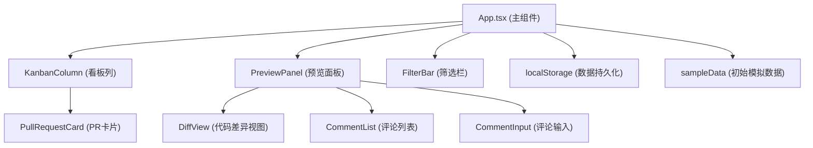
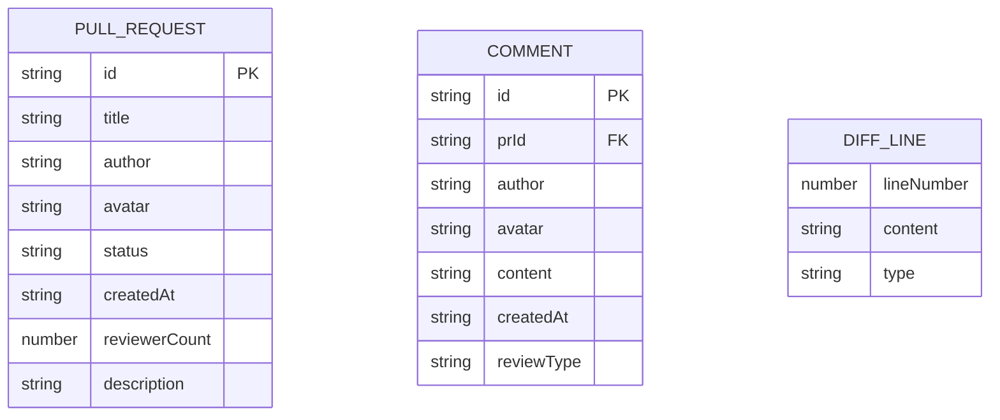

## 1. 架构设计



## 2. 技术描述
- **前端**：React@18 + TypeScript + Vite
- **初始化工具**：vite-init
- **后端**：无（纯前端应用）
- **数据存储**：浏览器 localStorage
- **状态管理**：React useState/useEffect（轻量级场景无需状态管理库）
- **样式方案**：原生 CSS（无需 Tailwind，使用 CSS 变量实现主题）

## 3. 路由定义
| 路由 | 用途 |
|-------|---------|
| / | 看板主页面 |

## 4. 数据模型

### 4.1 数据模型定义



### 4.2 类型定义
```typescript
type PRStatus = 'pending' | 'in-progress' | 'changes-requested' | 'approved';

interface PullRequest {
  id: string;
  title: string;
  author: string;
  avatar: string;
  status: PRStatus;
  createdAt: string;
  reviewerCount: number;
  description: string;
  diff: DiffBlock;
}

interface DiffBlock {
  original: DiffLine[];
  modified: DiffLine[];
}

interface DiffLine {
  lineNumber: number;
  content: string;
  type: 'added' | 'removed' | 'unchanged';
}

interface Comment {
  id: string;
  prId: string;
  author: string;
  avatar: string;
  content: string;
  createdAt: string;
  reviewType: 'approve' | 'request-changes';
}

interface FilterState {
  author: string;
  status: PRStatus | 'all';
  keyword: string;
}
```

## 5. 文件结构
```
.
├── package.json
├── index.html
├── vite.config.js
├── tsconfig.json
└── src/
    ├── App.tsx
    ├── index.css
    ├── main.tsx
    ├── components/
    │   ├── KanbanColumn.tsx
    │   ├── PullRequestCard.tsx
    │   ├── PreviewPanel.tsx
    │   ├── DiffView.tsx
    │   └── FilterBar.tsx
    ├── types/
    │   └── index.ts
    ├── utils/
    │   └── storage.ts
    └── data/
        └── sampleData.ts
```
