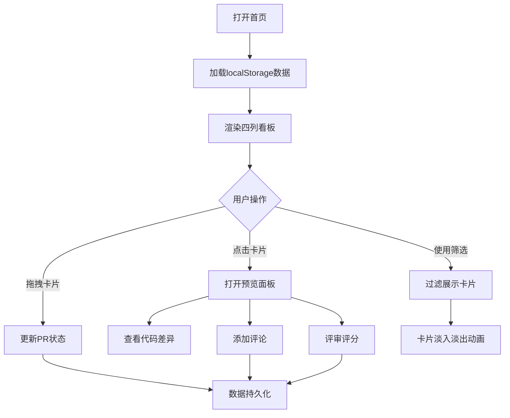

## 1. 产品概述

微型在线团队代码审查工作流看板，帮助中小型开发团队直观追踪代码审查进度。开发者提交PR后，团队成员可进行审查、通过或要求修改，全过程以看板形式可视化展示。

- 目标用户：中小型开发团队成员
- 核心价值：简化代码审查流程，提升团队协作效率

## 2. 核心功能

### 2.1 用户角色
无需复杂角色区分，所有用户具备相同操作权限。

### 2.2 功能模块
1. **看板主页**：四列状态看板、PR卡片展示、拖拽交互、筛选栏
2. **PR卡片**：标题、提交人、提交时间、审查人数、悬停效果
3. **预览面板**：代码差异对比视图、评论输入、评论列表、评审操作
4. **筛选系统**：按提交人、状态、关键词搜索过滤

### 2.3 页面详情
| 页面名称 | 模块名称 | 功能描述 |
|-----------|-------------|---------------------|
| 看板主页 | 四列看板 | 待审查、进行中、待修改、已通过四列，列宽自适应，列头显示状态标签和卡片计数 |
| 看板主页 | PR卡片 | 展示PR核心信息，支持拖拽（0.2s弹性跟随）和释放动画（0.4s滑入），点击展开预览面板 |
| 看板主页 | 筛选栏 | 底部筛选栏，支持按提交人、状态、关键词搜索，筛选时0.3s淡入淡出过渡 |
| 预览面板 | 代码差异视图 | 左右分栏对比，绿色#48BB78新增、红色#FC8181删除、灰色#718096未变，带行号 |
| 预览面板 | 评论系统 | 纯文本输入、评论列表（头像、用户名、时间戳、内容），按时间倒序，最多显示10条 |

## 3. 核心流程

用户打开首页 → 查看四列看板中所有PR卡片 → 拖拽卡片更新状态 / 点击卡片查看详情 → 在预览面板中查看代码差异、添加评论、执行评审操作 → 通过筛选栏快速定位目标PR → 所有数据自动持久化到localStorage

## 4. 用户界面设计

### 4.1 设计风格
- **主题**：深色主题
- **主背景**：深灰 #2D3748
- **卡片背景**：#4A5568，悬停 #5A6A7B 并上移2px（0.2s过渡）
- **列头文字**：浅琥珀色 #F6AD55
- **卡片标题**：白色 #FFFFFF
- **提交人信息**：浅灰 #CBD5E0
- **差异新增**：绿色 #48BB78
- **差异删除**：红色 #FC8181
- **差异未变**：灰色 #718096
- **预览面板背景**：#1A202C

### 4.2 页面设计概述
| 页面名称 | 模块名称 | UI元素 |
|-----------|-------------|-------------|
| 看板主页 | 四列看板 | 网格布局、列头标签、卡片计数、拖拽放置区域 |
| 看板主页 | PR卡片 | 圆角卡片、80px默认高度、信息分层排版、悬停动效 |
| 看板主页 | 筛选栏 | 底部固定、多条件筛选控件 |
| 预览面板 | 侧滑面板 | 480px宽度、0.3s ease-out滑出动画、上下分区布局 |
| 预览面板 | 代码差异 | 左右分栏、行号、颜色高亮差异行 |
| 预览面板 | 评论区 | 输入框、提交按钮、评论列表（倒序排列） |

### 4.3 响应式
- **大屏 (>1024px)**：四列均分水平排列
- **中屏 (768-1024px)**：两行两列布局
- **小屏 (<768px)**：单列上下堆叠排列

### 4.4 动画性能
- 拖拽：0.2s弹性跟随
- 释放：0.4s滑入新列
- 预览面板：0.3s ease-out侧滑
- 筛选：0.3s淡入淡出
- 卡片悬停：0.2s过渡
- 目标帧率：≥30fps
