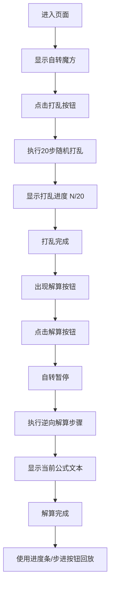

## 1. 产品概述
一个基于Web的交互式3D魔方解算路径可视化器，让用户在浏览器中动态观察魔方各层旋转、打乱和解算的完整过程。
- 主要目的：通过视觉化方式展示魔方打乱与解算的全过程，支持用户手动交互探索和步进式回放
- 目标用户：魔方爱好者、算法学习者、对3D可视化感兴趣的开发者
- 产品价值：提供沉浸式、交互式的魔方解算学习与观察体验

## 2. 核心特性

### 2.1 功能模块
1. **3D魔方渲染模块**：完整3x3x3魔方渲染，标准配色，黑色间隙，自动缓慢自转
2. **打乱功能模块**：随机打乱20步，每步0.5秒动画，实时显示步数进度
3. **解算功能模块**：逆向操作序列解算，每步0.8秒间隔，显示公式文本，暂停自转
4. **手动交互模块**：鼠标拖拽视角旋转，滚轮缩放，层选择+方向按钮手动旋转
5. **步进回放模块**：进度条显示总步数，拖动滑块跳转，上一步/下一步按钮

### 2.2 页面详情
| 页面名称 | 模块名称 | 功能描述 |
|-----------|-------------|---------------------|
| 主页面 | 3D场景画布 | 深空渐变背景，居中魔方3D渲染，支持鼠标交互 |
| 主页面 | 左下角状态面板 | 毛玻璃效果，显示当前状态（打乱中/解算中/已完成）和步数信息 |
| 主页面 | 底部控制栏 | 圆形功能按钮，层选择滑块，方向按钮组，进度条 |

## 3. 核心流程

用户进入页面 → 看到缓慢自转的完整魔方 → 点击打乱按钮 → 魔方自动打乱20步（显示进度） → 打乱完成 → 点击解算按钮 → 自动执行解算步骤（显示公式文本，自转暂停） → 解算完成 → 使用进度条和步进按钮回放任意步骤

## 4. 用户界面设计

### 4.1 设计风格
- **主色调**：深蓝 #0B0E17 → #1A1F36 深空渐变背景
- **辅助色**：冷灰 #2D3748（按钮背景），亮蓝 #63B3ED（滑块、强调）
- **文本色**：#E2E8F0（浅灰白）
- **按钮风格**：圆形40px，悬停放大1.1倍 + 白色发光阴影 #FFFFFF33
- **字体**：现代无衬线字体，科技感
- **布局风格**：全屏画布，左下角状态面板，底部居中控制栏
- **图标风格**：Unicode符号（▶ ⏸ ⏭ ⏮ 🔀）

### 4.2 页面设计概览
| 页面名称 | 模块名称 | UI元素 |
|-----------|-------------|-------------|
| 主页面 | 3D场景 | 深空渐变背景，居中3x3x3魔方，标准6色配色，黑色间隙，缓慢自转 |
| 主页面 | 状态面板 | 半透明毛玻璃 rgba(0,0,0,0.3)，模糊8px，圆角12px，状态文字+步数 |
| 主页面 | 控制栏 | 圆形按钮间距12px，悬停动画，纵向层选择滑块（4px宽，16px滑钮），方向按钮组，进度条 |

### 4.3 响应式
- 桌面优先设计，画布全屏自适应
- 控制栏在小屏幕上自动换行
- 触控设备支持触摸拖拽旋转与双指缩放

### 4.4 3D场景指引
- **环境**：深空渐变背景 #0B0E17 → #1A1F36，营造科技沉浸感
- **光照**：环境光 + 方向光，确保六色面颜色清晰可辨
- **相机**：透视相机，距离适中，可通过鼠标交互自由旋转（OrbitControls）
- **动画**：默认自转1圈/20秒，解算时暂停；旋转动画平滑过渡（tween.js）
- **性能**：动画帧率≥30FPS，步进回放≥45FPS
