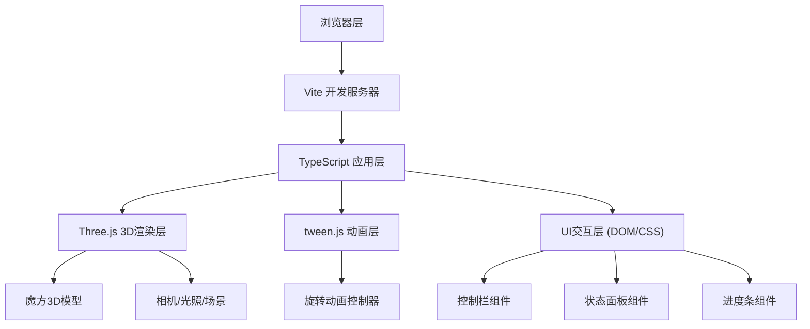
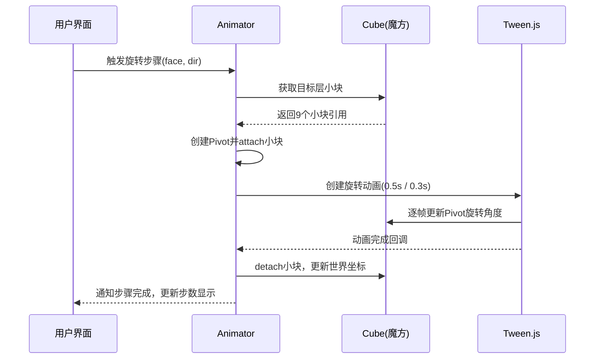

## 1. 架构设计



## 2. 技术描述
- **前端框架**：TypeScript 5.x + Vite 5.x
- **3D渲染**：Three.js (three) + @types/three
- **动画引擎**：tween.js（@tweenjs/tween.js）
- **构建工具**：Vite
- **无后端**，纯前端Web应用

## 3. 项目结构
| 文件路径 | 用途 |
|----------|------|
| `/package.json` | 项目依赖与脚本配置 |
| `/index.html` | 入口页面，全屏3D场景容器 |
| `/vite.config.js` | Vite构建配置 |
| `/tsconfig.json` | TypeScript严格模式配置，包含DOM类型 |
| `/src/main.ts` | 程序入口：初始化场景、相机、渲染器，管理动画循环和UI交互 |
| `/src/cube.ts` | 魔方核心逻辑：3x3x3色块网格构建，层旋转与颜色贴图，打乱算法与解算步骤生成 |
| `/src/animator.ts` | 动画管理器：tween.js驱动层旋转动画，支持步进播放、暂停、回放，记录时间戳和旋转参数 |

## 4. 核心数据结构

### 4.1 魔方坐标系与面定义
```typescript
type Face = 'U' | 'D' | 'F' | 'B' | 'L' | 'R'
type Direction = 'cw' | 'ccw' // 顺时针 / 逆时针

interface RotationStep {
  face: Face
  direction: Direction
  double?: boolean // 是否为180度旋转 (如 R2)
}
```

### 4.2 颜色映射
```typescript
const FACE_COLORS = {
  U: 0xFFFFFF, // 白
  D: 0xFFD700, // 黄
  F: 0x32CD32, // 绿
  B: 0x0000FF, // 蓝 - 修正为 #1E90FF
  L: 0xFF8C00, // 橙
  R: 0xFF4444  // 红
}
```

### 4.3 小块数据结构
```typescript
interface Cubie {
  mesh: THREE.Group      // 小块3D对象（含6个面）
  position: [number, number, number] // 在3x3x3网格中的坐标 [-1,0,1]
}
```

## 5. 核心算法

### 5.1 层旋转实现
- 选中对应层的9个小块（根据x/y/z坐标值筛选）
- 将这些小块attach到一个临时枢轴Pivot对象
- 对Pivot执行绕对应轴旋转90°/180°动画
- 动画完成后，将小块从Pivot中detach，并更新其世界坐标

### 5.2 打乱算法
```
for i in 0..19:
  face = 随机选择 [U,D,F,B,L,R]
  direction = 随机选择 [cw, ccw]
  记录到打乱步骤序列
```

### 5.3 解算步骤生成
- 解算 = 打乱步骤的逆序 + 每步方向取反
- 公式文本：`U` = 顺时针，`U'` = 逆时针，`U2` = 180°

## 6. 动画流程



## 7. 性能保障
- 使用THREE.Group进行层旋转，而非逐个矩阵变换
- 材质/几何体复用，减少draw call
- tween.js基于requestAnimationFrame帧更新
- 旋转完成后及时清理临时Pivot对象，防止内存泄漏
- 相机控制使用Three.js内置OrbitControls，优化触摸/鼠标交互
