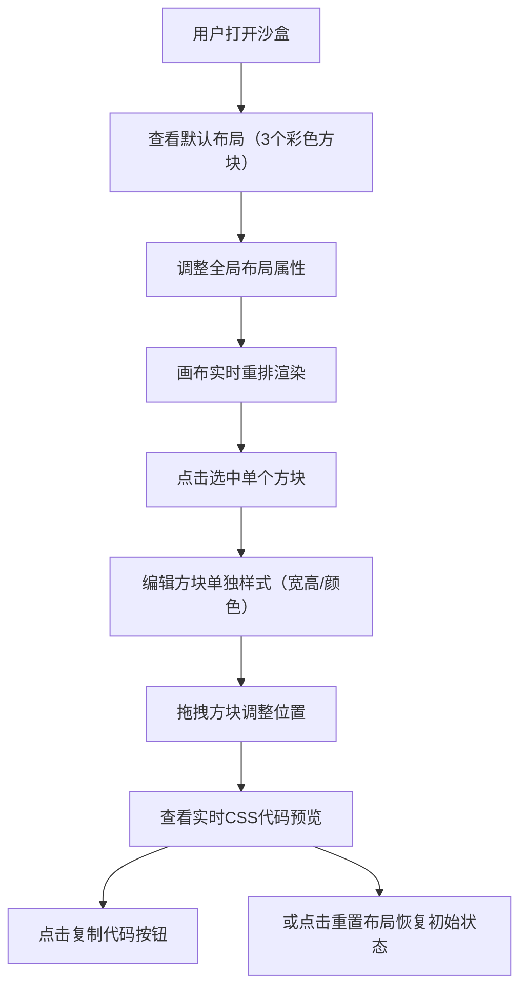

## 1. 产品概述

一个轻量级的交互式CSS布局可视化沙盒工具，帮助前端开发者实时观察不同CSS属性对元素排列的影响，并快速导出样式代码。

- 面向前端开发者，用于调试和探索CSS布局（flex、grid、定位等）的视觉效果
- 提供拖拽操作、实时属性调整、代码生成与复制功能，降低CSS布局学习和调试成本

## 2. 核心功能

### 2.1 用户角色

| 角色 | 注册方式 | 核心权限 |
|------|----------|----------|
| 前端开发者 | 无需注册 | 使用全部布局探索功能 |

### 2.2 功能模块

1. **主界面**：属性面板区、画布区、代码预览区
2. **画布组件**：可拖拽方块、布局实时渲染、选中状态管理
3. **属性面板组件**：布局属性调整、单个方块属性编辑
4. **代码预览组件**：CSS代码生成、一键复制

### 2.3 页面详情

| 页面名称 | 模块名称 | 功能描述 |
|----------|----------|----------|
| 主界面 | 顶部工具栏 | 重置布局按钮，一键恢复所有默认状态 |
| 主界面 | 左侧属性面板 | display、position、flex/grid属性控件，选中方块的单独样式编辑 |
| 主界面 | 右侧画布区 | 3个可拖拽彩色方块，4x4网格辅助线，实时布局响应 |
| 主界面 | 右下角代码预览 | 实时CSS代码显示，等宽字体，复制按钮 |

## 3. 核心流程

用户打开沙盒 → 查看默认flex布局的3个方块 → 在属性面板调整display/flex/grid属性 → 画布实时重排（0.3s过渡动画）→ 点击选中单个方块 → 编辑其宽高/颜色 → 拖拽方块到任意位置 → 点击复制代码按钮获取完整CSS → 或点击重置按钮恢复初始状态

## 4. 用户界面设计

### 4.1 设计风格

- 主背景色：#F7FAFC（浅色），面板背景：#FFFFFF，边框：#E2E8F0
- 重置按钮：背景#EF4444，白色文字，圆角6px
- 选中方块边框：2px实线#6366F1
- 方块默认颜色：#3B82F6、#F59E0B、#10B981
- 标签文字：12px，#4A5568；控件文字：14px
- 过渡动画：所有交互0.3s ease-in-out
- 字体：代码预览区使用 'Fira Code', monospace 等宽字体

### 4.2 页面设计概览

| 页面名称 | 模块名称 | UI元素 |
|----------|----------|--------|
| 主界面 | 顶部工具栏 | 左侧标题，右侧红色重置按钮 |
| 主界面 | 左侧属性面板 | 固定宽度300px，带圆角和阴影的白色卡片，下拉选择框和数值输入框，标签与控件垂直排列 |
| 主界面 | 右侧画布区 | 浅灰网格背景（4x4），方块带圆角和阴影，拖拽时动态阴影偏移 |
| 主界面 | 代码预览区 | 右下角浮动卡片，深色背景pre标签，右上角复制按钮（点击后文本临时变为"已复制"） |

### 4.3 响应式

- Desktop-first设计
- 移动端（宽度<768px）：属性面板折叠为顶部横条，画布垂直占满剩余空间
- 所有过渡动画保持一致

### 4.4 性能约束

- 属性修改导致画布重排 ≤16ms（60FPS）
- 方块拖拽保持60帧流畅
- 代码预览区每秒最多更新10次（防抖优化）
