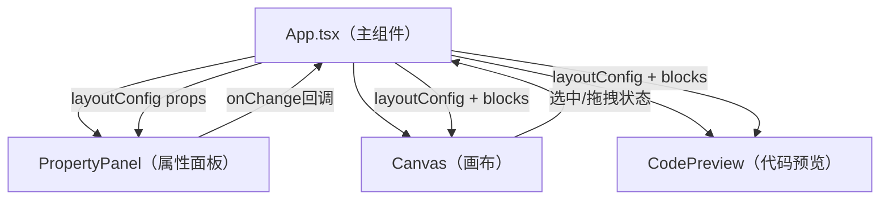

## 1. 架构设计



## 2. 技术说明

- 前端框架：React@18 + TypeScript@5
- 构建工具：Vite@5 + @vitejs/plugin-react@4
- 唯一ID生成：uuid@9
- 样式方案：原生CSS（配合CSS变量与过渡动画）
- 状态管理：React useState/useRef（无需Redux，简单单页应用）
- 无需后端服务，纯前端应用

## 3. 路由定义

| 路由 | 用途 |
|------|------|
| / | 主界面（唯一页面，所有功能集成于此） |

## 4. API定义

无后端API，纯前端应用。

核心TypeScript类型定义：

```typescript
// 单个方块数据结构
interface Block {
  id: string;
  x: number;       // 画布X坐标
  y: number;       // 画布Y坐标
  width: number;   // 宽度px
  height: number;  // 高度px
  backgroundColor: string;
}

// 全局布局配置
interface LayoutConfig {
  display: 'flex' | 'grid' | 'block' | 'inline-block';
  position: 'static' | 'relative' | 'absolute' | 'fixed';
  // Flex属性
  flexDirection?: 'row' | 'column' | 'row-reverse' | 'column-reverse';
  justifyContent?: 'flex-start' | 'center' | 'flex-end' | 'space-between' | 'space-around' | 'space-evenly';
  alignItems?: 'stretch' | 'center' | 'flex-start' | 'flex-end' | 'baseline';
  // Grid属性
  gridTemplateColumns?: string;
  gridTemplateRows?: string;
}
```

## 5. 文件结构与调用关系

```
src/
├── main.tsx              # React入口 → 渲染App
├── App.tsx               # 主组件（状态容器）→ 管理layoutConfig、blocks、selectedBlockId
├── types/
│   └── index.ts          # 类型定义 Block、LayoutConfig
├── utils/
│   ├── cssGenerator.ts   # 代码预览：根据layoutConfig+blocks生成CSS字符串
│   └── constants.ts      # 默认值、颜色等常量
├── hooks/
│   └── useThrottle.ts    # 性能优化：代码预览区10fps节流
└── components/
    ├── Canvas.tsx        # 画布组件：接收props → 渲染可拖拽方块 → onSelect/onDrag回调
    ├── PropertyPanel.tsx # 属性面板：接收props → 渲染控件 → onChange回调
    └── CodePreview.tsx   # 代码预览：接收props → 生成CSS → 渲染pre + 复制按钮
```

数据流方向：
`PropertyPanel.onChange → App.setState → Canvas/CodePreview.props更新 → UI重渲染`
`Canvas.onDrag/onSelect → App.setState → PropertyPanel/CodePreview.props更新`

## 6. 数据模型

所有数据存储在React状态中，无需数据库。

### 6.1 初始数据

- 3个默认方块：
  - block-1: #3B82F6, 120x120px
  - block-2: #F59E0B, 120x120px
  - block-3: #10B981, 120x120px
- 默认布局配置：display=flex, flexDirection=row, justifyContent=center, alignItems=stretch, position=static
- 默认方块间距：20px
