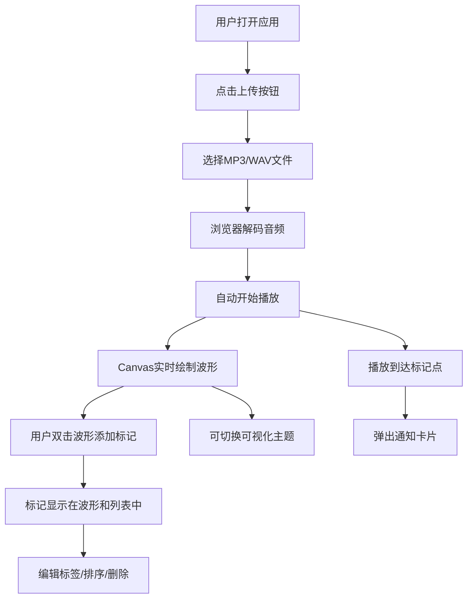

## 1. 产品概述

微型音乐播放与节奏可视化工具是一款完全运行在浏览器端的轻量级Web应用，专为音乐爱好者和音频信号处理学习者设计。它解决了用户在学习音频波形可视化和节奏标记时缺乏直观、交互式演示工具的痛点，无需安装任何软件即可使用。

- **核心目标**：提供音乐播放、实时波形渲染、交互式节奏标记三位一体的轻量级演示工具
- **目标用户**：音乐爱好者、音频工程师学生、前端可视化开发者
- **产品价值**：降低音频信号处理学习门槛，提供可分享、可交互的可视化演示体验

## 2. 核心功能

### 2.1 功能模块

1. **主应用界面**：左右分栏布局，主波形区域 + 标记列表面板
2. **音频播放器**：文件上传、播放控制、进度拖拽、音量调节、时间显示
3. **波形可视化**：Canvas实时绘制音频波形，支持三种主题切换
4. **节奏标记系统**：双击添加标记、拖拽排序、编辑标签、删除标记
5. **主题切换器**：默认/霓虹/极简三种预设主题，平滑过渡动画
6. **标记通知系统**：播放到标记点时弹出浮动通知卡片

### 2.2 页面详情

| 页面名称 | 模块名称 | 功能描述 |
|-----------|-------------|---------------------|
| 主界面 | 波形显示区域 | Canvas实时绘制音频波形，背景色随主题变化，波形线条颜色与峰值高亮 |
| 主界面 | 播放控制条 | 播放/暂停按钮、可拖拽进度条、音量滑块、当前时间/总时长显示 |
| 主界面 | 文件上传按钮 | SVG上传图标+文字，支持MP3/WAV格式本地文件 |
| 主界面 | 主题选择器 | 右上角下拉菜单，一键切换三种可视化主题 |
| 主界面 | 标记通知卡片 | 播放到达标记点时弹出，显示标签和精确时间，支持合并显示 |
| 右侧面板 | 标记点列表 | 显示所有标记点的时间（MM:SS.ms格式）和可编辑标签 |
| 右侧面板 | 标记排序 | HTML5拖拽排序，延迟不超过50ms |
| 右侧面板 | 标记删除 | 每项右侧删除按钮，点击立即移除 |

## 3. 核心流程

### 3.1 用户主流程

用户打开应用 → 点击上传按钮选择本地音频文件 → 浏览器解码音频并自动开始播放 → Canvas实时渲染波形 → 用户双击波形区域添加节奏标记 → 在右侧面板编辑标记标签/排序/删除 → 可随时切换主题查看不同视觉效果 → 播放时经过标记点弹出通知卡片

## 4. 用户界面设计

### 4.1 设计风格

- **主色调**：深色主背景 #2D3748，波形青色 #4FD1C5，标记浅紫 #B794F4
- **按钮样式**：圆角 6px，悬停背景色加深 10% 并增加阴影，点击缩放 0.97
- **字体**：使用现代无衬线字体，重视可读性和专业感
- **布局风格**：左右分栏卡片式布局，70% 主区域 + 30% 侧栏
- **图标**：使用 Lucide React 图标库，上传按钮使用自定义 SVG 箭头图标（32x32px）

### 4.2 三种可视化主题

| 主题名称 | 背景色 | 波形颜色 | 特点 |
|-----------|--------|----------|------|
| 默认 | #1A202C（深灰） | #4FD1C5（青色）→ #81E6D9（峰值高亮） | 专业音频工具风格 |
| 霓虹 | #000000（纯黑） | #D53F8C（品红）→ #ECC94B（亮黄）渐变 | 炫酷赛博朋克风 |
| 极简 | #FFFFFF（白色） | #A0AEC0（灰色） | 简洁清晰，重视排版 |

### 4.3 页面设计概述

| 页面名称 | 模块名称 | UI 元素 |
|-----------|-------------|-------------|
| 主界面 | 波形显示区域 | Canvas 画布，深色背景卡片（#2D3748），圆角 12px，浅阴影 |
| 主界面 | 播放控制条 | 底部横向布局，按钮圆角 6px，进度条可拖拽 |
| 主界面 | 主题选择器 | 右上角下拉菜单，0.5s 平滑渐变过渡 |
| 主界面 | 标记通知卡片 | 圆角 8px，白色背景带阴影，2s 停留后淡出 |
| 右侧面板 | 标记列表容器 | 浅色背景（#F7FAFC），圆角 8px，内边距 16px |
| 右侧面板 | 标记列表项 | 时间显示 + 可编辑标签输入框 + 删除按钮 |

### 4.4 响应式设计

- **桌面端（≥768px）**：左右分栏布局，主区域 70%，侧栏 30%
- **移动端（<768px）**：上下布局，标记面板移动到波形下方
- **触控优化**：移动端控制条高度增加 30%，便于触控操作
- **设计策略**：Desktop-first，通过媒体查询自适应移动端

## 5. 性能要求

| 指标 | 要求 |
|------|------|
| 音频播放与波形绘制帧率 | 60 FPS |
| 标记点拖拽排序响应延迟 | ≤ 50ms |
| 本地文件解码时间 | ≤ 1秒 |
| 标记点数量上限 | 50个 |
| 标记合并阈值 | 间隔 < 0.3秒自动合并提示 |
| 主题切换过渡动画 | 0.5秒平滑渐变 |
