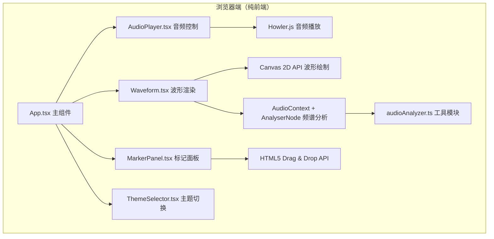

## 1. 架构设计



## 2. 技术描述

- **前端框架**：React 18 + TypeScript
- **构建工具**：Vite 5
- **音频播放**：Howler.js
- **音频分析**：Web Audio API（AudioContext + AnalyserNode）
- **波形渲染**：HTML5 Canvas 2D API
- **样式方案**：原生 CSS + CSS 变量（主题切换）
- **状态管理**：React useState + useCallback（轻量级场景无需 Zustand）
- **图标库**：Lucide React

## 3. 项目文件结构

```
├── package.json
├── vite.config.js
├── tsconfig.json
├── index.html
└── src/
    ├── main.tsx                 # React 入口
    ├── App.tsx                  # 主应用组件（全局状态管理）
    ├── components/
    │   ├── AudioPlayer.tsx      # 音频控制组件
    │   ├── Waveform.tsx         # 波形渲染组件
    │   ├── MarkerPanel.tsx      # 标记列表面板
    │   └── ThemeSelector.tsx    # 主题选择器
    └── utils/
        └── audioAnalyzer.ts     # 音频分析工具模块
```

## 4. 核心模块职责

### 4.1 App.tsx - 主应用组件
- 管理全局状态：audioFile、isPlaying、currentTime、duration、volume、markers、theme
- 组合子组件：AudioPlayer、Waveform、MarkerPanel、ThemeSelector
- 提供状态更新回调函数
- 布局：左右分栏（70%/30%），响应式上下布局

### 4.2 AudioPlayer.tsx - 音频控制组件
- 文件上传按钮（SVG 图标 + 文字，MP3/WAV 格式）
- Howler.js 音频播放控制
- 播放/暂停按钮
- 可拖拽进度条
- 音量滑块
- 当前时间/总时长显示
- 监听 ended 事件

### 4.3 Waveform.tsx - 波形渲染组件
- Canvas ref 获取画布元素
- requestAnimationFrame 60FPS 渲染循环
- 通过 AudioContext.createAnalyser 获取频谱数据（128 点）
- 绘制实时波形，支持三种主题
- 叠加标记点垂直虚线
- 双击添加标记点，计算时间位置
- 0.5s 主题切换渐变动画

### 4.4 MarkerPanel.tsx - 标记列表面板
- 列表展示所有标记点（时间 MM:SS.ms + 可编辑标签）
- HTML5 Drag & Drop 拖拽排序
- 删除标记点按钮
- 标签点击编辑
- 标记数量上限 50 个提示

### 4.5 ThemeSelector.tsx - 主题选择器
- 右上角下拉菜单
- 三种预设主题：默认、霓虹、极简
- 切换时更新 CSS 变量
- 控制波形区域过渡动画

### 4.6 audioAnalyzer.ts - 音频分析工具
- 封装 AudioContext 和 AnalyserNode 的创建与销毁
- getSpectrum(): 返回 128 个浮点数的频域数据数组
- decodeAudioData(ArrayBuffer): 解码为 AudioBuffer
- FFT 大小：256（对应 128 个频域数据点）

## 5. 数据模型

### 5.1 核心类型定义

```typescript
interface Marker {
  id: string;
  time: number;        // 秒
  label: string;
}

type ThemeName = 'default' | 'neon' | 'minimal';

interface ThemeConfig {
  name: ThemeName;
  label: string;
  background: string;       // 波形区背景色
  waveColor: string;        // 波形主色
  wavePeakColor: string;    // 峰值高亮色
  markerColor: string;      // 标记线颜色
  waveGradient?: {         // 霓虹主题渐变
    from: string;
    to: string;
  };
}
```

## 6. 主题配置常量

```typescript
const THEMES: Record<ThemeName, ThemeConfig> = {
  default: {
    name: 'default',
    label: '默认',
    background: '#1A202C',
    waveColor: '#4FD1C5',
    wavePeakColor: '#81E6D9',
    markerColor: '#B794F4',
  },
  neon: {
    name: 'neon',
    label: '霓虹',
    background: '#000000',
    waveColor: '#D53F8C',
    wavePeakColor: '#ECC94B',
    markerColor: '#B794F4',
    waveGradient: { from: '#D53F8C', to: '#ECC94B' },
  },
  minimal: {
    name: 'minimal',
    label: '极简',
    background: '#FFFFFF',
    waveColor: '#A0AEC0',
    wavePeakColor: '#718096',
    markerColor: '#805AD5',
  },
};
```

## 7. 性能优化策略

| 优化项 | 策略 |
|--------|------|
| 波形渲染 | requestAnimationFrame + Canvas 离屏缓存，避免不必要的重绘 |
| 频谱数据 | 每帧只取一次 AnalyserNode 数据，批量处理 |
| 标记检测 | 使用二分查找已排序标记数组，O(log n) 时间复杂度 |
| 通知合并 | 防抖节流机制，200ms 窗口内连续触发的标记合并显示 |
| 响应式 | CSS Grid + 媒体查询，避免 JS 监听 resize 带来的性能开销 |
| 组件重渲染 | React.memo 包裹子组件，useCallback 缓存回调函数 |

## 8. 依赖版本

| 依赖包 | 版本 | 用途 |
|--------|------|------|
| react | ^18.2.0 | UI 框架 |
| react-dom | ^18.2.0 | DOM 渲染 |
| howler | ^2.2.4 | 音频播放 |
| typescript | ^5.3.0 | 类型系统 |
| vite | ^5.0.0 | 构建工具 |
| @vitejs/plugin-react | ^4.2.0 | React 插件 |
| @types/react | ^18.2.0 | React 类型 |
| @types/react-dom | ^18.2.0 | React DOM 类型 |
| lucide-react | ^0.294.0 | 图标库 |
