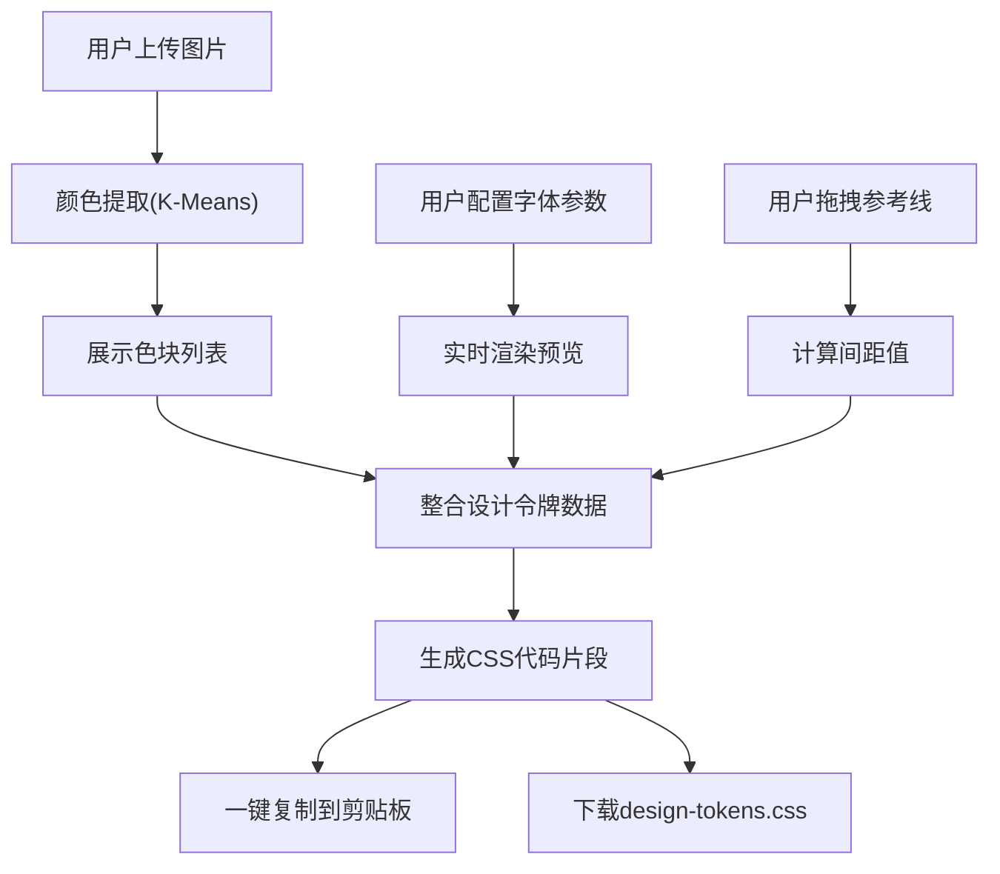

## 1. 产品概述
微型交互式设计令牌提取与实时预览应用，帮助UI设计师快速将设计稿中的颜色、字体、间距转化为可交互预览并生成CSS代码。
- 面向UI/UX设计师，解决设计参数提取和代码生成效率问题
- 核心价值：快速提取设计令牌、实时预览、一键导出CSS代码

## 2. 核心功能

### 2.1 功能模块
1. **颜色提取面板**：上传图片、K-Means聚类提取主色、色块展示、一键复制
2. **字体预览面板**：字体选择、字号/字重调节、文本输入、实时渲染
3. **间距标尺面板**：画布参考线、距离计算、标尺显示
4. **代码导出面板**：CSS变量生成、字体样式导出、间距代码、复制/下载
5. **历史记录与重置**：状态重置、最近3次历史记录恢复

### 2.2 页面详情
| 页面名称 | 模块名称 | 功能描述 |
|---------|---------|----------|
| 主应用 | 左侧控制面板 | 垂直折叠卡片形式的颜色/字体/间距三个功能模块 |
| 主应用 | 右侧预览画布 | 上传图片展示、字体实时渲染、参考线标尺 |
| 主应用 | 顶部工具栏 | 快速预览颜色、字体摘要、标尺切换 |
| 主应用 | 底部代码导出 | CSS代码生成、一键复制、下载CSS文件、历史记录 |

## 3. 核心流程
用户上传设计稿→系统提取主色→用户配置字体样式→用户绘制参考线→系统实时更新预览→生成CSS代码→复制或下载导出

## 4. 用户界面设计

### 4.1 设计风格
- 主色调：浅钴蓝 #3182CE（卡片标题栏）、深灰 #2D3748（导航栏）
- 背景色：面板 #FFFFFF、画布 #F7FAFC
- 按钮风格：圆角矩形、悬停浅灰 #E2E8F0、焦点蓝色边框过渡
- 字体：Google Fonts 加载 Inter/Roboto/Poppins/Merriweather/Fira Code
- 布局：左右两栏（左320px / 右自适应），<900px 上下堆叠
- 图标样式：简洁线性图标

### 4.2 页面设计概述
| 页面名称 | 模块名称 | UI元素 |
|---------|---------|--------|
| 主应用 | 左侧面板 | 折叠卡片（淡入动画0.3s）、色块卡片(60x60)、滑块、下拉框 |
| 主应用 | 画布区域 | 灰色背景、虚线参考线(#4A5568)、间距标签(半透明白底) |
| 主应用 | 工具栏 | 小按钮组、悬停变灰 |
| 主应用 | 代码面板 | 代码块、复制按钮(闪烁反馈)、下载按钮、历史记录卡片 |

### 4.3 响应式
- 桌面端（≥900px）：左右两栏布局，左宽320px
- 移动端（<900px）：上下堆叠，左侧全宽，画布高度减半
