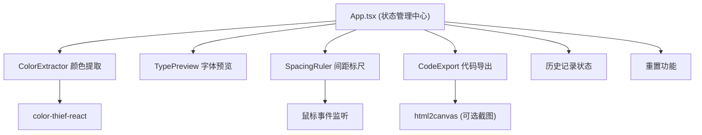

## 1. 架构设计



## 2. 技术描述
- 前端框架：React@18 + TypeScript@5
- 构建工具：Vite@5 + @vitejs/plugin-react
- 状态管理：React useState/useReducer（轻量场景，无需zustand）
- 样式方案：原生CSS + CSS Modules
- 图片颜色提取：color-thief-react
- 画布导出：html2canvas
- 图标：lucide-react

## 3. 数据模型

### 3.1 类型定义
```typescript
// 颜色项
interface ColorToken {
  hex: string;
  percentage: number;
  rgb: [number, number, number];
}

// 字体样式
interface TypographyToken {
  fontFamily: string;
  fontSize: number;
  fontWeight: number;
  lineHeight: number;
  text: string;
  showGrid: boolean;
}

// 参考线
interface GuideLine {
  id: string;
  type: 'horizontal' | 'vertical';
  position: number; // px 距离画布顶部或左侧
}

// 间距值
interface SpacingValue {
  id: string;
  fromId: string;
  toId: string;
  distance: number;
}

// 设计令牌完整状态
interface DesignTokens {
  colors: ColorToken[];
  typography: TypographyToken;
  guidelines: GuideLine[];
  spacings: SpacingValue[];
}

// 历史记录项
interface HistoryItem {
  id: string;
  timestamp: number;
  tokens: DesignTokens;
}
```

## 4. 文件结构
```
src/
├── main.tsx                 # React入口
├── App.tsx                  # 主应用组件（状态管理）
├── App.css                  # 全局样式
├── types/
│   └── index.ts             # 类型定义
├── utils/
│   ├── colorUtils.ts        # 颜色转换工具
│   └── cssGenerator.ts      # CSS代码生成工具
├── hooks/
│   └── useColorExtraction.ts # 颜色提取Hook
└── components/
    ├── ColorExtractor.tsx   # 颜色提取面板
    ├── TypePreview.tsx      # 字体预览面板
    ├── SpacingRuler.tsx     # 间距标尺面板
    ├── CodeExport.tsx       # 代码导出面板
    ├── HistoryPanel.tsx     # 历史记录面板
    └── Toolbar.tsx          # 画布工具栏
```

## 5. 核心数据流
1. **ColorExtractor**：上传文件→调用color-thief-react→返回ColorToken[]→更新App状态
2. **TypePreview**：用户交互→更新TypographyToken→实时渲染预览→传递给CodeExport
3. **SpacingRuler**：鼠标拖拽→创建/移动GuideLine→计算SpacingValue→更新画布渲染
4. **CodeExport**：接收全部tokens→调用cssGenerator→生成CSS字符串→复制/下载
5. **History**：状态变更→快照存入历史数组→点击恢复→回写App状态
