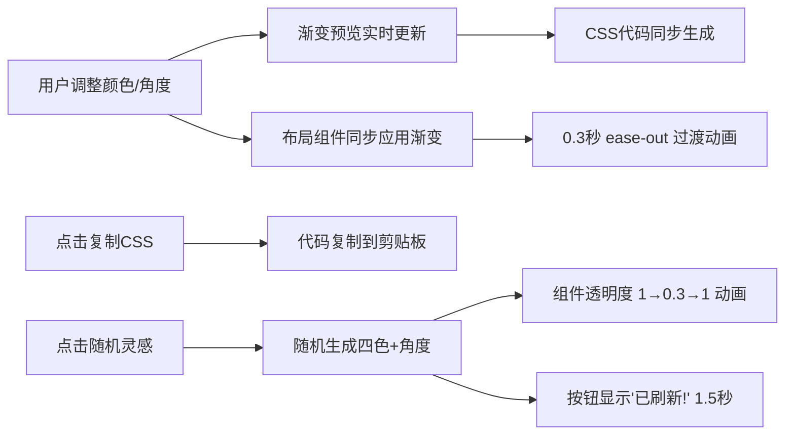

## 1. 产品概述
微型交互式渐变调色板生成与布局探索工具，帮助前端设计师和创意开发者在浏览器中快速生成CSS渐变背景并实时预览在UI组件上的视觉效果。
- 核心目的：提供直观的渐变配色方案生成与预览体验，降低设计师在色彩探索上的时间成本
- 目标用户：前端设计师、创意开发者、UI/UX从业者

## 2. 核心功能

### 2.1 功能模块
1. **调色板编辑区**：四色渐变停止点选择器、角度滑块、CSS代码展示与一键复制、随机灵感生成按钮
2. **布局预览区**：六种不同尺寸UI组件的实时渐变预览，包括宽卡片、头像组件、圆形徽章等

### 2.2 页面详情
| 页面名称 | 模块名称 | 功能描述 |
|-----------|-------------|---------------------|
| 主应用 | 调色板编辑区 | 四个颜色停止点（#667eea、#764ba2、#f093fb、#f5576c）可点击修改；角度滑块0-360度步长1度；200x150px圆角12px渐变预览方块；CSS代码片段展示与点击复制；随机灵感按钮 |
| 主应用 | 布局预览区 | 三列两排六种UI组件：宽卡片(300x180px)带标题/副标题/按钮、小头像(直径60px)带白色首字母、圆形徽章(直径40px)带白色边框显示色段比例；所有组件背景实时跟随渐变更新，0.3秒ease-out过渡动画 |

## 3. 核心流程
用户在调色板编辑区通过颜色选择器或角度滑块调整参数 → 渐变预览方块与CSS代码实时更新 → 右侧布局预览区所有组件同步应用新渐变 → 用户可点击CSS代码区域一键复制 → 点击"随机灵感"按钮随机生成配色方案，组件执行透明度刷新动画，按钮显示成功提示

## 4. 用户界面设计

### 4.1 设计风格
- 主色调：深色主题 #1A202C
- 面板色：#2D3748，内边框 #4A5568 0.5px
- 组件卡片：#2D3748 到 #1A202C 的微妙渐变
- 文字色：浅灰 #E2E8F0
- 随机按钮：紫到粉径向渐变，内阴影3px，悬停外发光4px #f093fb
- 交互元素悬停：外发光 + 轻微上移3px
- 按钮圆角8px
- 整体采用现代暗黑科技感风格

### 4.2 页面设计概述
| 页面名称 | 模块名称 | UI元素 |
|-----------|-------------|-------------|
| 主应用 | 调色板编辑区 | 深色面板背景、四个圆形颜色选择器、水平角度滑块、渐变预览方块(圆角12px)、等宽字体CSS代码块、渐变随机按钮 |
| 主应用 | 布局预览区 | 三列两排网格布局、宽卡片组件(标题/副标题/反色按钮)、圆形头像组件(白色首字母)、圆形徽章组件(白色边框+色段比例) |

### 4.3 响应式
- Desktop-first设计
- 浏览器宽度 < 768px 时，调色板区与预览区改为上下布局
- 调色板区占 40vh，预览区占剩余高度
- 渐变预览方块和组件按比例缩放

### 4.4 性能要求
- 颜色更新和动画帧率 ≥ 30fps
- 随机生成颜色分配和界面刷新 ≤ 50ms
