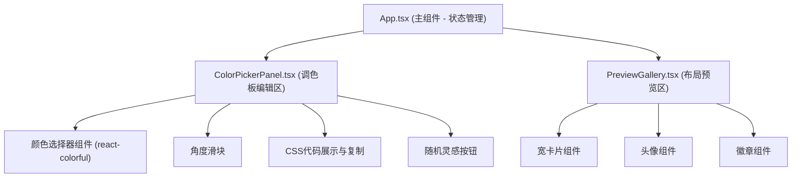

## 1. 架构设计

## 2. 技术描述
- 前端框架：React 18 + TypeScript
- 构建工具：Vite
- 颜色选择器：react-colorful
- ID生成：uuid
- 样式方案：内联样式 + CSS（Styled Components不使用，保持轻量）
- 无后端、无数据库，纯前端单页应用

## 3. 项目文件结构

| 文件路径 | 用途 |
|----------|------|
| `package.json` | 项目依赖与启动脚本配置 |
| `index.html` | 入口HTML页面，包含根节点 |
| `vite.config.js` | Vite构建配置（React插件） |
| `tsconfig.json` | TypeScript严格模式配置 |
| `src/main.tsx` | React根组件挂载，全局样式导入 |
| `src/App.tsx` | 主应用组件，渐变状态管理与随机生成逻辑，左右布局 |
| `src/components/ColorPickerPanel.tsx` | 调色板编辑区：四色选择器、角度滑块、CSS代码展示复制、随机按钮 |
| `src/components/PreviewGallery.tsx` | 布局预览区：六种UI组件展示（宽卡片、头像、徽章） |

## 4. 状态管理设计
- 所有状态在 App.tsx 中通过 React useState 管理
- 状态项：
  - `colors: string[]` - 四个渐变停止点颜色，默认 `['#667eea', '#764ba2', '#f093fb', '#f5576c']`
  - `angle: number` - 渐变角度 0-360，默认 135
  - `isRefreshing: boolean` - 随机生成时组件刷新动画状态
  - `showSuccess: boolean` - 随机按钮成功提示显示状态

## 5. 核心工具函数
- `generateGradientCSS(colors, angle)` - 生成线性渐变CSS字符串
- `generateRandomColors()` - 生成四个随机十六进制颜色
- `generateRandomAngle()` - 生成0-360随机角度
- `copyToClipboard(text)` - CSS代码复制到剪贴板
- `invertColor(hex)` - 计算按钮反色（用于宽卡片按钮）

## 6. 性能优化
- 使用 CSS transition 处理颜色过渡，避免JS动画
- 颜色状态变化采用批量更新（React 18 automatic batching）
- 避免不必要的重渲染：使用 React.memo 包裹子组件
- 复制功能使用现代 Clipboard API
