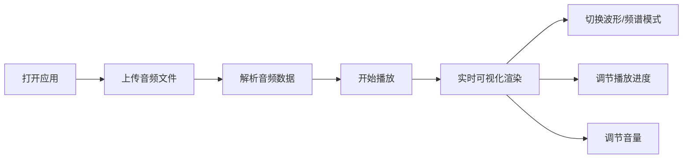

## 1. 产品概述
交互式音频可视化应用，用户可上传音乐文件并实时查看动态波形和频谱效果。
- 解决用户将音频以视觉方式呈现的需求，提供沉浸式的音乐可视化体验
- 面向音乐爱好者、创作者和视觉艺术爱好者

## 2. 核心功能

### 2.1 功能模块
1. **文件上传模块**：点击选择或拖拽上传 MP3/WAV 音频文件
2. **可视化模块**：波形图（时间域）和频谱图（频率域）两种模式切换
3. **播放控制模块**：播放/暂停、进度拖动、音量调节

### 2.2 页面详情
| 页面名称 | 模块名称 | 功能描述 |
|-----------|-------------|---------------------|
| 主页面 | 文件拖拽区 | 虚线边框，悬浮高亮，支持点击和拖拽上传 |
| 主页面 | Canvas 可视化区 | 宽90%，高400px，实时渲染波形或频谱 |
| 主页面 | 控制栏 | 模式切换、播放控制、进度条（显示当前/总时长）、音量滑块 |

## 3. 核心流程
用户打开应用 → 点击或拖拽上传音频文件 → 自动解析并开始播放 → 实时可视化渲染 → 可切换波形/频谱模式 → 可调节播放进度和音量

## 4. 用户界面设计
### 4.1 设计风格
- 主色调：深色科技风背景 #0a0a2e
- 波形渐变蓝色：从浅蓝到深蓝
- 频谱渐变：红→橙→黄→绿→蓝→紫
- 进度条和音量条使用渐变填充
- 控制图标精简，悬停有亮色动画
- 无滚动条，垂直居中布局

### 4.2 页面设计概述
| 页面名称 | 模块名称 | UI 元素 |
|-----------|-------------|-------------|
| 主页面 | 文件拖拽区 | 虚线边框、悬浮高亮、提示文字"点击或拖拽音频文件到此" |
| 主页面 | Canvas 可视化区 | 波形线渐变蓝色上下对称（立体声双声道），频谱柱状图彩虹渐变 |
| 主页面 | 控制栏 | 模式切换按钮、播放/暂停按钮、进度条（带时间显示）、音量滑块 |

### 4.3 响应式
以桌面端为主，Canvas 宽度自适应窗口，频谱柱子数量根据窗口宽度自动调整。
