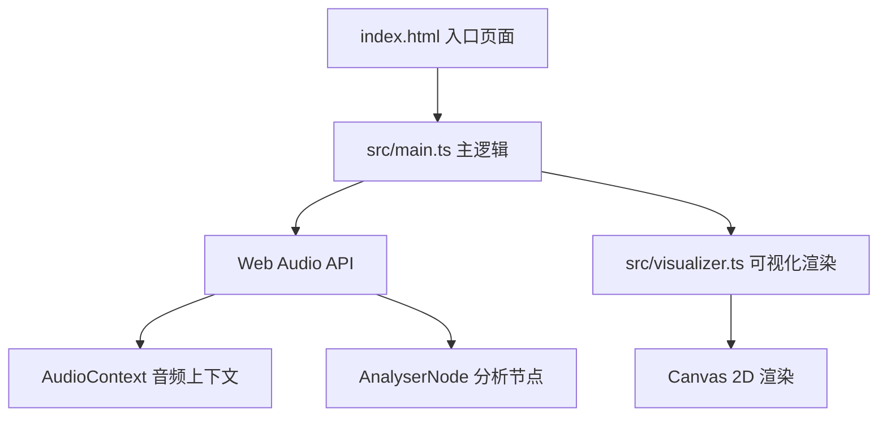

## 1. 架构设计

## 2. 技术说明
- 前端：TypeScript + Vite（原生 TS，无框架）
- 构建工具：Vite
- 音频处理：Web Audio API（AudioContext、AnalyserNode、AudioBufferSourceNode）
- 可视化渲染：HTML5 Canvas 2D API
- 动画循环：requestAnimationFrame

## 3. 文件结构
| 文件路径 | 用途 |
|-------|---------|
| package.json | 依赖配置（typescript、vite），启动脚本 |
| index.html | 入口页面，布局和内联样式 |
| vite.config.js | Vite 构建配置 |
| tsconfig.json | TypeScript 严格模式配置，ES 模块 |
| src/main.ts | 初始化音频上下文、处理文件上传、启动可视化循环 |
| src/visualizer.ts | 波形和频谱渲染函数 |

## 4. 核心模块设计

### 4.1 音频处理模块（main.ts）
- 初始化 AudioContext（用户交互后激活）
- 通过 FileReader 读取上传的音频文件
- 使用 AudioContext.decodeAudioData 解析音频数据
- 创建 AudioBufferSourceNode、GainNode、AnalyserNode 连接音频图
- AnalyserNode 获取时域数据（ByteTimeDomainData）和频域数据（ByteFrequencyData）

### 4.2 可视化模块（visualizer.ts）
- drawWaveform：渲染波形图，渐变蓝色，立体声上下对称，单声道单线，按时间滚动
- drawSpectrum：渲染频谱柱状图，柱子数量自适应窗口宽度，彩虹渐变
- 使用局部重绘优化性能，最小化 Canvas 重绘面积

## 5. 性能优化策略
- 使用 requestAnimationFrame 实现稳定 60FPS 渲染
- Canvas 仅重绘变化区域，避免全屏清空重绘
- AnalyserNode 的 fftSize 和 smoothingTimeConstant 调优
- 进度条和音量条使用 CSS 渐变，不占用 Canvas 渲染资源
