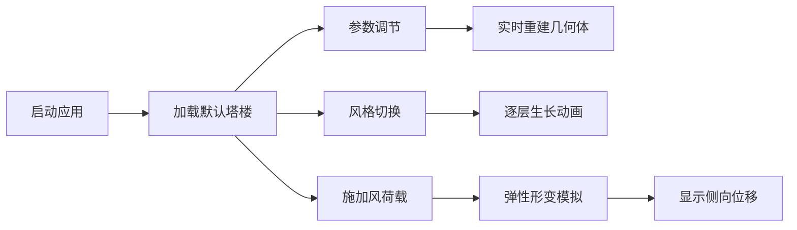

## 1. 产品概述

参数化塔楼生成器是一个基于WebGL的交互式3D建筑演示工具，为建筑爱好者和学生提供结构力学与几何美学的可视化学习平台。通过实时参数调节、3D渲染和力学模拟，用户可直观观察多层塔式建筑的形态变化与结构响应。

- **核心价值**：将抽象的结构力学概念转化为可交互的3D视觉体验，降低学习门槛
- **目标用户**：建筑学生、结构工程爱好者、几何设计探索者

## 2. 核心功能

### 2.1 用户角色
| 角色 | 注册方式 | 核心权限 |
|------|----------|----------|
| 访客用户 | 无需注册 | 完整使用所有参数调节、风格切换、力学模拟功能 |

### 2.2 功能模块
1. **3D场景渲染模块**：WebGL渲染器、相机控制、光照系统、材质系统
2. **参数化塔楼生成模块**：多层结构生成、两种建筑风格、逐层生长动画
3. **控制面板模块**：层数滑块、楼层参数Tab分组、风格切换胶囊按钮、力学模拟按钮
4. **力学模拟模块**：风荷载弹性形变、实时侧向位移显示

### 2.3 页面详情
| 页面名称 | 模块名称 | 功能描述 |
|----------|----------|----------|
| 主页面 | 3D视口 | Three.js渲染场景，鼠标拖拽旋转，滚轮缩放，点光源拖拽 |
| 主页面 | 控制面板 | 参数调节（层数、每层高度/宽度/旋转）、风格切换、力学模拟触发 |
| 主页面 | 位移显示 | 风荷载模拟时显示底部实时侧向位移（毫米） |

## 3. 核心流程

用户打开应用 → 查看默认塔楼(4层经典方形塔) → 通过滑块调节层数/楼层参数 → 建筑实时重建刷新 → 切换建筑风格 → 塔楼逐层生长动画 → 点击风荷载按钮 → 建筑弹性摇摆5秒 → 观察底部位移数值 → 继续自由调节探索

## 4. 用户界面设计

### 4.1 设计风格
- **主色调**：深灰背景#1A202C，控制面板#2D3748，强调蓝#4299E1
- **玻璃色**：#74B9FF 透明度0.3，地板暖色渐变#FF6B6B→#FFD93D
- **按钮样式**：胶囊圆角按钮，选中填充蓝色，未选白色描边
- **字体**：现代无衬线字体，标题20px/600，正文14px/400
- **布局风格**：主场景左75%，控制面板右25%，控制面板圆角16px
- **交互反馈**：悬停亮蓝#63B3ED，滑块实时响应，动画平滑过渡

### 4.2 页面设计概览
| 页面名称 | 模块名称 | UI元素 |
|----------|----------|--------|
| 主页面 | 3D视口 | 全屏Canvas，背景#1A202C，轨道控制，点光源辅助球 |
| 主页面 | 控制面板 | 标题栏、层数滑块组、楼层Tab、每层三滑块、风格切换胶囊组、模拟按钮+位移显示 |
| 主页面 | 响应式 | <768px时控制面板折叠为顶部横幅，点击展开抽屉 |

### 4.3 响应式
- **桌面端优先**：主视图75% + 控制面板25%（最小240px）
- **移动端适配**：屏幕<768px时控制面板折叠为顶部60px横幅，点击展开全屏抽屉
- **触控优化**：滑块支持触摸拖拽，相机支持双指缩放

### 4.4 3D场景指引
- **环境**：深灰背景#1A202C，浅灰地面#DFE6E9带轻微反射
- **光照**：环境光+点光源(右上45度)，点光源位置可拖拽
- **相机**：初始(15,12,15)看向原点，拖拽灵敏度0.5，缩放范围5-30
- **材质**：玻璃半透明+线框边缘，地板暖色渐变
- **动画**：风格切换时逐层生长(0.4s/层)，风荷载摇摆5秒(振幅2-4°, 0.5Hz, 阻尼0.3)
- **性能**：目标60FPS，几何体合并优化
